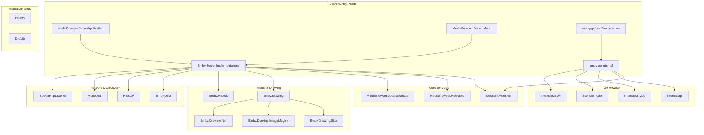
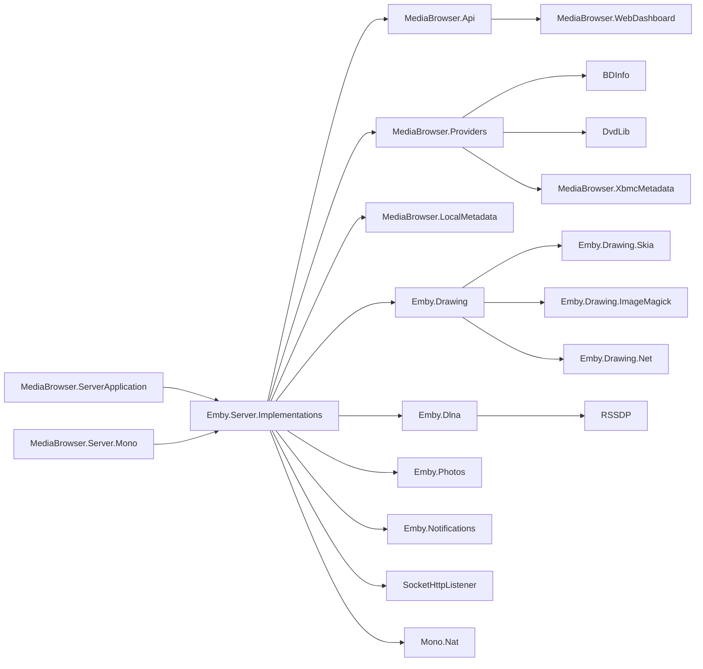

# Project: Emby Server

**Path:** `/`
**Type:** Root | Solution
**Language:** C# / .NET Framework + Go
**Version:** 3.5.3.0 (from `SharedVersion.cs`)
**Generated:** 2026-05-02

## Description

Emby Server is a personal media server with a REST-based API and apps on multiple devices. The codebase is a C#/.NET solution with multiple projects handling media streaming, metadata, DLNA, drawing, and notifications. A Go rewrite (`emby-go/`) is in progress.

## Structure

```
Emby/
├── BDInfo/                          # Blu-ray disc info library → .discovery/100-bdinfo.md
├── DvdLib/                          # DVD library (IFO parsing) → .discovery/110-dvdlib.md
├── Emby.Dlna/                       # DLNA server implementation → .discovery/120-emby-dlna.md
├── Emby.Drawing/                    # Drawing abstractions → .discovery/130-emby-drawing.md
├── Emby.Drawing.ImageMagick/          # ImageMagick drawing backend → .discovery/131-emby-drawing-imagemagick.md
├── Emby.Drawing.Net/                # .NET drawing backend → .discovery/132-emby-drawing-net.md
├── Emby.Drawing.Skia/               # Skia drawing backend → .discovery/133-emby-drawing-skia.md
├── Emby.Notifications/              # Notification system → .discovery/140-emby-notifications.md
├── Emby.Photos/                     # Photo handling → .discovery/150-emby-photos.md
├── Emby.Server.Implementations/     # Core server implementations → .discovery/160-emby-server-impl.md
├── MediaBrowser.Api/                # REST API controllers → .discovery/200-mediabrowser-api.md
├── MediaBrowser.LocalMetadata/      # Local metadata providers → .discovery/210-mediabrowser-localmetadata.md
├── MediaBrowser.Providers/          # External metadata providers → .discovery/220-mediabrowser-providers.md
├── MediaBrowser.Server.Mono/        # Mono runtime server entry → .discovery/230-mediabrowser-server-mono.md
├── MediaBrowser.ServerApplication/  # Windows server application → .discovery/240-mediabrowser-serverapp.md
├── MediaBrowser.Tests/              # Unit tests → .discovery/250-mediabrowser-tests.md
├── MediaBrowser.WebDashboard/       # Web dashboard UI → .discovery/260-mediabrowser-webdashboard.md
├── MediaBrowser.XbmcMetadata/       # XBMC/Kodi metadata compatibility → .discovery/270-mediabrowser-xbmcmetadata.md
├── Mono.Nat/                        # NAT traversal (UPnP/NAT-PMP) → .discovery/300-mono-nat.md
├── RSSDP/                           # SSDP/UPnP discovery protocol → .discovery/310-rssdp.md
├── SocketHttpListener/              # Custom HTTP listener → .discovery/320-sockethttplistener.md
├── ThirdParty/                      # Third-party libraries → .discovery/400-thirdparty.md
├── emby-go/                         # Go rewrite in progress → .discovery/500-emby-go.md
├── MediaBrowser.sln                 # Visual Studio solution file → .discovery/900-solution.md
├── SharedVersion.cs                 # Assembly version info → .discovery/910-sharedversion.md
├── README.md                        # Project readme → .discovery/920-readme.md
├── CONTRIBUTORS.md                  # Contributors list → .discovery/930-contributors.md
└── LICENSE.md                       # License (GPL) → .discovery/940-license.md
```

## Architecture Overview



## Technology Stack

| Layer | Technology |
|-------|-----------|
| Runtime | .NET Framework / Mono / Go |
| Language | C# 7.0+ / Go 1.22+ |
| Build | MSBuild / `go build` |
| Package Manager | NuGet / Go modules |
| Web Framework | Custom (SocketHttpListener) / Go net/http |
| Drawing | SkiaSharp / ImageMagick / System.Drawing |
| Media | Custom (BDInfo, DvdLib) |

## Entry Points

| Entry Point | Type | Description |
|-------------|------|-------------|
| `MediaBrowser.ServerApplication/Program.cs` | Application | Windows server entry |
| `MediaBrowser.Server.Mono/Program.cs` | Application | Mono/Linux server entry |
| `emby-go/cmd/emby-server/main.go` | Application | Go server entry |
| `MediaBrowser.sln` | Solution | Visual Studio solution |

## Dependency Graph (High-Level)



## Statistics

| Metric | Count |
|--------|-------|
| C# Projects | 20 |
| Go Packages | ~15 |
| Third-party Libraries | 3 (7zip, taglib, emby) |
| Solution Configurations | 5 (Debug, Release, Release Mono, Signed) |

## Document Map

| File | Component | Type | Description |
|------|-----------|------|-------------|
| [000-root.md](./000-root.md) | Project root | Root | This document |
| [100-bdinfo.md](./100-bdinfo.md) | BDInfo | Library | Blu-ray disc info |
| [110-dvdlib.md](./110-dvdlib.md) | DvdLib | Library | DVD IFO parsing |
| [120-emby-dlna.md](./120-emby-dlna.md) | Emby.Dlna | Module | DLNA server |
| [130-emby-drawing.md](./130-emby-drawing.md) | Emby.Drawing | Module | Drawing abstractions |
| [160-emby-server-impl.md](./160-emby-server-impl.md) | Emby.Server.Implementations | Module | Core server logic |
| [200-mediabrowser-api.md](./200-mediabrowser-api.md) | MediaBrowser.Api | Module | REST API |
| [220-mediabrowser-providers.md](./220-mediabrowser-providers.md) | MediaBrowser.Providers | Module | Metadata providers |
| [500-emby-go.md](./500-emby-go.md) | emby-go | Module | Go rewrite |
| [900-solution.md](./900-solution.md) | MediaBrowser.sln | Config | Solution configuration |

## Coverage Verification

- [x] All top-level directories mapped
- [x] All solution projects mapped
- [x] Entry points identified
- [x] Dependency graph generated (Mermaid)
- [x] Architecture overview generated (Mermaid)

## Reference

- CloudBSD Application Guidelines: `https://github.com/cloudbsdorg/application_guidelines`
- Emby Website: `http://www.emby.media/`
- API Docs: `https://github.com/MediaBrowser/MediaBrowser/wiki`

## Project Artifacts

- \`.gitignore\` — Git ignore rules → .discovery/950-project-artifacts.md
- \`.vs/\` — Visual Studio settings → .discovery/950-project-artifacts.md
- \`.plan/\` — Migration planning → .discovery/950-project-artifacts.md
- \`.plan.d/\` — Detailed planning docs → .discovery/950-project-artifacts.md
