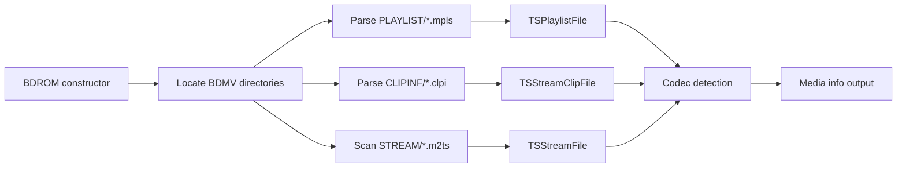

# Component: BDInfo

**Path:** `BDInfo/`
**Type:** Directory | Library
**Language:** C#
**Maps to:** `.discovery/100-bdinfo.md`

## Description

BDInfo is a Blu-ray Video and Audio Analysis Tool library. It parses Blu-ray disc structures (BDMV directories) to extract metadata about playlists, streams, codecs, and disc properties. Originally by Cinema Squid, integrated into Emby for Blu-ray media analysis.

## Structure

```
BDInfo/
├── BDInfo.csproj              # Project file
├── BDInfoSettings.cs            # Settings/configuration
├── BDROM.cs                     # Main Blu-ray ROM parser → [class] BDROM
│   ├── Parses BDMV directory structure
│   ├── Discovers playlists, clips, streams
│   ├── Detects BD+, BD-Java, 3D, region flags
│   └── Raises events on scan errors
├── LanguageCodes.cs             # Language code mappings
├── TSStream.cs                  # Transport stream base
├── TSStreamFile.cs              # Stream file parser
├── TSStreamClip.cs              # Stream clip
├── TSStreamClipFile.cs          # Stream clip file parser
├── TSPlaylistFile.cs            # Playlist file parser (MPLS)
├── TSInterleavedFile.cs         # Interleaved file handler
├── TSStreamBuffer.cs            # Stream buffer
├── TSCodecAC3.cs                # AC3/Dolby Digital codec
├── TSCodecAVC.cs                # AVC/H.264 codec
├── TSCodecDTS.cs                # DTS codec
├── TSCodecDTSHD.cs              # DTS-HD codec
├── TSCodecLPCM.cs               # LPCM audio codec
├── TSCodecMPEG2.cs              # MPEG-2 codec
├── TSCodecMVC.cs                # Multiview Video Coding (3D)
├── TSCodecTrueHD.cs             # Dolby TrueHD codec
├── TSCodecVC1.cs                # VC-1 codec
└── Properties/                  # Assembly info
```

## Key Classes

| Class | File | Purpose |
|-------|------|---------|
| `BDROM` | `BDROM.cs` | Main entry point for Blu-ray parsing |
| `TSPlaylistFile` | `TSPlaylistFile.cs` | Parses MPLS playlist files |
| `TSStreamFile` | `TSStreamFile.cs` | Parses individual stream files |
| `TSStreamClipFile` | `TSStreamClipFile.cs` | Parses clip info (CLPI) |

## Data Flow



## Dependencies

- `MediaBrowser.Model.IO` — File system abstraction
- `MediaBrowser.Model.Text` — Text encoding

## Side Effects

- Reads Blu-ray disc files from filesystem
- Raises events on parse errors (`StreamClipFileScanError`, `StreamFileScanError`, `PlaylistFileScanError`)

## Reference

- Original project: Cinema Squid BDInfo
- License: GNU LGPL v2.1+
