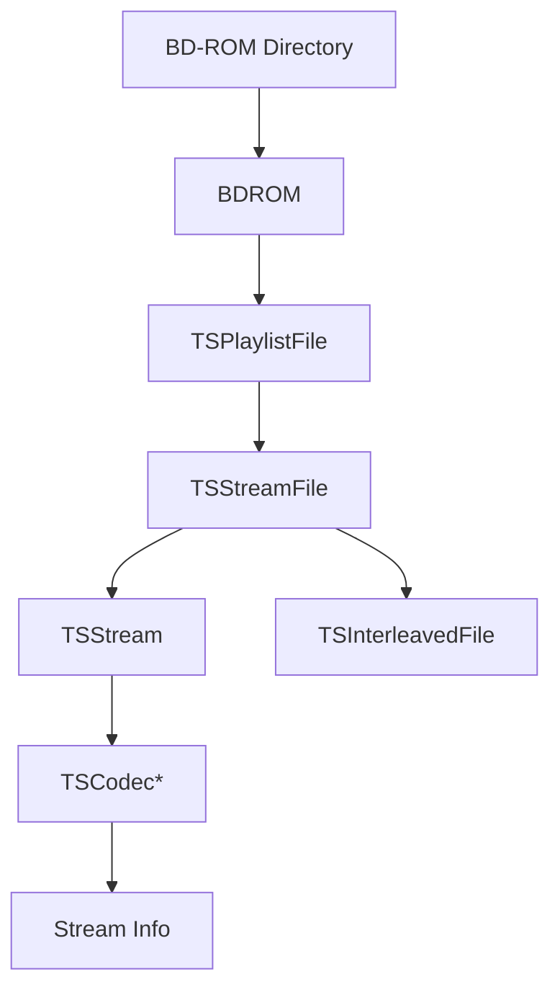

# Component: BDInfo — Expanded

**Path:** `BDInfo/`
**Type:** Directory | Library
**Language:** C#
**Maps to:** `.discovery/101-bdinfo-internals.md`

## Description

Blu-ray Disc analysis library. Parses BD-ROM directory structures, extracts stream information (video, audio, subtitles), and processes playlist files for accurate media metadata.

## Files

### Root Files (14 files)

- `BDInfo.csproj` — BDInfo/BDInfo.csproj
- `BDInfo.nuget.targets` — BDInfo/BDInfo.nuget.targets
- `BDInfoSettings.cs` — BDInfo/BDInfoSettings.cs
- `BDROM.cs` — BDInfo/BDROM.cs
- `LanguageCodes.cs` — BDInfo/LanguageCodes.cs
- `Properties/AssemblyInfo.cs` — BDInfo/Properties/AssemblyInfo.cs
- `ReadMe.txt` — BDInfo/ReadMe.txt
- `TSCodecAC3.cs` — BDInfo/TSCodecAC3.cs
- `TSCodecAVC.cs` — BDInfo/TSCodecAVC.cs
- `TSCodecDTS.cs` — BDInfo/TSCodecDTS.cs
- `TSCodecDTSHD.cs` — BDInfo/TSCodecDTSHD.cs
- `TSCodecLPCM.cs` — BDInfo/TSCodecLPCM.cs
- `TSCodecMPEG2.cs` — BDInfo/TSCodecMPEG2.cs
- `TSCodecMVC.cs` — BDInfo/TSCodecMVC.cs
- `TSCodecTrueHD.cs` — BDInfo/TSCodecTrueHD.cs
- `TSCodecVC1.cs` — BDInfo/TSCodecVC1.cs
- `TSInterleavedFile.cs` — BDInfo/TSInterleavedFile.cs
- `TSPlaylistFile.cs` — BDInfo/TSPlaylistFile.cs
- `TSStream.cs` — BDInfo/TSStream.cs
- `TSStreamBuffer.cs` — BDInfo/TSStreamBuffer.cs
- `TSStreamClip.cs` — BDInfo/TSStreamClip.cs
- `TSStreamClipFile.cs` — BDInfo/TSStreamClipFile.cs
- `TSStreamFile.cs` — BDInfo/TSStreamFile.cs
- `packages.config` — BDInfo/packages.config

## Codec Support

| Codec | File | Description |
|-------|------|-------------|
| AVC/H.264 | TSCodecAVC.cs | Most common Blu-ray codec |
| VC-1 | TSCodecVC1.cs | Windows Media codec |
| MPEG-2 | TSCodecMPEG2.cs | Legacy format |
| MVC | TSCodecMVC.cs | Multi-view coding (3D) |
| AC3 | TSCodecAC3.cs | Dolby Digital audio |
| DTS | TSCodecDTS.cs | DTS audio |
| DTS-HD | TSCodecDTSHD.cs | DTS-HD audio |
| TrueHD | TSCodecTrueHD.cs | Dolby TrueHD audio |
| LPCM | TSCodecLPCM.cs | Linear PCM audio |

## Data Flow



## Decomposition

### BDROM.cs (Main Entry Point)

#### Imports
```csharp
using MediaBrowser.MediaEncoding.BdInfo;
using System;
using System.Collections.Generic;
using System.IO;
using System.Linq;
```

#### Classes
`BDROM` (public class)

#### Key Properties
| Property | Type | Description |
|----------|------|-------------|
| `Titles` | `List<BdTitleInfo>` | All titles on disc |
| `PlaylistFiles` | `Dictionary<string, TSPlaylistFile>` | Parsed playlists |
| `StreamFiles` | `Dictionary<string, TSStreamFile>` | Stream files |

#### Key Methods
| Method | Return | Description |
|--------|--------|-------------|
| `Scan(string, bool)` | `void` | Scan BD-ROM directory |
| `Close()` | `void` | Release resources |

### TSPlaylistFile.cs (Playlist Parser)

#### Imports
```csharp
using MediaBrowser.MediaEncoding.BdInfo;
using System;
using System.Collections.Generic;
using System.IO;
using System.Text;
```

#### Classes
`TSPlaylistFile` (public class)

#### Key Properties
| Property | Type | Description |
|----------|------|-------------|
| `Name` | `string` | Playlist filename |
| `Chapters` | `List<ChapterInfo>` | Chapter marks |
| `StreamClips` | `List<TSStreamClip>` | Associated clips |

### TSStreamFile.cs (Transport Stream Reader)

#### Imports
```csharp
using MediaBrowser.MediaEncoding.BdInfo;
using System;
using System.Collections.Generic;
using System.IO;
```

#### Classes
`TSStreamFile` (public class : IDisposable)

#### Key Properties
| Property | Type | Description |
|----------|------|-------------|
| `Streams` | `Dictionary<int, TSStream>` | Stream ID to stream map |
| `Codecs` | `List<string>` | Detected codec names |

### TSCodecAVC.cs (AVC/H.264 Decoder)

#### Classes
`TSCodecAVC` (public class : TSStreamCodec)

#### Key Methods
| Method | Return | Description |
|--------|--------|-------------|
| `ParseHeader(byte[])` | `void` | Parse AVC sequence header |
| `GetProfile()` | `string` | Returns "AVC" or "MVC" |

### TSCodecDTS.cs (DTS Audio Decoder)

#### Classes
`TSCodecDTS` (public class : TSStreamCodec)

#### Key Properties
| Property | Type | Description |
|----------|------|-------------|
| `CoreBitRate` | `int` | Core DTS bitrate |
| `ExtensionBitRate` | `int` | Extension layer bitrate |

## Key Classes

| Class | Responsibility |
|-------|----------------|
| `BDROM` | Main entry point, parses disc structure |
| `TSPlaylistFile` | Parses MPLS playlist files |
| `TSStreamFile` | Reads transport stream files |
| `TSStream` | Represents a single media stream |
| `TSCodec*` | Codec-specific stream parsing |

## Dependencies

- Standard .NET libraries
