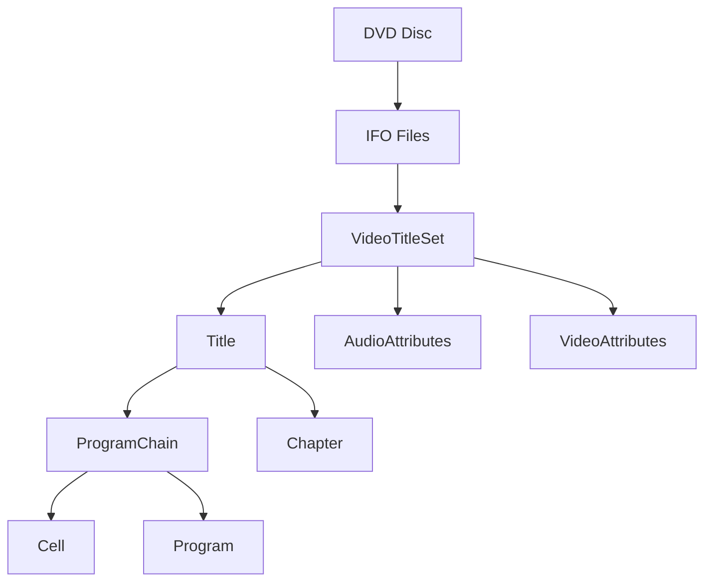

# Component: DvdLib — Expanded

**Path:** `DvdLib/`
**Type:** Directory | Library
**Language:** C#
**Maps to:** `.discovery/111-dvdliv-internals.md`

## Description

DVD structure analysis library. Parses DVD IFO files to extract title, chapter, and stream information. Uses big-endian binary reading for DVD format compatibility.

## Files

### Root Files (2 files)

- `BigEndianBinaryReader.cs` — DvdLib/BigEndianBinaryReader.cs
- `DvdLib.csproj` — DvdLib/DvdLib.csproj

### Ifo/ (12 files)

- `AudioAttributes.cs` — DvdLib/Ifo/AudioAttributes.cs
- `Cell.cs` — DvdLib/Ifo/Cell.cs
- `CellPlaybackInfo.cs` — DvdLib/Ifo/CellPlaybackInfo.cs
- `CellPositionInfo.cs` — DvdLib/Ifo/CellPositionInfo.cs
- `Chapter.cs` — DvdLib/Ifo/Chapter.cs
- `Dvd.cs` — DvdLib/Ifo/Dvd.cs
- `DvdTime.cs` — DvdLib/Ifo/DvdTime.cs
- `PgcCommandTable.cs` — DvdLib/Ifo/PgcCommandTable.cs
- `Program.cs` — DvdLib/Ifo/Program.cs
- `ProgramChain.cs` — DvdLib/Ifo/ProgramChain.cs
- `Title.cs` — DvdLib/Ifo/Title.cs
- `UserOperation.cs` — DvdLib/Ifo/UserOperation.cs
- `VideoAttributes.cs` — DvdLib/Ifo/VideoAttributes.cs

### Properties/ (1 file)

- `Properties/AssemblyInfo.cs` — DvdLib/Properties/AssemblyInfo.cs

### Config Files (2 files)

- `packages.config` — DvdLib/packages.config

## DVD Structure

## Key Classes

| Class | Responsibility |
|-------|----------------|
| `BigEndianBinaryReader` | Reads big-endian binary data |
| `Dvd` | Main DVD parsing entry point |
| `Title` | Represents a DVD title |
| `ProgramChain` | Program sequence information |
| `Cell` | Playback cell data |
| `Chapter` | Chapter navigation |

## Dependencies

- Standard .NET libraries
