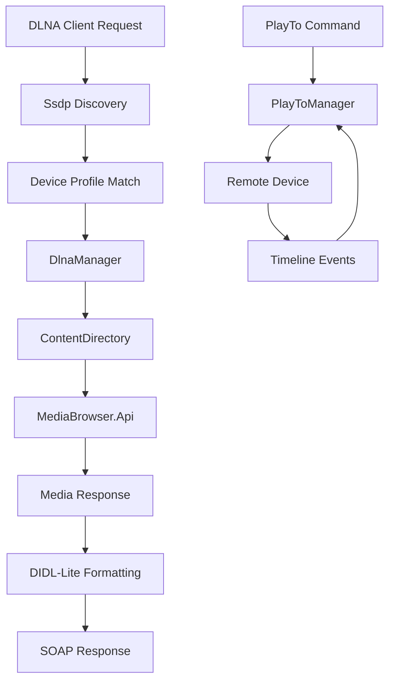

# Component: Emby.Dlna

**Path:** `Emby.Dlna/`
**Type:** Directory | Module
**Language:** C#
**Maps to:** `.discovery/120-emby-dlna.md`

## Description

Emby.Dlna implements a DLNA (Digital Living Network Alliance) server and control point. It enables Emby to act as a media server discoverable via UPnP, stream content to DLNA-compatible devices, and support PlayTo functionality for remote control of playback on other devices.

## Structure

```
Emby.Dlna/
├── DlnaManager.cs               # DLNA profile manager → [class] DlnaManager
│   ├── Loads device profiles (XML/JSON)
│   ├── Matches devices to profiles
│   └── Supports custom user profiles
├── Api/                         # DLNA API endpoints
├── Common/                      # Shared utilities
├── Configuration/               # DLNA configuration
├── ConfigurationExtension.cs    # Config extension methods
├── ConnectionManager/           # UPnP ConnectionManager service
├── ContentDirectory/            # UPnP ContentDirectory service
├── ControlRequest.cs            # SOAP control request
├── ControlResponse.cs           # SOAP control response
├── Didl/                        # DIDL-Lite metadata format
├── Eventing/                    # UPnP eventing/subscriptions
├── EventSubscriptionResponse.cs # Event subscription response
├── IConnectionManager.cs        # ConnectionManager interface
├── IContentDirectory.cs         # ContentDirectory interface
├── IEventManager.cs             # Event manager interface
├── Images/                      # DLNA image handling
├── IMediaReceiverRegistrar.cs   # MediaReceiverRegistrar interface
├── IUpnpService.cs              # UPnP service interface
├── Main/                        # Main DLNA service logic
├── MediaReceiverRegistrar/      # Media receiver registration
├── PlayTo/                      # PlayTo remote control
│   ├── Device discovery and pairing
│   ├── Remote playback control
│   └── Timeline/position tracking
├── Profiles/                    # Built-in device profiles
│   ├── DefaultProfile.cs
│   ├── Profiles for TVs, consoles, mobile devices
│   └── XML profile definitions
├── Server/                      # DLNA server implementation
├── Service/                     # UPnP service base classes
├── Ssdp/                        # SSDP discovery protocol
└── Properties/                  # Assembly info
```

## Key Classes

| Class | File | Purpose |
|-------|------|---------|
| `DlnaManager` | `DlnaManager.cs` | Manages device profiles |
| `ContentDirectory` | `ContentDirectory/` | UPnP ContentDirectory service |
| `ConnectionManager` | `ConnectionManager/` | UPnP ConnectionManager service |
| `PlayToManager` | `PlayTo/` | Remote playback control |
| `DeviceProfile` | `Profiles/` | Device capability profiles |

## Data Flow



## Dependencies

- `MediaBrowser.Controller` — Core controller interfaces
- `MediaBrowser.Model.Dlna` — DLNA model types
- `MediaBrowser.Model.Drawing` — Image formatting
- `RSSDP` — SSDP discovery protocol → `.discovery/310-rssdp.md`

## Side Effects

- Opens network ports for UPnP/DLNA communication
- Writes device profiles to filesystem
- Sends SSDP multicast packets
- Maintains event subscriptions with clients

## Reference

- UPnP Device Architecture 1.1
- DLNA Guidelines
