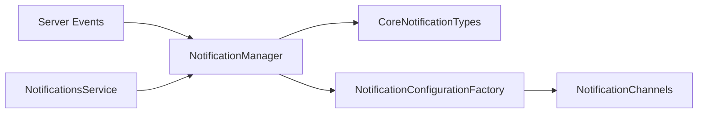

# Component: Emby.Notifications — Expanded

**Path:** `Emby.Notifications/`
**Type:** Directory | Module
**Language:** C#
**Maps to:** `.discovery/131-emby-notifications-internals.md`

## Description

Notification system for sending alerts to users. Supports various notification types including playback, library changes, and system events.

## Files

### Root Files

- `CoreNotificationTypes.cs` — Emby.Notifications/CoreNotificationTypes.cs
- `NotificationConfigurationFactory.cs` — Emby.Notifications/NotificationConfigurationFactory.cs
- `NotificationManager.cs` — Emby.Notifications/NotificationManager.cs
- `Notifications.cs` — Emby.Notifications/Notifications.cs

### Api/ (1 file)

- `NotificationsService.cs` — Emby.Notifications/Api/NotificationsService.cs

### Properties/ (1 file)

- `AssemblyInfo.cs` — Emby.Notifications/Properties/AssemblyInfo.cs

## Architecture

## Notification Types

| Type | Description |
|------|-------------|
| PlaybackStart | Media playback began |
| PlaybackStop | Media playback ended |
| LibraryChanged | Library was modified |
| PluginInstalled | New plugin installed |
| PluginUpdateAvailable | Plugin update ready |
| ServerRestartRequired | Server needs restart |
| NewLibraryContent | New content added |

## Dependencies

- `MediaBrowser.Controller` — Base entity types
- `MediaBrowser.Model` — API models
