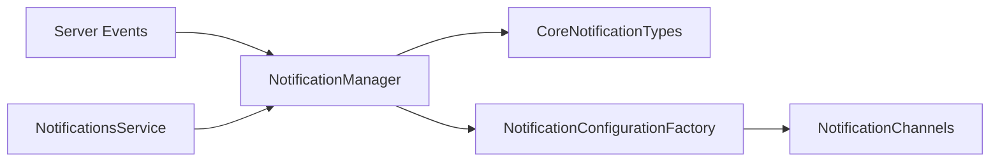

# Component: Emby.Notifications — Expanded

**Path:** `Emby.Notifications/`
**Type:** Directory | Module
**Language:** C#
**Maps to:** `.discovery/131-emby-notifications-internals.md`

## Description

Notification system for sending alerts to users. Supports various notification types including playback, library changes, and system events.

## Files

### Root Files

- `CoreNotificationTypes.cs` — Emby.Notifications/CoreNotificationTypes.cs
- `NotificationConfigurationFactory.cs` — Emby.Notifications/NotificationConfigurationFactory.cs
- `NotificationManager.cs` — Emby.Notifications/NotificationManager.cs
- `Notifications.cs` — Emby.Notifications/Notifications.cs

### Api/ (1 file)

- `NotificationsService.cs` — Emby.Notifications/Api/NotificationsService.cs

### Properties/ (1 file)

- `AssemblyInfo.cs` — Emby.Notifications/Properties/AssemblyInfo.cs

## Architecture



## Notification Types

| Type | Description |
|------|-------------|
| PlaybackStart | Media playback began |
| PlaybackStop | Media playback ended |
| LibraryChanged | Library was modified |
| PluginInstalled | New plugin installed |
| PluginUpdateAvailable | Plugin update ready |
| ServerRestartRequired | Server needs restart |
| NewLibraryContent | New content added |

## Decomposition

### NotificationManager.cs (Main Manager)

#### Imports
```csharp
using MediaBrowser.Common.Implementations;
using MediaBrowser.Controller.Notifications;
using MediaBrowser.Model.Logging;
using MediaBrowser.Model.Notifications;
using System;
using System.Collections.Generic;
using System.Linq;
using System.Threading.Tasks;
```

#### Classes
`NotificationManager` (public class : INotificationManager)

#### Key Properties
| Property | Type | Description |
|----------|------|-------------|
| `NotificationTypes` | `IEnumerable<NotificationTypeDescription>` | Available types |

#### Key Methods
| Method | Return | Description |
|--------|--------|-------------|
| `QueueNotification(NotificationRequest)` | `Task` | Queue notification for delivery |
| `GetNotificationTypes()` | `IEnumerable<NotificationTypeDescription>` | List available types |
| `GetNotificationServices()` | `IEnumerable<NotificationServiceInfo>` | List registered services |

### CoreNotificationTypes.cs (Type Definitions)

#### Classes
`CoreNotificationTypes` (public static class)

#### Notification Types
| Type | Description |
|------|-------------|
| `PlaybackStart` | Media playback began |
| `PlaybackStop` | Media playback ended |
| `LibraryChanged` | Library was modified |
| `PluginInstalled` | New plugin installed |
| `PluginUpdateAvailable` | Plugin update ready |

### Api/NotificationsService.cs (REST API)

#### Classes
`NotificationsService` (public class : IRequiresRequest)

#### Key Methods
| Method | Return | Description |
|--------|--------|-------------|
| `GetNotifications` | `Task` | Get user notifications |
| `AcknowledgeNotification` | `Task` | Mark as read |

## Dependencies

- `MediaBrowser.Controller` — Base entity types
- `MediaBrowser.Model` — API models
