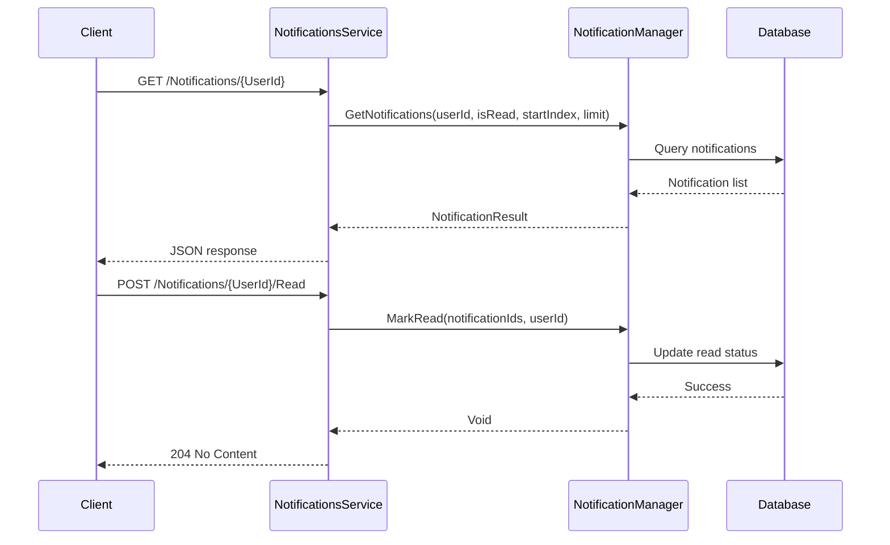

# Component: Emby.Notifications

**Path:** `Emby.Notifications/`
**Type:** Directory | Plugin
**Language:** C#
**Maps to:** `.discovery/133-notifications.md`

## Description

Emby.Notifications is a server plugin that provides the notification subsystem for Emby Server. It manages notification types, notification services, and the notification lifecycle (send, mark read/unread, summary). It exposes REST API endpoints for client notification management.

## Structure

```
Emby.Notifications/
├── Emby.Notifications.csproj
├── Properties/
│   └── AssemblyInfo.cs            # Assembly metadata
├── Notifications.cs               # Plugin entry point
│   └── [class] Notifications : IServerEntryPoint
│       ├── [method] public void Run(IServerApplicationHost appHost, ILoggerFactory loggerFactory)
│       │   ├── Registers NotificationManager as INotificationManager
│       │   ├── Registers CoreNotificationTypes as INotificationTypeFactory
│       │   └── Registers NotificationConfigurationFactory as IConfigurationFactory
│       └── [method] public void Dispose()
│           └── Unregisters services
├── NotificationManager.cs       # Notification manager
│   └── [class] NotificationManager : INotificationManager
│       ├── [method] public void SendNotification(NotificationRequest request, CancellationToken cancellationToken)
│       │   ├── Validates request
│       │   ├── Finds matching notification services
│       │   ├── Sends notification through each service
│       │   └── Stores notification in database
│       ├── [method] public void MarkRead(Guid[] notificationIds, string userId)
│       │   └── Marks notifications as read for user
│       ├── [method] public void MarkUnread(Guid[] notificationIds, string userId)
│       │   └── Marks notifications as unread for user
│       ├── [method] public NotificationsSummary GetNotificationsSummary(string userId)
│       │   └── Returns unread count and latest notifications
│       ├── [method] public List<Notification> GetNotifications(string userId, bool? isRead, int? startIndex, int? limit)
│       │   └── Returns paginated notification list
│       └── [method] public List<NotificationTypeInfo> GetNotificationTypes()
│           └── Returns all registered notification types
├── CoreNotificationTypes.cs     # Core notification type definitions
│   └── [class] CoreNotificationTypes : INotificationTypeFactory
│       ├── [method] public List<NotificationTypeInfo> GetNotificationTypes()
│       │   └── Returns built-in types:
│       │       ├── ApplicationUpdateAvailable
│       │       ├── ApplicationUpdateInstalled
│       │       ├── PluginInstalled
│       │       ├── PluginUpdateAvailable
│       │       ├── ServerRestartRequired
│       │       ├── TaskCompleted
│       │       ├── NewLibraryContent
│       │       ├── AudioPlayback
│       │       ├── VideoPlayback
│       │       ├── PlaybackStart
│       │       ├── PlaybackStop
│       │       ├── SubtitleDownloadFailure
│       │       └── InstallationFailed
│       └── [method] public string GetNotificationTypeName(string type)
│           └── Returns human-readable name for type
├── NotificationConfigurationFactory.cs  # Configuration factory
│   └── [class] NotificationConfigurationFactory : IConfigurationFactory
│       └── [method] public IEnumerable<ConfigurationInfo> GetConfigurations()
│           └── Returns notification configuration options
└── Api/
    └── NotificationsService.cs    # REST API service
        ├── [class] GetNotifications : IReturn<NotificationResult>
        │   └── [property] public string UserId
        ├── [class] Notification
        │   ├── [property] public Guid Id
        │   ├── [property] public string UserId
        │   ├── [property] public string NotificationType
        │   ├── [property] public string Name
        │   ├── [property] public string Description
        │   ├── [property] public string Url
        │   ├── [property] public string Category
        │   ├── [property] public DateTime Date
        │   ├── [property] public bool IsRead
        │   └── [property] public string Level
        ├── [class] NotificationResult
        │   ├── [property] public List<Notification> Notifications
        │   └── [property] public int TotalRecordCount
        ├── [class] NotificationsSummary
        │   ├── [property] public int UnreadCount
        │   └── [property] public List<Notification> Notifications
        ├── [class] GetNotificationsSummary : IReturn<NotificationsSummary>
        │   └── [property] public string UserId
        ├── [class] GetNotificationTypes : IReturn<List<NotificationTypeInfo>>
        ├── [class] GetNotificationServices : IReturn<List<NameIdPair>>
        ├── [class] AddAdminNotification : IReturnVoid
        │   ├── [property] public string Name
        │   ├── [property] public string Description
        │   ├── [property] public string NotificationType
        │   ├── [property] public string Url
        │   ├── [property] public string Level
        │   └── [property] public string UserId
        ├── [class] MarkRead : IReturnVoid
        │   └── [property] public Guid[] NotificationIds
        ├── [class] MarkUnread : IReturnVoid
        │   └── [property] public Guid[] NotificationIds
        └── [class] NotificationsService : IService
            ├── [route] GET /Notifications/{UserId}
            │   └── Returns paginated notifications for user
            ├── [route] GET /Notifications/{UserId}/Summary
            │   └── Returns notification summary (unread count)
            ├── [route] GET /Notifications/Types
            │   └── Returns all notification types
            ├── [route] GET /Notifications/Services
            │   └── Returns available notification services
            ├── [route] POST /Notifications/Admin
            │   └── Adds admin notification
            ├── [route] POST /Notifications/{UserId}/Read
            │   └── Marks notifications as read
            └── [route] POST /Notifications/{UserId}/Unread
                └── Marks notifications as unread
```

## Notification Lifecycle



## Core Notification Types

| Type | Description | Trigger |
|------|-------------|---------|
| ApplicationUpdateAvailable | New server version available | Update check |
| ApplicationUpdateInstalled | Server updated | Post-update |
| PluginInstalled | Plugin installed | Plugin install |
| PluginUpdateAvailable | Plugin update available | Plugin check |
| ServerRestartRequired | Restart needed | Config change |
| TaskCompleted | Scheduled task done | Task finish |
| NewLibraryContent | New media added | Library scan |
| AudioPlayback | Audio started | Playback event |
| VideoPlayback | Video started | Playback event |
| PlaybackStart | Playback started | Playback event |
| PlaybackStop | Playback stopped | Playback event |
| SubtitleDownloadFailure | Subtitle download failed | Subtitle task |
| InstallationFailed | Install failed | Install error |

## Side Effects

- Reads/writes notification data to database
- Sends notifications through registered INotificationService plugins
- No external network calls (delegated to notification service plugins)
