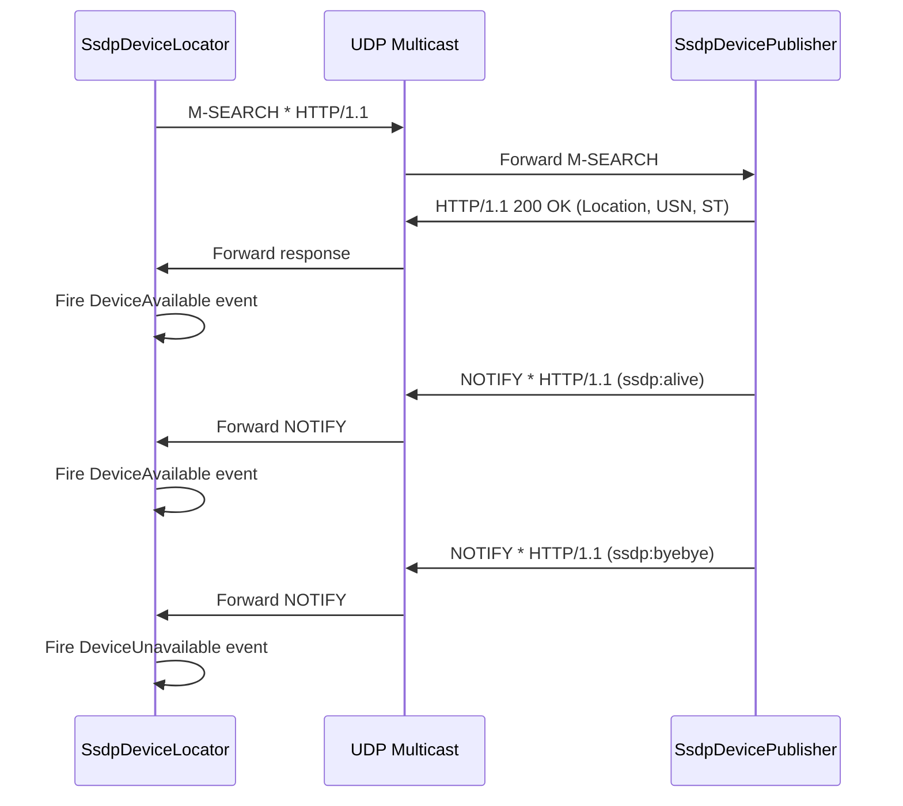

# Component: RSSDP

**Path:** `RSSDP/`
**Type:** Directory | Library
**Language:** C#
**Maps to:** `.discovery/142-rssdp.md`

## Description

RSSDP is a managed C# implementation of the Simple Service Discovery Protocol (SSDP), used for UPnP/DLNA device discovery. It enables Emby Server to announce itself as a UPnP media server and discover other UPnP devices on the local network. This is a standalone library with no external dependencies.

## Structure

```
RSSDP/
├── RSSDP.csproj
├── Properties/
│   └── AssemblyInfo.cs            # Assembly metadata
├── SsdpConstants.cs               # SSDP protocol constants
│   └── [const] string SsdpMulticastAddress = "239.255.255.250"
│   └── [const] int SsdpMulticastPort = 1900
│   └── [const] string SsdpDiscoverMessage = "M-SEARCH * HTTP/1.1"
│   └── [const] string SsdpNotifyMessage = "NOTIFY * HTTP/1.1"
│   └── [const] string SsdpResponseMessage = "HTTP/1.1 200 OK"
├── DisposableManagedObjectBase.cs # Base disposable class
│   └── [class] DisposableManagedObjectBase : IDisposable
│       ├── [method] public void Dispose()
│       │   └── Calls Dispose(true) then GC.SuppressFinalize
│       ├── [method] protected virtual void Dispose(bool disposing)
│       │   └── Override point for cleanup
│       └── [property] public bool IsDisposed
├── HttpParserBase.cs              # Base HTTP message parser
│   └── [class] HttpParserBase<T> where T : new()
│       ├── [method] public T Parse(string data)
│       │   ├── Parses HTTP headers from raw string
│       │   └── Returns populated T instance
│       └── [method] protected virtual void ParseHeader(...)
│           └── Override point for specific header parsing
├── HttpRequestParser.cs           # HTTP request parser
│   └── [class] HttpRequestParser : HttpParserBase<SsdpRequest>
│       └── Parses M-SEARCH and NOTIFY requests
├── HttpResponseParser.cs          # HTTP response parser
│   └── [class] HttpResponseParser : HttpParserBase<SsdpResponse>
│       └── Parses 200 OK responses with device info
├── ISsdpCommunicationsServer.cs   # Communications server interface
│   └── [interface] ISsdpCommunicationsServer : IDisposable
│       ├── [method] Task SendMessage(byte[] message, IPEndPoint endPoint)
│       ├── [method] Task<ReceivedUdpData> Receive()
│       └── [method] void StopListening()
├── SsdpCommunicationsServer.cs    # UDP communications server
│   └── [class] SsdpCommunicationsServer
│       ├── [method] public Task SendMessage(byte[] message, IPEndPoint endPoint)
│       │   └── Sends UDP multicast message
│       ├── [method] public Task<ReceivedUdpData> Receive()
│       │   └── Listens for UDP multicast responses
│       └── [method] public void StopListening()
│           └── Closes UDP socket
├── ISsdpDeviceLocator.cs          # Device locator interface
│   └── [interface] ISsdpDeviceLocator
│       ├── [method] Task<IEnumerable<DiscoveredSsdpDevice>> SearchAsync()
│       ├── [method] Task<IEnumerable<DiscoveredSsdpDevice>> SearchAsync(string searchTarget)
│       └── [event] EventHandler<DeviceAvailableEventArgs> DeviceAvailable
├── SsdpDeviceLocator.cs           # SSDP device discovery
│   └── [class] SsdpDeviceLocator : DisposableManagedObjectBase
│       ├── [method] public async Task<IEnumerable<DiscoveredSsdpDevice>> SearchAsync()
│       │   ├── Sends M-SEARCH multicast request
│       │   ├── Listens for responses (timeout: 3 seconds)
│       │   ├── Parses SSDP responses
│       │   └── Returns discovered devices
│       ├── [method] public async Task<IEnumerable<DiscoveredSsdpDevice>> SearchAsync(string searchTarget)
│       │   └── Searches for specific device type (e.g., "urn:schemas-upnp-org:device:MediaServer:1")
│       ├── [event] public EventHandler<DeviceAvailableEventArgs> DeviceAvailable
│       │   └── Fired when new device responds
│       └── [event] public EventHandler<DeviceUnavailableEventArgs> DeviceUnavailable
│           └── Fired when device stops responding
├── ISsdpDevicePublisher.cs        # Device publisher interface
│   └── [interface] ISsdpDevicePublisher
│       ├── [method] void AddDevice(SsdpRootDevice device)
│       ├── [method] void RemoveDevice(SsdpRootDevice device)
│       └── [event] EventHandler<RequestReceivedEventArgs> RequestReceived
├── SsdpDevicePublisher.cs         # SSDP device announcement
│   └── [class] SsdpDevicePublisher : DisposableManagedObjectBase, ISsdpDevicePublisher
│       ├── [method] public void AddDevice(SsdpRootDevice device)
│       │   ├── Starts periodic NOTIFY broadcasts (every 10 minutes)
│       │   └── Adds device to announced list
│       ├── [method] public void RemoveDevice(SsdpRootDevice device)
│       │   ├── Sends ssdp:byebye NOTIFY
│       │   └── Removes from announced list
│       ├── [method] private void SendAliveNotifications(SsdpDevice device)
│       │   └── Sends ssdp:alive NOTIFY for device and services
│       ├── [method] private void SendByeByeNotifications(SsdpDevice device)
│       │   └── Sends ssdp:byebye NOTIFY
│       └── [event] public EventHandler<RequestReceivedEventArgs> RequestReceived
│           └── Fired when M-SEARCH request received
├── SsdpDevice.cs                  # Base SSDP device
│   └── [class] SsdpDevice
│       ├── [property] public string DeviceTypeUri
│       ├── [property] public string FriendlyName
│       ├── [property] public string Manufacturer
│       ├── [property] public string ModelName
│       ├── [property] public string ModelNumber
│       ├── [property] public string SerialNumber
│       ├── [property] public string Udn
│       ├── [property] public Uri Location
│       └── [property] public IEnumerable<SsdpService> Services
├── SsdpRootDevice.cs              # Root UPnP device
│   └── [class] SsdpRootDevice : SsdpDevice
│       ├── [property] public string DeviceType
│       │   └── e.g., "urn:schemas-upnp-org:device:MediaServer:1"
│       └── [property] public IEnumerable<SsdpEmbeddedDevice> EmbeddedDevices
├── SsdpEmbeddedDevice.cs          # Embedded UPnP device
│   └── [class] SsdpEmbeddedDevice : SsdpDevice
│       └── [property] public SsdpRootDevice RootDevice
├── DiscoveredSsdpDevice.cs        # Discovered device info
│   └── [class] DiscoveredSsdpDevice
│       ├── [property] public string DescriptionLocation
│       ├── [property] public string Usn
│       ├── [property] public string NotificationType
│       ├── [property] public DateTimeOffset AsAt
│       └── [property] public TimeSpan CacheLifetime
├── DeviceEventArgs.cs             # Base device event args
│   └── [class] DeviceEventArgs : EventArgs
│       └── [property] public SsdpDevice Device
├── DeviceAvailableEventArgs.cs    # Device available event
│   └── [class] DeviceAvailableEventArgs : DeviceEventArgs
│       └── [property] public bool IsNewlyDiscovered
├── DeviceUnavailableEventArgs.cs  # Device unavailable event
│   └── [class] DeviceUnavailableEventArgs : DeviceEventArgs
├── RequestReceivedEventArgs.cs   # Request received event
│   └── [class] RequestReceivedEventArgs : EventArgs
│       └── [property] public SsdpRequest Message
└── ResponseReceivedEventArgs.cs  # Response received event
    └── [class] ResponseReceivedEventArgs : EventArgs
        └── [property] public SsdpResponse Message
```

## SSDP Protocol Flow



## Side Effects

- Sends UDP multicast messages to 239.255.255.250:1900
- Listens on UDP port 1900 for SSDP traffic
- No external network calls (local network only)
- No file I/O
