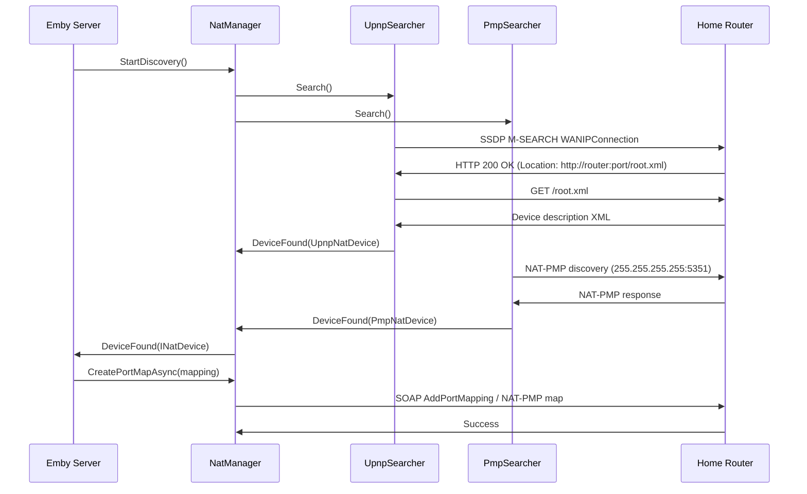

# Component: Mono.Nat

**Path:** `Mono.Nat/`
**Type:** Directory | Library
**Language:** C#
**Maps to:** `.discovery/143-mono-nat.md`

## Description

Mono.Nat is a managed C# library for Network Address Translation (NAT) traversal via UPnP-IGD and NAT-PMP protocols. It enables Emby Server to automatically configure port forwarding on home routers, allowing remote access without manual router configuration. Supports both UPnP (Universal Plug and Play) and NAT-PMP (NAT Port Mapping Protocol) discovery and port mapping.

## Structure

```
Mono.Nat/
├── Mono.Nat.csproj
├── Properties/
│   └── AssemblyInfo.cs            # Assembly metadata
├── Enums/
│   └── ProtocolType.cs            # NAT protocol enumeration
│       └── [enum] ProtocolType
│           ├── Upnp               # Universal Plug and Play
│           └── Pmp                # NAT Port Mapping Protocol
├── EventArgs/
│   └── DeviceEventArgs.cs         # NAT device discovery event
│       └── [class] DeviceEventArgs : EventArgs
│           └── [property] public INatDevice Device
├── INatDevice.cs                  # NAT device interface
│   └── [interface] INatDevice
│       ├── [method] Task CreatePortMap(Mapping mapping)
│       │   └── Creates port forwarding rule on router
│       ├── [method] Task DeletePortMap(Mapping mapping)
│       │   └── Removes port forwarding rule
│       ├── [method] Task<IEnumerable<Mapping>> GetAllMappings()
│       │   └── Returns all active port mappings
│       ├── [method] Task<IPAddress> GetExternalIP()
│       │   └── Queries router for public IP address
│       └── [property] public IPAddress LocalAddress
│           └── Local IP address of the device
├── ISearcher.cs                   # Device searcher interface
│   └── [interface] ISearcher
│       ├── [method] Task Search()
│       │   └── Broadcasts discovery message
│       └── [event] EventHandler<DeviceEventArgs> DeviceFound
├── AbstractNatDevice.cs           # Base NAT device implementation
│   └── [class] AbstractNatDevice : INatDevice
│       ├── [method] public abstract Task CreatePortMap(Mapping mapping)
│       ├── [method] public abstract Task DeletePortMap(Mapping mapping)
│       ├── [method] public abstract Task<IEnumerable<Mapping>> GetAllMappings()
│       ├── [method] public abstract Task<IPAddress> GetExternalIP()
│       ├── [property] public IPAddress LocalAddress
│       └── [property] public NatProtocol Protocol
├── Mapping.cs                     # Port mapping data
│   └── [class] Mapping
│       ├── [property] public Protocol Protocol
│       │   └── TCP or UDP
│       ├── [property] public int PrivatePort
│       │   └── Local port on this machine
│       ├── [property] public int PublicPort
│       │   └── External port on router
│       ├── [property] public IPAddress PrivateIP
│       ├── [property] public IPAddress PublicIP
│       ├── [property] public string Description
│       │   └── Rule description (e.g., "Emby Server")
│       └── [property] public int Lifetime
│           └── Lease duration in seconds
├── NatManager.cs                  # NAT manager facade
│   └── [class] NatManager : IDisposable
│       ├── [method] public void StartDiscovery()
│       │   ├── Creates UpnpSearcher and PmpSearcher
│       │   ├── Starts both discovery protocols in parallel
│       │   └── Listens for DeviceFound events
│       ├── [method] public void StopDiscovery()
│       │   └── Stops all searchers and disposes
│       ├── [method] public Task CreatePortMapAsync(Mapping mapping)
│       │   └── Creates mapping on first available NAT device
│       ├── [method] public Task DeletePortMapAsync(Mapping mapping)
│       │   └── Deletes mapping from all devices
│       └── [event] public EventHandler<DeviceEventArgs> DeviceFound
│           └── Fired when UPnP or NAT-PMP device discovered
├── NatProtocol.cs                 # Protocol constants
│   └── [class] NatProtocol
│       └── [const] string WanIPConnection = "urn:schemas-upnp-org:service:WANIPConnection:1"
├── Pmp/
│   ├── PmpConstants.cs            # NAT-PMP protocol constants
│   │   └── [class] PmpConstants
│   │       ├── [const] int PmpPort = 5351
│   │       │   └── NAT-PMP server port
│   │       ├── [const] byte Version = 0
│   │       ├── [const] byte OperationCode = 1
│   │       └── [const] int RetryDelay = 250
│   │           └── Initial retry delay in ms (doubles each retry)
│   ├── PmpSearcher.cs             # NAT-PMP device discovery
│   │   └── [class] PmpSearcher : ISearcher, IDisposable
│   │       ├── [method] public async Task Search()
│   │       │   ├── Sends NAT-PMP discovery to gateway (255.255.255.255:5351)
│   │       │   ├── Retries with exponential backoff (max 9 retries)
│   │       │   └── Parses response to create PmpNatDevice
│   │       └── [event] public EventHandler<DeviceEventArgs> DeviceFound
│   └── PmpNatDevice.cs            # NAT-PMP device implementation
│       └── [class] PmpNatDevice : AbstractNatDevice, IEquatable<PmpNatDevice>
│           ├── [method] public override Task CreatePortMap(Mapping mapping)
│           │   └── Sends NAT-PMP mapping request to gateway
│           ├── [method] public override Task DeletePortMap(Mapping mapping)
│           │   └── Sends NAT-PMP unmap request (lifetime=0)
│           ├── [method] public override Task<IEnumerable<Mapping>> GetAllMappings()
│           │   └── NAT-PMP does not support listing mappings
│           │   └── Returns empty list
│           └── [method] public override Task<IPAddress> GetExternalIP()
│               └── Sends NAT-PMP external address request
└── Upnp/
    ├── Messages/
    │   ├── UpnpMessage.cs         # Base UPnP SOAP message
    │   │   └── [class] MessageBase
    │   │       ├── [method] protected string BuildMessage(string body)
    │   │       │   └── Wraps body in SOAP envelope
    │   │       └── [method] protected string EncodeXml(string xml)
    │   │           └── XML-encodes special characters
    │   ├── GetServicesMessage.cs  # Service discovery message
    │   │   └── [class] GetServicesMessage : MessageBase
    │   │       └── [method] public string BuildMessage()
    │   │           └── Creates GetGenericPortMappingEntry SOAP request
    │   └── Requests/
    │       └── CreatePortMappingMessage.cs
    │           └── [class] CreatePortMappingMessage : MessageBase
    │               └── [method] public string BuildMessage(Mapping mapping)
    │                   └── Creates AddPortMapping SOAP request
    ├── Searchers/
    │   └── UpnpSearcher.cs        # UPnP device discovery
    │       └── [class] UpnpSearcher : ISearcher
    │           ├── [method] public async Task Search()
    │           │   ├── Sends SSDP M-SEARCH for WANIPConnection service
    │           │   ├── Listens for responses (timeout: 3 seconds)
    │           │   ├── Parses location URL from response
    │           │   ├── Fetches device description XML from location URL
    │           │   ├── Extracts control URL for WANIPConnection
    │           │   └── Creates UpnpNatDevice with control URL
    │           └── [event] public EventHandler<DeviceEventArgs> DeviceFound
    └── UpnpNatDevice.cs           # UPnP device implementation
        └── [class] UpnpNatDevice : AbstractNatDevice, IEquatable<UpnpNatDevice>
            ├── [method] public override Task CreatePortMap(Mapping mapping)
            │   └── POSTs AddPortMapping SOAP to control URL
            ├── [method] public override Task DeletePortMap(Mapping mapping)
            │   └── POSTs DeletePortMapping SOAP to control URL
            ├── [method] public override Task<IEnumerable<Mapping>> GetAllMappings()
            │   └── Iterates GetGenericPortMappingEntry (index 0..n)
            │   └── Stops when error (no more mappings)
            └── [method] public override Task<IPAddress> GetExternalIP()
                └── POSTs GetExternalIPAddress SOAP to control URL
```

## NAT Traversal Flow



## Side Effects

- Sends UDP multicast SSDP messages for UPnP discovery
- Sends UDP broadcast to 255.255.255.255:5351 for NAT-PMP
- Makes HTTP GET requests to router device description URLs
- Makes HTTP POST requests to router SOAP control URLs
- Creates port forwarding rules on home router
- No file I/O
