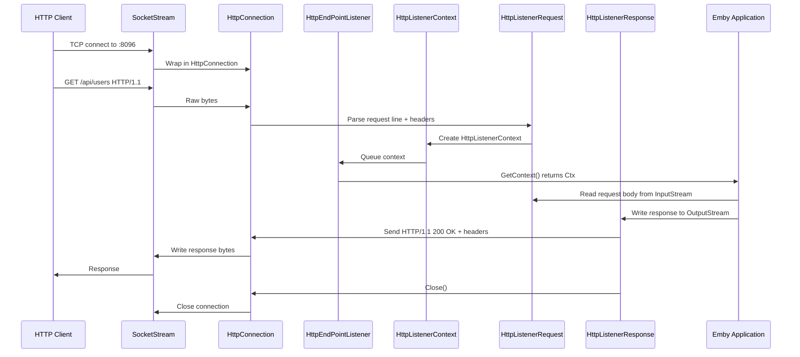
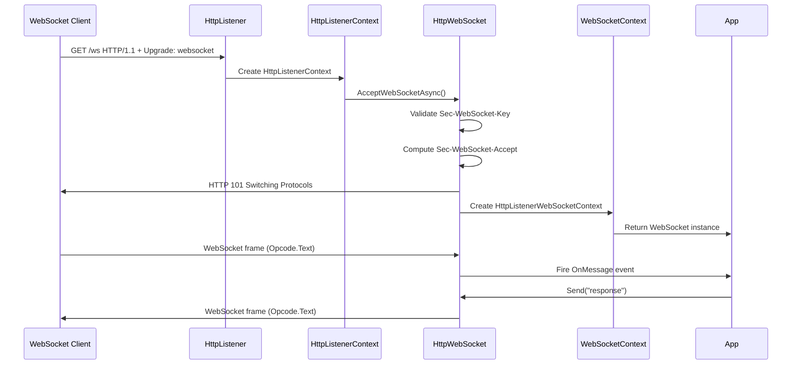

# Component: SocketHttpListener

**Path:** `SocketHttpListener/`
**Type:** Directory | Library
**Language:** C#
**Maps to:** `.discovery/144-sockethttplistener.md`

## Description

SocketHttpListener is a cross-platform managed HTTP server and WebSocket implementation for .NET. It provides `System.Net.HttpListener` functionality without requiring Windows-specific HTTP.sys kernel driver, making it portable to Linux and macOS via Mono. It also includes a full WebSocket implementation (`System.Net.WebSockets` equivalent) for real-time bidirectional communication. This is a critical infrastructure component that replaces platform-specific HTTP server APIs.

## Structure

```
SocketHttpListener/
├── SocketHttpListener.csproj
├── Properties/
│   └── AssemblyInfo.cs            # Assembly metadata
├── Primitives/
│   └── ITextEncoding.cs           # Text encoding abstraction
│       └── [interface] ITextEncoding
├── Net/
│   ├── HttpListener.cs            # Main HTTP server
│   │   └── [class] HttpListener : IDisposable
│   │       ├── [method] public void Start()
│   │       │   └── Binds to configured prefixes, starts accepting connections
│   │       ├── [method] public void Stop()
│   │       │   └── Stops accepting, closes active connections
│   │       ├── [method] public HttpListenerContext GetContext()
│   │       │   └── Blocks until HTTP request received
│   │       ├── [method] public Task<HttpListenerContext> GetContextAsync()
│   │       │   └── Async version of GetContext
│   │       ├── [property] public AuthenticationSchemes AuthenticationSchemes
│   │       ├── [property] public HttpListenerPrefixCollection Prefixes
│   │       └── [property] public bool IsListening
│   ├── HttpListenerContext.cs   # HTTP request/response context
│   │   └── [class] HttpListenerContext
│   │       ├── [property] public HttpListenerRequest Request
│   │       ├── [property] public HttpListenerResponse Response
│   │       ├── [property] public IPrincipal User
│   │       └── [method] public async Task<HttpListenerWebSocketContext> AcceptWebSocketAsync()
│   │           └── Upgrades HTTP connection to WebSocket
│   ├── HttpListenerRequest.cs   # HTTP request parsing
│   │   └── [class] HttpListenerRequest
│   │       ├── [property] public string HttpMethod
│   │       ├── [property] public Uri Url
│   │       ├── [property] public NameValueCollection Headers
│   │       ├── [property] public Stream InputStream
│   │       ├── [property] public string ContentType
│   │       ├── [property] public long ContentLength64
│   │       ├── [property] public bool IsAuthenticated
│   │       ├── [property] public bool IsSecureConnection
│   │       └── [property] public IPEndPoint RemoteEndPoint
│   ├── HttpListenerResponse.cs  # HTTP response generation
│   │   └── [class] HttpListenerResponse : IDisposable
│   │       ├── [property] public int StatusCode
│   │       ├── [property] public string StatusDescription
│   │       ├── [property] public WebHeaderCollection Headers
│   │       ├── [property] public Stream OutputStream
│   │       ├── [method] public void Close()
│   │       └── [method] public void Abort()
│   ├── HttpListenerPrefixCollection.cs
│   │   └── [class] HttpListenerPrefixCollection : ICollection<string>
│   │       ├── [method] public void Add(string uriPrefix)
│   │       │   └── e.g., "http://*:8096/"
│   │       └── [method] public bool Remove(string uriPrefix)
│   ├── HttpListenerBasicIdentity.cs
│   │   └── [class] HttpListenerBasicIdentity : GenericIdentity
│   │       └── [property] public string Password
│   │           └── Basic auth password (plaintext)
│   ├── HttpConnection.cs        # TCP connection management
│   │   └── [class] HttpConnection
│   │       ├── [method] public void Close()
│   │       ├── [method] public RequestStream GetRequestStream()
│   │       └── [method] public ResponseStream GetResponseStream()
│   ├── HttpEndPointListener.cs  # Endpoint listener (per-prefix)
│   │   └── [class] HttpEndPointListener
│   │       ├── [method] public void Start()
│   │       └── [method] public void Close()
│   ├── HttpEndPointManager.cs   # Endpoint manager (singleton)
│   │   └── [class] HttpEndPointManager
│   │       ├── [method] public static void AddEndpoint(...)
│   │       └── [method] public static void RemoveEndpoint(...)
│   ├── HttpRequestStream.cs     # Request body stream
│   │   └── [class] HttpRequestStream : Stream
│   │       └── [method] public override int Read(byte[] buffer, int offset, int count)
│   ├── HttpResponseStream.cs    # Response body stream
│   │   └── [class] HttpResponseStream : Stream
│   │       └── [method] public override void Write(byte[] buffer, int offset, int count)
│   ├── ChunkedInputStream.cs    # HTTP chunked transfer decoding
│   │   └── [class] ChunkedInputStream : HttpRequestStream
│   │       └── Reads chunked-encoded request bodies
│   ├── ChunkStream.cs           # HTTP chunk parser
│   │   └── [class] ChunkStream
│   │       └── Parses chunk size and data
│   ├── HttpListenerRequestUriBuilder.cs
│   │   └── [class] HttpListenerRequestUriBuilder
│   │       └── Builds absolute URI from request line and Host header
│   ├── ListenerPrefix.cs        # URI prefix parser
│   │   └── [class] ListenerPrefix
│   │       └── Parses "scheme://host:port/path"
│   ├── WebHeaderCollection.cs   # HTTP header collection
│   │   └── [class] WebHeaderCollection : QueryParamCollection
│   │       ├── [method] public void Add(string name, string value)
│   │       ├── [method] public string Get(string name)
│   │       └── [method] public void Set(string name, string value)
│   ├── WebHeaderEncoding.cs     # Header value encoding
│   │   └── [class] WebHeaderEncoding
│   │       └── Handles RFC 5987 encoding
│   ├── HttpKnownHeaderNames.cs  # Standard header names
│   │   └── [class] HttpKnownHeaderNames
│   │       └── Constants for common headers (Content-Type, etc.)
│   ├── HttpStatusCode.cs        # HTTP status codes
│   │   └── [enum] HttpStatusCode
│   │       ├── OK = 200
│   │       ├── NotFound = 404
│   │       ├── InternalServerError = 500
│   │       └── ... (full HTTP status code enumeration)
│   ├── HttpStatusDescription.cs # Status code descriptions
│   │   └── [class] HttpStatusDescription
│   │       └── Maps codes to "OK", "Not Found", etc.
│   ├── HttpVersion.cs           # HTTP version constants
│   │   └── [class] HttpVersion
│   │       ├── Version10 = "HTTP/1.0"
│   │       └── Version11 = "HTTP/1.1"
│   ├── HttpStreamAsyncResult.cs # Async I/O result
│   │   └── [class] HttpStreamAsyncResult : IAsyncResult
│   ├── CookieHelper.cs          # Cookie parsing
│   │   └── [class] CookieHelper
│   │       └── Parses Set-Cookie and Cookie headers
│   ├── AuthenticationTypes.cs   # Auth scheme constants
│   │   └── [class] AuthenticationTypes
│   ├── AuthenticationSchemeSelector.cs
│   │   └── [class] AuthenticationSchemeSelector
│   ├── BoundaryType.cs          # MIME boundary type
│   │   └── [enum] BoundaryType
│   ├── EntitySendFormat.cs      # Entity body format
│   │   └── [enum] EntitySendFormat
│   └── WebSockets/
│       ├── WebSocketContext.cs  # Base WebSocket context
│       │   └── [class] WebSocketContext
│       │       ├── [property] public WebSocket WebSocket
│       │       ├── [property] public string SecWebSocketKey
│       │       ├── [property] public string SecWebSocketProtocol
│       │       └── [property] public string SecWebSocketExtensions
│       ├── HttpListenerWebSocketContext.cs
│       │   └── [class] HttpListenerWebSocketContext : WebSocketContext
│       │       └── Wraps HttpListenerContext for WebSocket upgrade
│       ├── HttpWebSocket.cs     # WebSocket protocol handler
│       │   └── [class] HttpWebSocket
│       │       ├── [method] static WebSocket CreateServerWebSocket(...)
│       │       └── Handles WebSocket handshake and framing
│       └── WebSocketValidate.cs # WebSocket validation
│           └── [class] WebSocketValidate
│               └── Validates Sec-WebSocket-Key, protocol, extensions
├── WebSocket.cs                 # Public WebSocket API
│   └── [class] WebSocket : IDisposable
│       ├── [method] public void Connect()
│       ├── [method] public void Close()
│       ├── [method] public void Send(string data)
│       ├── [method] public void Send(byte[] data)
│       ├── [event] public EventHandler<MessageEventArgs> OnMessage
│       ├── [event] public EventHandler<CloseEventArgs> OnClose
│       └── [event] public EventHandler<ErrorEventArgs> OnError
├── WebSocketFrame.cs            # WebSocket frame parser
│   └── [class] WebSocketFrame : IEnumerable<byte>
│       ├── [property] public bool IsFinal
│       ├── [property] public Opcode Opcode
│       ├── [property] public byte[] PayloadData
│       └── [method] public byte[] ToByteArray()
├── PayloadData.cs               # WebSocket payload
│   └── [class] PayloadData : IEnumerable<byte>
├── SocketStream.cs              # Raw socket stream
│   └── [class] SocketStream : Stream
│       └── Wraps Socket for Stream API
├── HttpBase.cs                  # Base HTTP message
│   └── [class] HttpBase
├── HttpResponse.cs              # HTTP response parser
│   └── [class] HttpResponse : HttpBase
├── Ext.cs                       # Extension methods
│   └── [class] Ext
├── ByteOrder.cs                 # Byte order enum
│   └── [enum] ByteOrder
├── Opcode.cs                    # WebSocket opcode enum
│   └── [enum] Opcode
│       ├── Continuation = 0
│       ├── Text = 1
│       ├── Binary = 2
│       ├── Close = 8
│       ├── Ping = 9
│       └── Pong = 10
├── CloseStatusCode.cs           # WebSocket close codes
│   └── [enum] CloseStatusCode
├── CompressionMethod.cs         # Compression enum
│   └── [enum] CompressionMethod
├── Fin.cs                       # FIN flag enum
│   └── [enum] Fin
├── Mask.cs                      # MASK flag enum
│   └── [enum] Mask
├── Rsv.cs                       # RSV flag enum
│   └── [enum] Rsv
├── MessageEventArgs.cs          # Message received event
│   └── [class] MessageEventArgs : EventArgs
│       ├── [property] public string Data
│       └── [property] public byte[] RawData
├── CloseEventArgs.cs            # Close event
│   └── [class] CloseEventArgs : EventArgs
│       ├── [property] public ushort Code
│       └── [property] public string Reason
└── ErrorEventArgs.cs            # Error event
    └── [class] ErrorEventArgs : EventArgs
        └── [property] public Exception Exception
```

## HTTP Request Flow



## WebSocket Upgrade Flow



## Side Effects

- Binds TCP sockets to configured ports
- Accepts incoming TCP connections
- Reads/writes raw socket data
- Parses HTTP request lines and headers
- Handles chunked transfer encoding
- Manages WebSocket frame parsing and masking
- No file I/O (pure network I/O)
