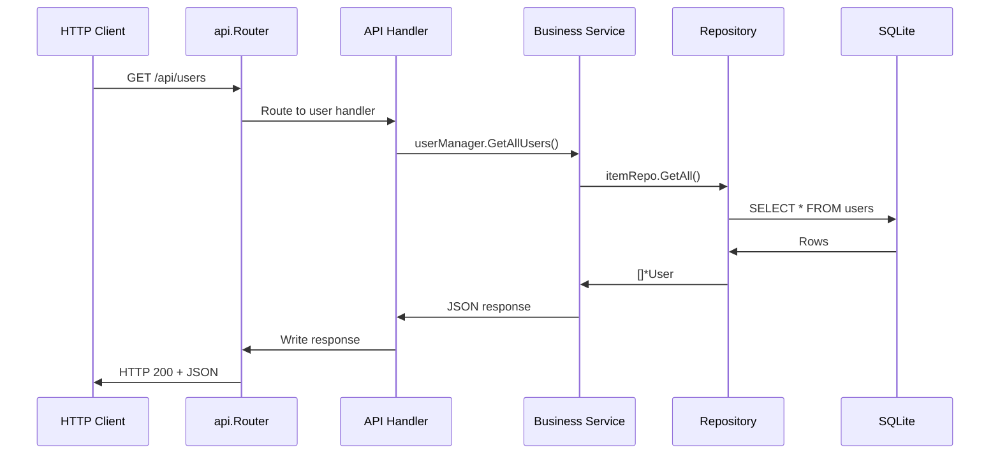

# Component: emby-go

**Path:** `emby-go/`
**Type:** Directory | Go Application
**Language:** Go
**Maps to:** `.discovery/145-emby-go.md`
**Dependencies:**
- `github.com/go-chi/chi/v5` — HTTP router
- `github.com/go-chi/chi/v5/middleware` — HTTP middleware
- `go.uber.org/zap` — Structured logging
- `github.com/mattn/go-sqlite3` — SQLite driver
- `database/sql` — Standard SQL interface
- `github.com/golang-jwt/jwt/v5` — JWT authentication
- `github.com/nfnt/resize` — Image resizing
- `github.com/bbrks/go-blurhash` — BlurHash generation
- `github.com/google/uuid` — UUID generation
- `github.com/spf13/viper` — Configuration management
- `github.com/robfig/cron/v3` — Cron scheduling
- `github.com/gorilla/websocket` — WebSocket client
- `github.com/stretchr/testify` — Testing assertions

## Description

emby-go is a Go-based reimplementation of the Emby Server core. It provides a modern, cross-platform HTTP API server with REST endpoints, WebSocket real-time communication, SQLite database persistence, media library management, user authentication with JWT, transcoding support via FFmpeg, DLNA server, scheduled tasks, and notification system. It uses the Chi router for HTTP handling and Zap for structured logging.

## Structure

```
emby-go/
├── cmd/
│   └── emby-server/
│       └── main.go                  # Application entry point
│           └── [func] main()
│               ├── Loads configuration via config.LoadConfig()
│               ├── Initializes Zap logger
│               ├── Creates database.Manager (SQLite)
│               ├── Creates server.HTTPServer
│               ├── Registers all API routes via api.NewRouter()
│               └── Starts HTTP server on configured port
├── internal/
│   ├── api/
│   │   ├── router.go                # HTTP route registration
│   │   │   └── [func] NewRouter(cfg, logger, dbManager) *Router
│   │   │       ├── Creates chi.Mux router
│   │   │       ├── Applies middleware (logging, recovery, auth)
│   │   │       └── Calls registerAll() for all route groups
│   │   │   └── [func] (r *Router) RegisterAll()
│   │   │       ├── registerLibraryRoutes()   → GET /api/library/*
│   │   │       ├── registerSessionRoutes()   → GET|POST /api/sessions/*
│   │   │       ├── registerUserRoutes()      → GET|POST /api/users/*
│   │   │       ├── registerDeviceRoutes()  → GET|POST /api/devices/*
│   │   │       ├── registerImageRoutes()     → GET /api/images/*
│   │   │       ├── registerMediaRoutes()    → GET /api/media/*
│   │   │       ├── registerNotificationRoutes() → GET|POST /api/notifications/*
│   │   │       ├── registerScheduledTaskRoutes() → GET|POST /api/scheduledtasks/*
│   │   │       └── registerTranscodingRoutes() → GET /api/transcoding/*
│   │   ├── middleware/
│   │   │   ├── auth.go              # JWT authentication middleware
│   │   │   │   └── [func] Authenticate(next http.Handler) http.Handler
│   │   │   │       ├── Extracts Bearer token from Authorization header
│   │   │   │       ├── Validates JWT signature
│   │   │   │       ├── Sets user context for downstream handlers
│   │   │   │       └── Returns 401 Unauthorized on failure
│   │   │   └── middleware.go        # Common middleware
│   │   │       └── [func] LoggerMiddleware, RecoveryMiddleware
│   │   └── handlers/
│   │       ├── activity.go          # Activity log endpoints
│   │       ├── branding.go          # Server branding endpoints
│   │       ├── channel.go           # Channel endpoints
│   │       ├── config.go            # Configuration endpoints
│   │       ├── device.go            # Device management endpoints
│   │       ├── displayprefs.go      # Display preferences endpoints
│   │       ├── environment.go       # Environment info endpoints
│   │       ├── filter.go            # Filter endpoints
│   │       ├── games.go             # Games endpoints
│   │       ├── image.go             # Image endpoints
│   │       ├── library.go           # Library endpoints
│   │       ├── livetv.go            # Live TV endpoints
│   │       ├── localization.go      # Localization endpoints
│   │       ├── media.go             # Media endpoints
│   │       ├── movies.go            # Movies endpoints
│   │       ├── notification.go      # Notification endpoints
│   │       ├── package.go           # Package endpoints
│   │       ├── playback.go          # Playback endpoints
│   │       ├── playlist.go          # Playlist endpoints
│   │       ├── scheduledtask.go     # Scheduled task endpoints
│   │       ├── search.go            # Search endpoints
│   │       ├── session.go           # Session endpoints
│   │       ├── startup.go           # Startup endpoints
│   │       ├── system.go            # System endpoints
│   │       ├── transcoding.go       # Transcoding endpoints
│   │       ├── tvshows.go           # TV shows endpoints
│   │       └── user.go              # User endpoints
│   ├── config/
│   │   ├── config.go                # Configuration management
│   │   │   └── [func] DefaultConfig() *Config
│   │   │       ├── ServerPort: 8096
│   │   │       ├── DatabasePath: "emby.db"
│   │   │       ├── LogLevel: "info"
│   │   │       └── ...
│   │   │   └── [func] LoadConfig(path string) (*Config, error)
│   │   │       ├── Reads from YAML/JSON file
│   │   │       ├── Falls back to environment variables
│   │   │       └── Returns populated Config struct
│   │   │   └── [func] (c *Config) SaveConfig(path string) error
│   │   │       └── Serializes Config to YAML file
│   │   └── config_test.go           # Config tests
│   ├── database/
│   │   └── database.go              # SQLite database manager
│   │       └── [func] NewManager(cfg) (*Manager, error)
│   │           ├── Opens SQLite connection with WAL mode
│   │           ├── Runs schema migrations
│   │           └── Returns Manager with *sql.DB
│   │       └── [func] (m *Manager) DB() *sql.DB
│   │       └── [func] (m *Manager) Close() error
│   │       └── [func] (m *Manager) Ping() error
│   ├── model/
│   │   ├── item.go                  # Media item models
│   │   │   └── [type] MediaItem struct
│   │   │       ├── ID, Name, Type, Path, DateCreated
│   │   │       ├── ParentID, IndexNumber, ProductionYear
│   │   │       ├── Overview, Genres, Tags, Studios
│   │   │       ├── People []Person
│   │   │       └── MediaSources []MediaSource
│   │   │   └── [type] MediaSource struct
│   │   │       ├── ID, Path, Protocol, Container
│   │   │       ├── VideoCodec, AudioCodec, SubtitleCodec
│   │   │       ├── Width, Height, Bitrate, Size
│   │   │       └── Streams []MediaStream
│   │   │   └── [type] StreamInfo struct
│   │   │       ├── ID, MediaSourceID, Path
│   │   │       ├── Container, VideoCodec, AudioCodec
│   │   │       └── Bitrate, Width, Height
│   │   │   └── [type] Channel struct
│   │   │   └── [type] Person struct
│   │   │       ├── Name, Role, Type
│   │   │       └── ImageUrl
│   │   │   └── [type] UserData struct
│   │   │       ├── PlaybackPositionTicks, IsFavorite
│   │   │       └── LastPlayedDate
│   │   ├── session.go               # Session models
│   │   │   └── [type] SessionInfo struct
│   │   │       ├── ID, UserID, DeviceID, DeviceName
│   │   │       ├── Client, ApplicationVersion
│   │   │       ├── LastActivityDate, LastPlaybackCheckIn
│   │   │       ├── NowPlayingItem, PlayState
│   │   │       └── Capabilities, TranscodingInfo
│   │   │   └── [type] SessionUser struct
│   │   │   └── [type] Capabilities struct
│   │   │       ├── PlayableMediaTypes, SupportedCommands
│   │   │       └── MessageCallbackUrl
│   │   │   └── [type] TranscodingProfile struct
│   │   │   └── [type] DirectPlayProfile struct
│   │   │   └── [type] SubtitleProfile struct
│   │   │   └── [type] PlayState struct
│   │   │       ├── PositionTicks, IsPaused, IsMuted
│   │   │       └── VolumeLevel, AudioStreamIndex, SubtitleStreamIndex
│   │   │   └── [type] TranscodingInfo struct
│   │   │       ├── AudioCodec, VideoCodec, Container
│   │   │       ├── Bitrate, Framerate, CompletionPercentage
│   │   │       ├── Width, Height, AudioChannels
│   │   │       └── SubProtocol, TranscodeReasons
│   │   ├── stream.go                # Media stream models
│   │   │   └── [type] MediaStream struct
│   │   │       ├── ID, Type, Codec, Language
│   │   │       ├── IsDefault, IsForced, IsExternal
│   │   │       ├── Path, Index, Bitrate
│   │   │       └── Width, Height, ChannelLayout
│   │   ├── user.go                  # User models
│   │   │   └── [type] User struct
│   │   │       ├── ID, Name, Email, PasswordHash
│   │   │       ├── DateCreated, LastActivityDate
│   │   │       ├── IsAdmin, IsHidden, IsDisabled
│   │   │       └── Configuration UserConfiguration
│   │   │   └── [type] UserPolicy struct
│   │   │       ├── IsAdministrator, IsHidden, EnableUserPreferenceAccess
│   │   │       ├── EnableRemoteControlOfOtherUsers
│   │   │       ├── EnableSharedDeviceControl
│   │   │       ├── EnableLiveTvManagement
│   │   │       ├── EnableLiveTvAccess
│   │   │       ├── EnableMediaPlayback
│   │   │       ├── EnableAudioPlaybackTranscoding
│   │   │       ├── EnableVideoPlaybackTranscoding
│   │   │       ├── EnablePlaybackRemuxing
│   │   │       ├── EnableContentDeletion
│   │   │       ├── EnableContentDownloading
│   │   │       ├── EnableSubtitleDownloading
│   │   │       ├── EnableSubtitleManagement
│   │   │       ├── EnableSyncTranscoding
│   │   │       ├── EnableMediaConversion
│   │   │       ├── EnableAllDevices
│   │   │       ├── EnabledDevices
│   │   │       └── EnablePublicSharing
│   │   │   └── [type] UserConfiguration struct
│   │   │       ├── AudioLanguagePreference
│   │   │       ├── PlayDefaultAudioTrack
│   │   │       ├── SubtitleLanguagePreference
│   │   │       ├── DisplayMissingEpisodes
│   │   │       ├── DisplayCollectionsView
│   │   │       ├── EnableLocalPassword
│   │   │       ├── OrderedViews
│   │   │       ├── LatestItemsExcludes
│   │   │       ├── MyMediaExcludes
│   │   │       ├── HidePlayedInLatest
│   │   │       ├── RememberAudioSelections
│   │   │       ├── RememberSubtitleSelections
│   │   │       └── EnableNextEpisodeAutoPlay
│   │   └── model_test.go            # Model tests
│   ├── repository/
│   │   ├── base.go                  # Base repository
│   │   │   └── [func] NewBaseRepository(db *sql.DB) *BaseRepository
│   │   │   └── [func] (r *BaseRepository) Exec(query string, args ...interface{})
│   │   │   └── [func] (r *BaseRepository) Query(query string, args ...interface{})
│   │   │   └── [func] (r *BaseRepository) QueryRow(query string, args ...interface{})
│   │   ├── item.go                  # Media item repository
│   │   │   └── [func] NewItemRepository(db *sql.DB) *ItemRepository
│   │   │   └── [func] (r *ItemRepository) Create(item *model.MediaItem) error
│   │   │   └── [func] (r *ItemRepository) GetByID(id string) (*model.MediaItem, error)
│   │   │   └── [func] (r *ItemRepository) GetByParentID(parentID string) ([]*model.MediaItem, error)
│   │   │   └── [func] (r *ItemRepository) Update(item *model.MediaItem) error
│   │   │   └── [func] (r *ItemRepository) Delete(id string) error
│   │   │   └── [func] (r *ItemRepository) Search(query string) ([]*model.MediaItem, error)
│   │   └── item_test.go             # Item repository tests
│   ├── server/
│   │   ├── http.go                  # HTTP server
│   │   │   └── [func] NewHTTPServer(cfg, logger) *HTTPServer
│   │   │       ├── Creates chi.Mux router
│   │   │       ├── Configures middleware stack
│   │   │       └── Returns HTTPServer with Start/Shutdown
│   │   │   └── [func] (s *HTTPServer) Start() error
│   │   │       ├── Binds to configured port
│   │   │       └── Starts accepting connections
│   │   │   └── [func] (s *HTTPServer) Shutdown(ctx context.Context) error
│   │   │       └── Graceful shutdown with timeout
│   │   │   └── [func] (s *HTTPServer) Router() *chi.Mux
│   │   │   └── [func] (s *HTTPServer) GetConfig() *config.Config
│   │   │   └── [func] (s *HTTPServer) GetLogger() *zap.Logger
│   │   └── ws/
│   │       └── websocket.go         # WebSocket server
│   │           └── [func] NewWebSocketServer(logger *zap.Logger) *WebSocketServer
│   │           └── [func] (s *WebSocketServer) HandleConnection(w, r)
│   │           └── [func] (s *WebSocketServer) Broadcast(msg []byte)
│   │           └── [func] (s *WebSocketServer) SendToSession(sessionID string, msg []byte)
│   ├── service/
│   │   ├── auth/
│   │   │   └── auth.go              # Authentication service
│   │   │       └── [func] NewUserManager() *UserManager
│   │   │       └── [func] (m *UserManager) AuthenticateUser(username, password string) (*Session, error)
│   │   │           ├── Validates username/password
│   │   │           ├── Hashes password with bcrypt
│   │   │           ├── Generates JWT token
│   │   │           └── Returns Session with token
│   │   │       └── [func] (m *UserManager) ValidateSession(token string) (*Session, error)
│   │   │           ├── Parses JWT token
│   │   │           ├── Validates signature and expiry
│   │   │           └── Returns Session or error
│   │   │       └── [func] (m *UserManager) InvalidateSession(token string) error
│   │   │       └── [func] (m *UserManager) GetSession(token string) (*Session, error)
│   │   │       └── [func] (m *UserManager) GetActiveSessions(userID string) []*Session
│   │   │       └── [func] HashPassword(password string) string
│   │   │           └── bcrypt with cost factor 12
│   │   │       └── [func] VerifyPassword(password, hash string) bool
│   │   ├── device/
│   │   │   └── device.go            # Device management service
│   │   │       └── [func] NewManager(logger) *Manager
│   │   │       └── [func] (m *Manager) RegisterDevice(d *Device) error
│   │   │       └── [func] (m *Manager) UpdateDevice(id, name, productName string) error
│   │   │       └── [func] (m *Manager) GetDevice(id string) (*Device, bool)
│   │   │       └── [func] (m *Manager) GetDevices() []*Device
│   │   │       └── [func] (m *Manager) RemoveDevice(id string) error
│   │   │       └── [func] (m *Manager) GetDeviceProfile(id string) (*DeviceProfile, bool)
│   │   │       └── [func] (m *Manager) GetActiveDeviceCount() int
│   │   ├── image/
│   │   │   ├── image.go             # Image service
│   │   │   │   └── [func] NewManager(logger) *Manager
│   │   │   │   └── [func] (m *Manager) GetItemImage(itemID, imageType, quality, width, height, tag string) ([]byte, string, error)
│   │   │   │       ├── Reads image from disk
│   │   │   │       ├── Resizes if width/height specified
│   │   │   │       ├── Applies quality compression
│   │   │   │       └── Returns image bytes + content type
│   │   │   │   └── [func] (m *Manager) GetImageBlurHash(itemID string, imageType ImageType) (string, error)
│   │   │   │       └── Generates BlurHash for placeholder
│   │   │   │   └── [func] (m *Manager) GetImageCrop(itemID, imageType, width, height int, cropPosition string) ([]byte, string, error)
│   │   │   │   └── [func] (m *Manager) GetImageResize(itemID, imageType, width, height int, quality int) ([]byte, string, error)
│   │   │   │   └── [func] (m *Manager) GetImageRotation(itemID, imageType, angle int) ([]byte, string, error)
│   │   │   │   └── [func] (m *Manager) AddImage(itemID string, image *ImageInfo) error
│   │   │   │   └── [func] (m *Manager) RemoveImage(itemID string, imageType ImageType) error
│   │   │   │   └── [func] (m *Manager) GetImages(itemID string) []*ImageInfo
│   │   │   │   └── [func] (m *Manager) GetImagesByType(itemID string, imageType ImageType) []*ImageInfo
│   │   │   │   └── [func] (m *Manager) GetImageCount(itemID string) int
│   │   │   │   └── [func] (m *Manager) GetImageCountByType(itemID string, imageType ImageType) int
│   │   │   └── processor.go         # Image processing
│   │   │       └── [func] ResizeImage(img image.Image, width, height int) image.Image
│   │   │       └── [func] CropImage(img image.Image, width, height int, position string) image.Image
│   │   │       └── [func] RotateImage(img image.Image, angle int) image.Image
│   │   │       └── [func] GenerateBlurHash(img image.Image) (string, error)
│   │   ├── library/
│   │   │   ├── library.go           # Library service
│   │   │   │   └── [func] NewManager(cfg, logger, dbManager) *Manager
│   │   │   │   └── [func] (m *Manager) RegisterRoutes(r chi.Router)
│   │   │   │       ├── GET /api/library/items
│   │   │   │       ├── GET /api/library/items/{id}
│   │   │   │       ├── POST /api/library/items
│   │   │   │       ├── PUT /api/library/items/{id}
│   │   │   │       ├── DELETE /api/library/items/{id}
│   │   │   │       └── GET /api/library/search
│   │   │   ├── scanner.go           # Library scanner
│   │   │   │   └── [func] NewScanner(cfg, logger, dbManager) *Scanner
│   │   │   │   └── [func] (s *Scanner) ScanLibrary(libraryID string) error
│   │   │   │       ├── Walks library path recursively
│   │   │   │       ├── Identifies media files by extension
│   │   │   │       ├── Extracts metadata (FFprobe)
│   │   │   │       ├── Creates/updates MediaItem records
│   │   │   │       └── Generates thumbnails
│   │   │   │   └── [func] (s *Scanner) ScanAllLibraries() error
│   │   │   ├── notifier.go          # Library change notifier
│   │   │   │   └── [func] NewNotifier(logger) *Notifier
│   │   │   │   └── [func] (n *Notifier) NotifyLibraryChanged(libraryID string)
│   │   │   │       └── Broadcasts WebSocket message to connected clients
│   │   │   └── scanner_test.go      # Scanner tests
│   │   ├── media/
│   │   │   ├── media.go             # Media service
│   │   │   │   └── [func] NewManager(cfg, logger) *Manager
│   │   │   │   └── [func] (m *Manager) GetMediaSource(itemID string) (*MediaSource, error)
│   │   │   │   └── [func] (m *Manager) GetMediaSources(itemID string) ([]MediaSource, error)
│   │   │   │   └── [func] (m *Manager) GetMediaInfo(filePath string) (*MediaInfo, error)
│   │   │   │       ├── Runs FFprobe on file
│   │   │   │       ├── Parses JSON output
│   │   │   │       ├── Extracts video/audio/subtitle streams
│   │   │   │       └── Returns MediaInfo struct
│   │   │   │   └── [func] (m *Manager) extractMediaInfo(filePath string) (*MediaInfo, error)
│   │   │   └── stream_manager.go    # Stream management
│   │   │       └── [func] (m *Manager) GetStreamURL(itemID, profile string) (*StreamInfo, error)
│   │   │       └── [func] (m *Manager) GetDirectStreamURL(itemID string) (string, error)
│   │   ├── metadata/
│   │   │   ├── metadata.go          # Metadata service
│   │   │   │   └── [func] NewManager(logger) *Manager
│   │   │   │   └── [func] (m *Manager) RegisterProvider(provider *MetadataProvider) error
│   │   │   │   └── [func] (m *Manager) GetProvider(id string) (*MetadataProvider, bool)
│   │   │   │   └── [func] (m *Manager) GetAllProviders() []*MetadataProvider
│   │   │   │   └── [func] (m *Manager) GetEnabledProviders() []*MetadataProvider
│   │   │   │   └── [func] (m *Manager) GetProvidersByType(providerType string) []*MetadataProvider
│   │   │   │   └── [func] (m *Manager) EnableProvider(id string) error
│   │   │   │   └── [func] (m *Manager) DisableProvider(id string) error
│   │   │   │   └── [func] (m *Manager) GetProviderCount() int
│   │   │   │   └── [func] (m *Manager) GetEnabledProviderCount() int
│   │   │   ├── fetcher.go           # Metadata fetcher
│   │   │   │   └── [func] (f *Fetcher) FetchMetadata(item *model.MediaItem) error
│   │   │   │       ├── Queries enabled providers in priority order
│   │   │   │       ├── Fetches metadata from external APIs
│   │   │   │       ├── Merges results into MediaItem
│   │   │   │       └── Returns error if all providers fail
│   │   │   └── limiter.go           # Rate limiter
│   │   │       └── [func] NewRateLimiter(requestsPerSecond int) *RateLimiter
│   │   │       └── [func] (l *RateLimiter) Wait()
│   │   ├── notification/
│   │   │   └── manager.go           # Notification service
│   │   │       └── [func] NewManager() *Manager
│   │   │       └── [func] (m *Manager) RegisterProvider(provider *Provider)
│   │   │       └── [func] (m *Manager) GetProviders() []*Provider
│   │   │       └── [func] (m *Manager) SendNotification(notification *Notification) error
│   │   │           ├── Routes to appropriate provider
│   │   │       └── [func] (m *Manager) GetNotifications(userID string) []*Notification
│   │   │       └── [func] (m *Manager) MarkAsRead(notificationID string) error
│   │   │       └── [func] (m *Manager) MarkAllAsRead(userID string) error
│   │   │       └── [func] (m *Manager) DeleteNotification(notificationID string) error
│   │   │       └── [func] (m *Manager) GetUnreadCount(userID string) int
│   │   ├── scheduled/
│   │   │   └── tasks.go             # Scheduled task service
│   │   │       └── [func] NewManager(logger) *Manager
│   │   │       └── [func] (m *Manager) RegisterTask(task *Task) error
│   │   │       └── [func] (m *Manager) GetTask(id string) (*Task, bool)
│   │   │       └── [func] (m *Manager) GetAllTasks() []*Task
│   │   │       └── [func] (m *Manager) GetRunningTasks() []*Task
│   │   │       └── [func] (m *Manager) GetTasksByCategory(category string) []*Task
│   │   │       └── [func] (m *Manager) ExecuteTask(id string) error
│   │   │           ├── Runs task in goroutine
│   │   │           ├── Updates progress
│   │   │           └── Marks complete on finish
│   │   │       └── [func] (m *Manager) CancelTask(id string) error
│   │   │       └── [func] (m *Manager) UpdateTaskProgress(id string, progress int) error
│   │   │       └── [func] (m *Manager) CompleteTask(id string) error
│   │   │       └── [func] (m *Manager) GetTaskCount() int
│   │   │       └── [func] (m *Manager) GetRunningTaskCount() int
│   │   │       └── [func] (m *Manager) GetTasksByStatus(running bool) []*Task
│   │   ├── session/
│   │   │   ├── session.go           # Session service
│   │   │   │   └── [func] NewManager(cfg, logger) *Manager
│   │   │   │   └── [func] (m *Manager) CreateSession(session *SessionInfo) error
│   │   │   │   └── [func] (m *Manager) GetSession(id string) (*SessionInfo, bool)
│   │   │   │   └── [func] (m *Manager) GetAllSessions() []*SessionInfo
│   │   │   │   └── [func] (m *Manager) UpdateSession(id string, position, volume, isPaused) error
│   │   │   │   └── [func] (m *Manager) DeleteSession(id string) error
│   │   │   │   └── [func] (m *Manager) GetSessionsByDevice(deviceName string) []*SessionInfo
│   │   │   │   └── [func] (m *Manager) GetSessionsByUser(displayName string) []*SessionInfo
│   │   │   │   └── [func] (m *Manager) GetActiveSessionCount() int
│   │   │   ├── websocket.go         # Session WebSocket
│   │   │   │   └── [func] (m *Manager) HandleWebSocket(w, r)
│   │   │   │       ├── Upgrades HTTP to WebSocket
│   │   │   │       ├── Associates with session
│   │   │   │       └── Handles real-time playback commands
│   │   │   └── session_test.go      # Session tests
│   │   ├── transcoding/
│   │   │   └── transcoding.go       # Transcoding service
│   │   │       └── [func] NewManager(cfg, logger) *Manager
│   │   │       └── [func] (m *Manager) GetStreamURL(itemID, profile string) (*StreamInfo, error)
│   │   │       └── [func] (m *Manager) BuildTranscodeCommand(itemID, mediaSourceID string, config TranscodeConfig) (*exec.Cmd, error)
│   │   │           ├── Determines output codec/container
│   │   │           ├── Builds FFmpeg command line
│   │   │           ├── Sets bitrate, resolution, audio channels
│   │   │           └── Returns *exec.Cmd ready to run
│   │   │       └── [func] (m *Manager) ExecuteTranscode(cmd *exec.Cmd) (io.ReadCloser, error)
│   │   │           ├── Starts FFmpeg process
│   │   │           ├── Returns stdout pipe for streaming
│   │   │           └── Manages process lifecycle
│   │   │       └── [func] (m *Manager) BuildAudioTranscodeCommand(itemID, mediaSourceID string, config AudioTranscodeConfig) (*exec.Cmd, error)
│   │   │       └── [func] (m *Manager) ExecuteAudioTranscode(cmd *exec.Cmd) (io.ReadCloser, error)
│   │   │       └── [func] (m *Manager) GetSubtitleStream(itemID, subtitleIndex, format string) ([]byte, error)
│   │   │       └── [func] (m *Manager) GetActiveStreamCount() int
│   │   │       └── [func] (m *Manager) StopStream(streamID string) error
│   │   │       └── [func] (m *Manager) GetTranscodingProfiles() []TranscodingProfile
│   │   └── user/
│   │       ├── user.go              # User service
│   │       │   └── [func] NewManager(dbManager, logger) *Manager
│   │       │   └── [func] (m *Manager) CreateUser(user *User) error
│   │       │       ├── Validates email uniqueness
│   │       │       ├── Hashes password with bcrypt
│   │       │       ├── Inserts into database
│   │       │       └── Returns error on duplicate
│   │       │   └── [func] (m *Manager) GetUser(id string) (*User, bool)
│   │       │   └── [func] (m *Manager) GetUserByName(name string) (*User, bool)
│   │       │   └── [func] (m *Manager) GetUserByEmail(email string) (*User, bool)
│   │       │   └── [func] (m *Manager) GetAllUsers() []*User
│   │       │   └── [func] (m *Manager) UpdateUser(id string, name, email, password) error
│   │       │   └── [func] (m *Manager) DeleteUser(id string) error
│   │       │   └── [func] (m *Manager) AuthenticateUser(email, password string) (*Session, error)
│   │       │       ├── Looks up user by email
│   │       │       ├── Verifies bcrypt password hash
│   │       │       ├── Generates JWT token
│   │       │       └── Returns Session with token
│   │       │   └── [func] (m *Manager) ValidateSession(token string) (*Session, error)
│   │       │       └── [func] (m *Manager) RevokeSession(token string) error
│   │       └── user_test.go         # User tests
│   ├── dlna/
│   │   ├── server.go                # DLNA server
│   │   │   └── [func] NewServer(cfg, logger) *Server
│   │   │   └── [func] (s *Server) Start() error
│   │   │       ├── Creates HTTP server on DLNA port
│   │   │       ├── Serves SSDP discovery responses
│   │   │       ├── Serves ContentDirectory SOAP
│   │   │       └── Serves media streaming
│   │   │   └── [func] (s *Server) Stop() error
│   │   └── xml/
│   │       └── descriptors.go       # DLNA XML descriptors
│   │           └── [func] GenerateDeviceDescription() string
│   │           └── [func] GenerateContentDirectory() string
│   │           └── [func] GenerateBrowseResponse(items []*model.MediaItem) string
│   ├── logging/
│   │   └── logging.go               # Logging setup
│   │       └── [func] NewLogger(level string) (*zap.Logger, error)
│   │           ├── Creates Zap logger with configured level
│   │       └── [func] (l *Logger) Info(msg string, fields ...zap.Field)
│   │       └── [func] (l *Logger) Error(msg string, fields ...zap.Field)
│   │       └── [func] (l *Logger) Debug(msg string, fields ...zap.Field)
│   └── plugin/
│       └── manager.go               # Plugin manager
│           └── [func] NewManager(cfg, logger) *Manager
│           └── [func] (m *Manager) LoadPlugin(path string) error
│           └── [func] (m *Manager) UnloadPlugin(name string) error
│           └── [func] (m *Manager) GetPlugin(name string) (*Plugin, bool)
│           └── [func] (m *Manager) GetAllPlugins() []*Plugin
├── tests/
│   ├── e2e/
│   │   └── e2e_test.go              # End-to-end tests
│   ├── integration/
│   │   └── integration_test.go      # Integration tests
│   └── performance/
│       └── benchmark_test.go        # Performance benchmarks
├── go.mod                           # Go module definition
└── go.sum                           # Go module checksums
```

## Data Flow



## Side Effects

- Opens SQLite database file (emby.db) with WAL mode
- Binds HTTP server to configured TCP port (default 8096)
- Spawns FFmpeg processes for transcoding
- Writes log files via Zap logger
- Manages WebSocket connections for real-time updates
- Serves DLNA discovery on UDP multicast
- Reads/writes media files from configured library paths
- Generates image thumbnails and BlurHash placeholders
