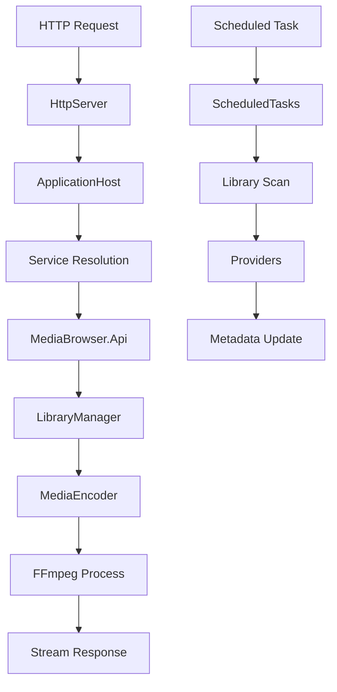

# Component: Emby.Server.Implementations

**Path:** `Emby.Server.Implementations/`
**Type:** Directory | Module
**Language:** C#
**Maps to:** `.discovery/160-emby-server-impl.md`

## Description

Emby.Server.Implementations is the core server module containing the bulk of Emby's business logic. It implements the `MediaBrowser.Controller` interfaces with concrete classes for library management, user management, media encoding, HTTP server, session management, scheduled tasks, and more. This is the largest and most critical module in the solution.

## Structure

```
Emby.Server.Implementations/
├── ApplicationHost.cs             # Main application host → [class] ApplicationHost
│   ├── Bootstraps all services
│   ├── Manages plugin lifecycle
│   └── Provides dependency injection container
├── ServerApplicationPaths.cs      # Server path configuration
├── StartupOptions.cs              # CLI startup options
├── SystemEvents.cs                # System event handling
├── Activity/                      # User activity tracking
├── AppBase/                       # Application base classes
├── Archiving/                     # Archive file handling
├── Branding/                      # Server branding/theming
├── Browser/                       # Browser detection
├── Channels/                      # Channel plugins (online content)
├── Collections/                   # Media collections
├── Configuration/                 # Configuration management
├── Cryptography/                  # Encryption/hashing utilities
├── Data/                          # Data persistence layer
├── Devices/                       # Device management
├── Diagnostics/                   # Diagnostics and profiling
├── Dto/                           # Data transfer objects
├── EntryPoints/                   # Plugin entry points
├── EnvironmentInfo/               # Environment detection
├── FFMpeg/                        # FFmpeg integration
├── HttpClientManager/             # HTTP client management
├── HttpServer/                    # HTTP server implementation
├── Images/                        # Image processing helpers
├── IO/                            # I/O utilities
├── Library/                       # Media library core
│   ├── Media library management
│   ├── Item resolvers
│   └── Search engine
├── LiveTv/                        # Live TV support
├── Localization/                  # Localization/i18n
├── Logging/                       # Logging infrastructure
├── MediaEncoder/                  # Media encoding/transcoding
├── Net/                           # Network utilities
├── Networking/                    # Network configuration
├── News/                          # News feed
├── Playlists/                     # Playlist management
├── Reflection/                    # Reflection utilities
├── ResourceFileManager.cs         # Embedded resource manager
├── ScheduledTasks/                # Background task scheduler
├── Security/                      # Authentication/authorization
├── Serialization/                 # JSON/XML serialization
├── ServerApplicationPaths.cs      # Path configuration
├── Services/                      # Internal services
├── Session/                       # User session management
├── Sorting/                       # Item sorting algorithms
├── TextEncoding/                  # Text encoding utilities
├── Threading/                     # Threading utilities
├── TV/                            # TV show management
├── Udp/                           # UDP networking
├── Updates/                       # Auto-update mechanism
├── UserViews/                     # User view management
├── Xml/                           # XML utilities
└── Properties/                    # Assembly info
```

## Key Classes

| Class | File | Purpose |
|-------|------|---------|
| `ApplicationHost` | `ApplicationHost.cs` | Main DI container and service bootstrap |
| `ServerApplicationPaths` | `ServerApplicationPaths.cs` | Configures data/cache/log paths |
| `LibraryManager` | `Library/` | Manages media library items |
| `UserManager` | `Security/` | Manages user accounts |
| `SessionManager` | `Session/` | Manages active sessions |
| `MediaEncoder` | `MediaEncoder/` | FFmpeg integration |
| `HttpServer` | `HttpServer/` | HTTP request handling |
| `ScheduledTaskWorker` | `ScheduledTasks/` | Background task execution |

## Data Flow



## Dependencies

- `MediaBrowser.Controller` — All controller interfaces
- `MediaBrowser.Model` — Model types
- `MediaBrowser.Api` — API services
- `MediaBrowser.Providers` — Metadata providers
- `Emby.Drawing` — Image processing
- `Emby.Dlna` — DLNA server
- `RSSDP` — SSDP discovery
- `Mono.Nat` — NAT traversal
- `SocketHttpListener` — HTTP server

## Side Effects

- Starts HTTP server on configured port
- Spawns FFmpeg processes for transcoding
- Writes to filesystem (config, cache, logs, media)
- Opens network ports (HTTP, DLNA, SSDP)
- Schedules background tasks
- Manages plugin assemblies

## Reference

- `IServerApplicationHost` interface in `MediaBrowser.Controller`
