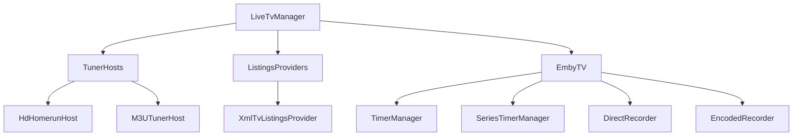

# Component: Emby.Server.Implementations — LiveTV

**Path:** `Emby.Server.Implementations/LiveTv/`
**Type:** Directory | Sub-module
**Language:** C#
**Maps to:** `.discovery/170-emby-server-impl-livetv.md`
**Parent:** `.discovery/160-emby-server-impl.md`

## Description

LiveTV subsystem for Emby Server. Manages live television streaming, recording,
EPG (Electronic Program Guide) data, tuner hosts, and TV series/episode scheduling.

## Structure

```
LiveTv/
├── LiveTvManager.cs              # [class] LiveTvManager → ILiveTvManager
│   ├── Manages all LiveTV operations
│   ├── Handles channel discovery and management
│   ├── Manages recordings and timers
│   └── Integrates with tuner hosts and listings providers
├── ILiveTvManager.cs             # [interface] ILiveTvManager (in Controller)
├── EmbyTV/
│   ├── EmbyTV.cs                 # [class] EmbyTV → main TV service
│   ├── IRecorder.cs              # [interface] IRecorder
│   ├── DirectRecorder.cs         # [class] DirectRecorder → IRecorder
│   ├── EncodedRecorder.cs        # [class] EncodedRecorder → IRecorder
│   ├── RecordingHelper.cs        # [class] RecordingHelper
│   ├── TimerManager.cs           # [class] TimerManager
│   ├── SeriesTimerManager.cs     # [class] SeriesTimerManager
│   └── ItemDataProvider.cs       # [class] ItemDataProvider
├── Listings/
│   ├── IListingProvider.cs       # [interface] IListingProvider
│   ├── XmlTvListingsProvider.cs  # [class] XmlTvListingsProvider
│   └── *Provider.cs              # Various EPG providers
├── TunerHosts/
│   ├── ITunerHost.cs             # [interface] ITunerHost
│   ├── HdHomerun/
│   │   ├── HdHomerunHost.cs      # [class] HdHomerunHost
│   │   └── HdHomerunManager.cs   # [class] HdHomerunManager
│   └── M3UTunerHost.cs           # [class] M3UTunerHost
└── LiveTvDto.cs                  # [class] LiveTvDto
```

## Key Classes

| Class | File | Purpose |
|-------|------|---------|
| `LiveTvManager` | `LiveTvManager.cs` | Central manager for all LiveTV |
| `EmbyTV` | `EmbyTV/EmbyTV.cs` | Core TV service implementation |
| `DirectRecorder` | `EmbyTV/DirectRecorder.cs` | Direct stream recording |
| `EncodedRecorder` | `EmbyTV/EncodedRecorder.cs` | Transcoded recording |
| `TimerManager` | `EmbyTV/TimerManager.cs` | Recording timer management |
| `SeriesTimerManager` | `EmbyTV/SeriesTimerManager.cs` | Series recording rules |

## Data Flow



## Files

`Emby.Server.Implementations/LiveTv/EmbyTV/DirectRecorder.cs`
`Emby.Server.Implementations/LiveTv/EmbyTV/EmbyTV.cs`
`Emby.Server.Implementations/LiveTv/EmbyTV/EncodedRecorder.cs`
`Emby.Server.Implementations/LiveTv/EmbyTV/EntryPoint.cs`
`Emby.Server.Implementations/LiveTv/EmbyTV/IRecorder.cs`
`Emby.Server.Implementations/LiveTv/EmbyTV/ItemDataProvider.cs`
`Emby.Server.Implementations/LiveTv/EmbyTV/RecordingHelper.cs`
`Emby.Server.Implementations/LiveTv/EmbyTV/SeriesTimerManager.cs`
`Emby.Server.Implementations/LiveTv/EmbyTV/TimerManager.cs`
`Emby.Server.Implementations/LiveTv/Listings/SchedulesDirect.cs`
`Emby.Server.Implementations/LiveTv/LiveTvConfigurationFactory.cs`
`Emby.Server.Implementations/LiveTv/LiveTvDtoService.cs`
`Emby.Server.Implementations/LiveTv/LiveTvManager.cs`
`Emby.Server.Implementations/LiveTv/LiveTvMediaSourceProvider.cs`
`Emby.Server.Implementations/LiveTv/RefreshChannelsScheduledTask.cs`
`Emby.Server.Implementations/LiveTv/TunerHosts/BaseTunerHost.cs`
`Emby.Server.Implementations/LiveTv/TunerHosts/HdHomerun/HdHomerunHost.cs`
`Emby.Server.Implementations/LiveTv/TunerHosts/HdHomerun/HdHomerunManager.cs`
`Emby.Server.Implementations/LiveTv/TunerHosts/HdHomerun/HdHomerunUdpStream.cs`
`Emby.Server.Implementations/LiveTv/TunerHosts/LiveStream.cs`
`Emby.Server.Implementations/LiveTv/TunerHosts/M3uParser.cs`
`Emby.Server.Implementations/LiveTv/TunerHosts/M3UTunerHost.cs`
`Emby.Server.Implementations/LiveTv/TunerHosts/SharedHttpStream.cs`
