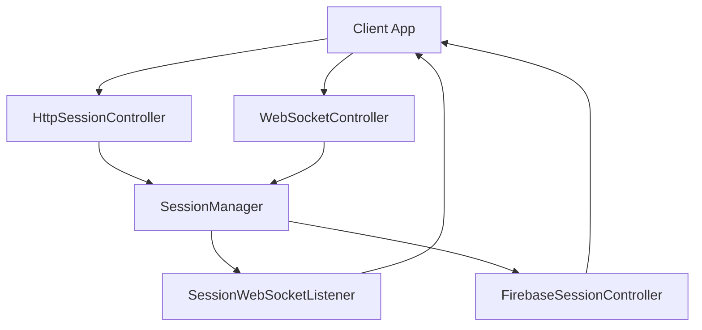

# Component: Emby.Server.Implementations — Session

**Path:** `Emby.Server.Implementations/Session/`
**Type:** Directory | Sub-module
**Language:** C#
**Maps to:** `.discovery/170-emby-session.md`

## Decomposition

### SessionManager.cs (Main Session Coordinator)

#### Imports
```csharp
using MediaBrowser.Controller.Net;
using MediaBrowser.Controller.Session;
using MediaBrowser.Model.Session;
using System;
using System.Collections.Generic;
using System.Threading;
using System.Threading.Tasks;
```

#### Classes
`SessionManager` (public class : ISessionManager)

#### Key Methods
```csharp
SessionInfo CreateSession(string clientName, string clientVersion, string userId)
void RemoveSession(string sessionId)
SessionInfo GetSession(string sessionId)
IEnumerable<SessionInfo> GetSessions()
Task SendMessage(string sessionId, string messageType, object data)
event EventHandler<SessionEventArgs> SessionCreated
event EventHandler<SessionEventArgs> SessionEnded
```

### HttpSessionController.cs (HTTP Session)

#### Classes
`HttpSessionController` (public class)

#### Key Methods
```csharp
Task Login(string username, string password)
Task Logout()
SessionInfo GetCurrentSession()
```

### WebSocketController.cs (WebSocket Session)

#### Classes
`WebSocketController` (public class)

#### Key Methods
```csharp
Task Connect(string sessionId)
Task Disconnect()
Task SendCommand(SessionCommand command)
event EventHandler<WebSocketEventArgs> MessageReceived
```

### SessionWebSocketListener.cs (WebSocket Listener)

#### Classes
`SessionWebSocketListener` (public class : IWebSocketListener)

#### Key Methods
```csharp
void OnMessageReceived(string message)
Task NotifySessionChange(SessionInfo session)
```

### FirebaseSessionController.cs (Firebase Integration)

#### Classes
`FirebaseSessionController` (public class)

#### Key Methods
```csharp
Task PushSessionUpdate(SessionInfo session)
Task SendNotification(string userId, Notification notification)
```

## Description

Session management handles client connections, authentication, and real-time communication. The SessionManager coordinates between HTTP and WebSocket sessions, maintains session state, and handles cross-client synchronization.

## Files

- `SessionManager.cs` — Main session coordinator
- `HttpSessionController.cs` — HTTP session handling
- `WebSocketController.cs` — WebSocket session handling
- `SessionWebSocketListener.cs` — WebSocket listener
- `FirebaseSessionController.cs` — Firebase push integration

## Architecture



## Key Classes

| Class | Responsibility |
|-------|----------------|
| `SessionManager` | Central session coordination |
| `HttpSessionController` | HTTP-based session management |
| `WebSocketController` | Real-time WebSocket sessions |
| `SessionWebSocketListener` | Push notifications to clients |
| `FirebaseSessionController` | Push notification delivery |

## Dependencies

- `MediaBrowser.Controller.Session` — Session interfaces
- `MediaBrowser.Model.Session` — Session models
