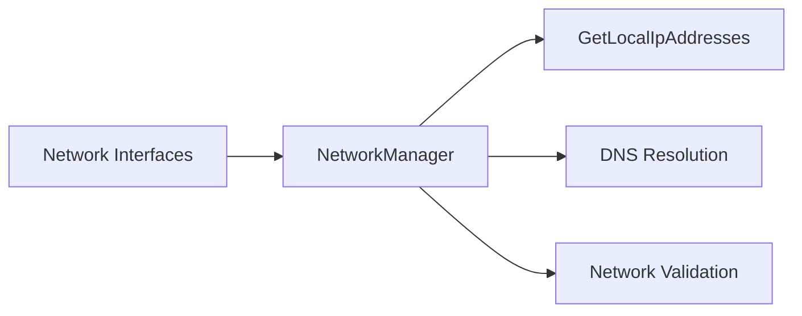

# Component: Emby.Server.Implementations — Networking

**Path:** `Emby.Server.Implementations/Networking/`
**Type:** Directory | Sub-module
**Language:** C#
**Maps to:** `.discovery/171-emby-networking.md`

## Decomposition

### NetworkManager.cs (Network Management)

#### Imports
```csharp
using MediaBrowser.Model.Net;
using System;
using System.Collections.Generic;
using System.Linq;
using System.Net;
using System.Net.NetworkInformation;
using System.Threading.Tasks;
```

#### Classes
`NetworkManager` (public class : INetworkManager)

#### Key Properties
```csharp
string CurrentServerIpAddress
IEnumerable<string> DNSServers
bool IsIPv6Supported
string LocalSubnetAddress
```

#### Key Methods
```csharp
string GetMacAddress()
IEnumerable<string> GetLocalIpAddresses()
bool IsInPrivateNetwork(string ipAddress)
Task<bool> PingAsync(string host)
string GetPreferredApiHost(bool preferPublic)
```

### IPNetwork.cs (IP Network Utilities)

#### Classes
`IPNetwork` (public class)

#### Key Methods
```csharp
static bool Contains(IPAddress address, IPAddress network, string mask)
static IPNetworkCollection ListNetworkInterfaces()
```

### IPAddressCollection.cs (IP Address Collection)

#### Classes
`IPAddressCollection` (public class : ICollection<IPAddress>)

## Description

Networking module handles IP address management, network interface enumeration, DNS resolution, and network utility functions for Emby Server.

## Files

- `NetworkManager.cs` — Main network management
- `IPNetwork/` — IP network utilities

## Architecture



## Key Classes

| Class | Responsibility |
|-------|----------------|
| `NetworkManager` | Central network management |
| `IPNetwork` | IP network utilities |
| `IPAddressCollection` | IP address collection |

## Dependencies

- `MediaBrowser.Model.Net` — Network models
- `System.Net` — Network types
