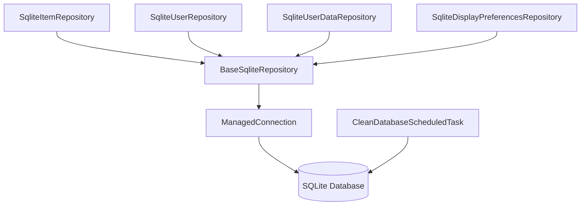

# Component: Emby.Server.Implementations — Data Layer

**Path:** `Emby.Server.Implementations/Data/`
**Type:** Directory | Sub-module
**Language:** C#
**Maps to:** `.discovery/171-emby-server-impl-data.md`
**Parent:** `.discovery/160-emby-server-impl.md`

## Description

SQLite-based data persistence layer for Emby Server. Provides repositories for
users, items, user data, and display preferences using SQLite.

## Structure

```
Data/
├── BaseSqliteRepository.cs       # [class] BaseSqliteRepository
│   └── Base class for all SQLite repositories
├── SqliteItemRepository.cs       # [class] SqliteItemRepository
│   └── Stores media library items
├── SqliteUserRepository.cs       # [class] SqliteUserRepository
│   └── Stores user accounts
├── SqliteUserDataRepository.cs   # [class] SqliteUserDataRepository
│   └── Stores user ratings, playback position
├── SqliteDisplayPreferencesRepository.cs
│   └── Stores user display preferences
├── ManagedConnection.cs          # [class] ManagedConnection
│   └── SQLite connection wrapper
├── TypeMapper.cs                 # [class] TypeMapper
│   └── Maps CLR types to SQLite types
├── SqliteExtensions.cs           # [class] SqliteExtensions
│   └── Extension methods for SQLite operations
└── CleanDatabaseScheduledTask.cs # [class] CleanDatabaseScheduledTask
    └── Periodic database maintenance
```

## Key Classes

| Class | File | Purpose |
|-------|------|---------|
| `BaseSqliteRepository` | `BaseSqliteRepository.cs` | Base with connection management |
| `SqliteItemRepository` | `SqliteItemRepository.cs` | Media item persistence |
| `SqliteUserRepository` | `SqliteUserRepository.cs` | User account persistence |
| `SqliteUserDataRepository` | `SqliteUserDataRepository.cs` | Playback state, ratings |
| `ManagedConnection` | `ManagedConnection.cs` | Connection lifecycle |

## Data Flow


