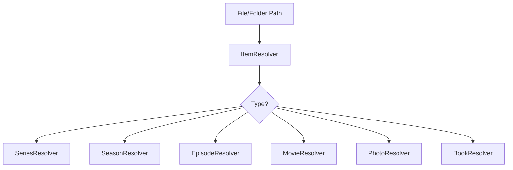

# Component: Emby.Server.Implementations — Library Resolvers

**Path:** `Emby.Server.Implementations/Library/Resolvers/`
**Type:** Directory | Sub-module
**Language:** C#
**Maps to:** `.discovery/172-emby-server-impl-resolvers.md`
**Parent:** `.discovery/160-emby-server-impl.md`

## Description

Library resolvers determine the type of media items from file system paths.
They identify movies, TV episodes, photos, books, and other content types.

## Structure

```
Library/Resolvers/
├── ItemResolver.cs               # [class] ItemResolver → base resolver
├── FolderResolver.cs             # [class] FolderResolver
├── VideoResolver.cs              # [class] VideoResolver
├── PhotoResolver.cs              # [class] PhotoResolver
├── PhotoAlbumResolver.cs         # [class] PhotoAlbumResolver
├── PlaylistResolver.cs           # [class] PlaylistResolver
├── TV/
│   ├── SeriesResolver.cs         # [class] SeriesResolver
│   ├── SeasonResolver.cs         # [class] SeasonResolver
│   └── EpisodeResolver.cs        # [class] EpisodeResolver
├── Movies/
│   └── MovieResolver.cs          # [class] MovieResolver
├── Audio/
│   └── *Resolver.cs             # Audio resolvers
└── Books/
    └── BookResolver.cs           # [class] BookResolver
```

## Key Classes

| Class | File | Purpose |
|-------|------|---------|
| `ItemResolver` | `ItemResolver.cs` | Base resolver class |
| `SeriesResolver` | `TV/SeriesResolver.cs` | Identifies TV series folders |
| `SeasonResolver` | `TV/SeasonResolver.cs` | Identifies season folders |
| `EpisodeResolver` | `TV/EpisodeResolver.cs` | Identifies episode files |
| `MovieResolver` | `Movies/MovieResolver.cs` | Identifies movie files |
| `BookResolver` | `Books/BookResolver.cs` | Identifies book files |

## Resolution Flow


