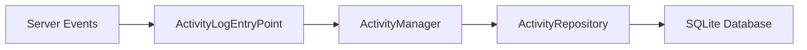

# Component: Emby.Server.Implementations — Activity

**Path:** `Emby.Server.Implementations/Activity/`
**Type:** Directory | Sub-module
**Language:** C#
**Maps to:** `.discovery/180-activity.md`

## Description

Activity logging and management. Tracks user activities and system events for audit and analytics purposes.

## Files

- `ActivityLogEntryPoint.cs` — Emby.Server.Implementations/Activity/ActivityLogEntryPoint.cs
- `ActivityManager.cs` — Emby.Server.Implementations/Activity/ActivityManager.cs
- `ActivityRepository.cs` — Emby.Server.Implementations/Activity/ActivityRepository.cs

## Architecture

## Key Classes

| Class | Responsibility |
|-------|----------------|
| `ActivityManager` | Manages activity log entries |
| `ActivityRepository` | Persists activity data |
| `ActivityLogEntryPoint` | Captures system events |

## Dependencies

- `MediaBrowser.Controller` — Base interfaces
- `SqliteItemRepository` — Data persistence
