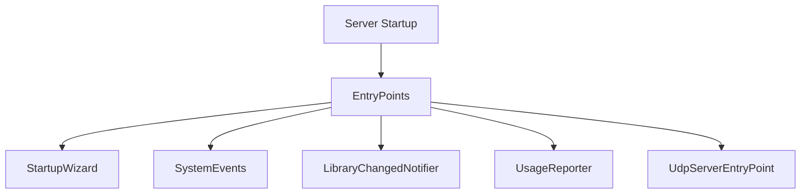

# Component: Emby.Server.Implementations — EntryPoints

**Path:** `Emby.Server.Implementations/EntryPoints/`
**Type:** Directory | Sub-module
**Language:** C#
**Maps to:** `.discovery/186-entrypoints.md`

## Description

Server entry points for system initialization, background tasks, and event handling.

## Files

- `AutomaticRestartEntryPoint.cs` — Emby.Server.Implementations/EntryPoints/AutomaticRestartEntryPoint.cs
- `ExternalPortForwarding.cs` — Emby.Server.Implementations/EntryPoints/ExternalPortForwarding.cs
- `KeepServerAwake.cs` — Emby.Server.Implementations/EntryPoints/KeepServerAwake.cs
- `LibraryChangedNotifier.cs` — Emby.Server.Implementations/EntryPoints/LibraryChangedNotifier.cs
- `RecordingNotifier.cs` — Emby.Server.Implementations/EntryPoints/RecordingNotifier.cs
- `RefreshUsersMetadata.cs` — Emby.Server.Implementations/EntryPoints/RefreshUsersMetadata.cs
- `ServerEventNotifier.cs` — Emby.Server.Implementations/EntryPoints/ServerEventNotifier.cs
- `StartupWizard.cs` — Emby.Server.Implementations/EntryPoints/StartupWizard.cs
- `SystemEvents.cs` — Emby.Server.Implementations/EntryPoints/SystemEvents.cs
- `UdpServerEntryPoint.cs` — Emby.Server.Implementations/EntryPoints/UdpServerEntryPoint.cs
- `UsageEntryPoint.cs` — Emby.Server.Implementations/EntryPoints/UsageEntryPoint.cs
- `UsageReporter.cs` — Emby.Server.Implementations/EntryPoints/UsageReporter.cs
- `UserDataChangeNotifier.cs` — Emby.Server.Implementations/EntryPoints/UserDataChangeNotifier.cs

## Architecture

## Key Classes

| Class | Responsibility |
|-------|----------------|
| `StartupWizard` | First-run configuration |
| `SystemEvents` | OS event handling |
| `LibraryChangedNotifier` | Library change broadcasts |
| `UsageReporter` | Analytics collection |
| `UdpServerEntryPoint` | UDP discovery service |

## Dependencies

- `MediaBrowser.Controller` — Entry point interfaces
