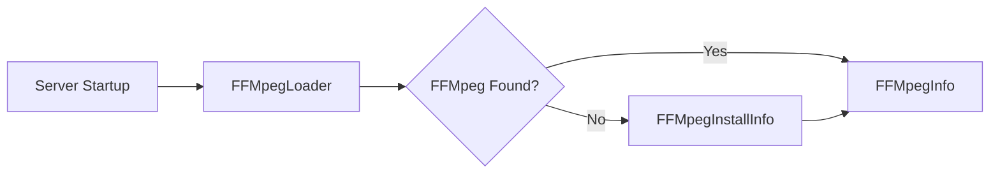

# Component: Emby.Server.Implementations — FFMpeg

**Path:** `Emby.Server.Implementations/FFMpeg/`
**Type:** Directory | Sub-module
**Language:** C#
**Maps to:** `.discovery/187-ffmpeg.md`

## Description

FFmpeg installation and management. Handles FFmpeg binary detection, download, and version checking.

## Files

- `FFMpegInfo.cs` — Emby.Server.Implementations/FFMpeg/FFMpegInfo.cs
- `FFMpegInstallInfo.cs` — Emby.Server.Implementations/FFMpeg/FFMpegInstallInfo.cs
- `FFMpegLoader.cs` — Emby.Server.Implementations/FFMpeg/FFMpegLoader.cs

## Architecture

## Key Classes

| Class | Responsibility |
|-------|----------------|
| `FFMpegLoader` | Binary detection and loading |
| `FFMpegInfo` | FFmpeg version and capabilities |
| `FFMpegInstallInfo` | Installation management |

## Dependencies

- `MediaBrowser.Model` — FFmpeg configuration
