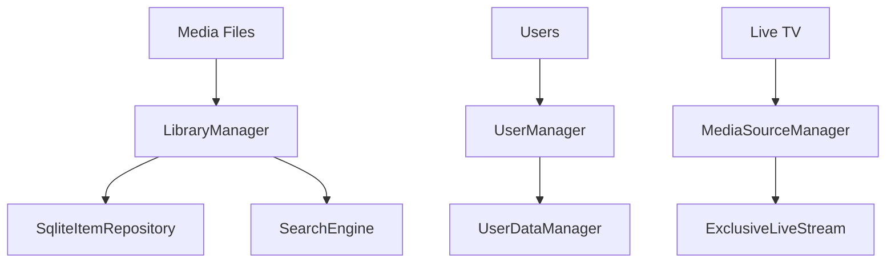

# Component: Emby.Server.Implementations — Library (Full)

**Path:** `Emby.Server.Implementations/Library/`
**Type:** Directory | Sub-module
**Language:** C#
**Maps to:** `.discovery/188-library-full.md`

## Decomposition

### LibraryManager.cs (Media Library Operations)

#### Imports
```csharp
using MediaBrowser.Controller.Entities;
using MediaBrowser.Controller.Library;
using MediaBrowser.Model.Entities;
using System;
using System.Collections.Generic;
using System.Threading;
using System.Threading.Tasks;
```

#### Classes
\`LibraryManager\` (public class : ILibraryManager)

#### Key Methods
```csharp
Task<BaseItem> GetItemById(Guid id, CancellationToken cancellationToken)
Task<IEnumerable<BaseItem>> GetItemsByPath(string path)
Task ValidateMediaLibrary(CancellationToken cancellationToken)
event EventHandler<ValidateMediaLibraryEventArgs> LibraryValidated
```

### UserManager.cs (User Account Management)

#### Imports
```csharp
using MediaBrowser.Controller.Entities;
using MediaBrowser.Controller.Session;
using MediaBrowser.Model.Users;
using System;
using System.Collections.Generic;
```

#### Classes
\`UserManager\` (public class : IUserManager)

#### Key Methods
```csharp
User GetUserById(Guid id)
User GetUserByName(string name)
Task<User> CreateUser(string name)
Task DeleteUser(Guid userId)
AuthenticationResult AuthenticateUser(string username, string password)
```

### UserDataManager.cs (Playback State, Favorites)

#### Classes
\`UserDataManager\` (public class : IUserDataManager)

#### Key Methods
```csharp
UserItemData GetUserData(User user, BaseItem item)
void SaveUserData(User user, BaseItem item, UserItemData data)
void UpdatePlayState(UserItemData data, long positionTicks)
```

### MediaSourceManager.cs (Media Source Handling)

#### Classes
\`MediaSourceManager\` (public class : IMediaSourceManager)

#### Key Methods
```csharp
Task<MediaSourceInfo> GetMediaSource(BaseItem item, string mediaSourceId)
Task OpenMediaSource(string openToken, CancellationToken cancellationToken)
Task CloseMediaSource(string closeToken)
```

### SearchEngine.cs (Full-Text Search)

#### Classes
\`SearchEngine\` (public class : ISearchEngine)

#### Key Methods
```csharp
QueryResult<BaseItem> Search(SearchQuery query)
```

## Description

Core library management. Handles media library operations, user management, and live streams.

## Files

- `CoreResolutionIgnoreRule.cs` — Emby.Server.Implementations/Library/CoreResolutionIgnoreRule.cs
- `DefaultAuthenticationProvider.cs` — Emby.Server.Implementations/Library/DefaultAuthenticationProvider.cs
- `ExclusiveLiveStream.cs` — Emby.Server.Implementations/Library/ExclusiveLiveStream.cs
- `LibraryManager.cs` — Emby.Server.Implementations/Library/LibraryManager.cs
- `LiveStreamHelper.cs` — Emby.Server.Implementations/Library/LiveStreamHelper.cs
- `MediaSourceManager.cs` — Emby.Server.Implementations/Library/MediaSourceManager.cs
- `MediaStreamSelector.cs` — Emby.Server.Implementations/Library/MediaStreamSelector.cs
- `MusicManager.cs` — Emby.Server.Implementations/Library/MusicManager.cs
- `PathExtensions.cs` — Emby.Server.Implementations/Library/PathExtensions.cs
- `ResolverHelper.cs` — Emby.Server.Implementations/Library/ResolverHelper.cs
- `SearchEngine.cs` — Emby.Server.Implementations/Library/SearchEngine.cs
- `UserDataManager.cs` — Emby.Server.Implementations/Library/UserDataManager.cs
- `UserManager.cs` — Emby.Server.Implementations/Library/UserManager.cs
- `UserViewManager.cs` — Emby.Server.Implementations/Library/UserViewManager.cs

## Architecture



## Key Classes

| Class | Responsibility |
|-------|----------------|
| `LibraryManager` | Media library operations |
| `UserManager` | User account management |
| `UserDataManager` | Playback state, favorites |
| `MediaSourceManager` | Media source handling |
| `LiveStreamHelper` | Live TV streaming |
| `SearchEngine` | Full-text search |

## Dependencies

- `MediaBrowser.Controller` — Library interfaces
- `SqliteItemRepository` — Data persistence
