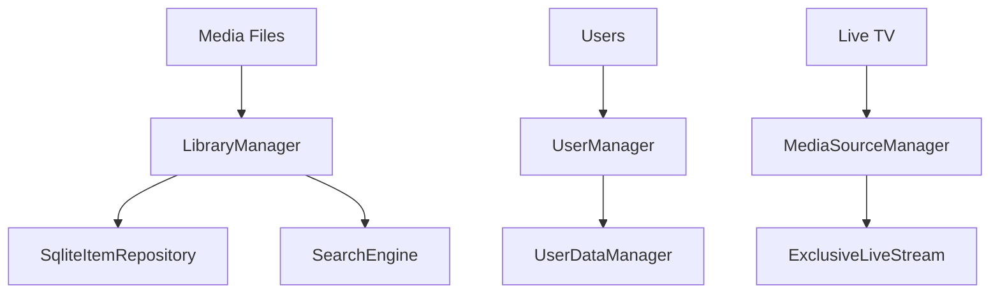

# Component: Emby.Server.Implementations — Library (Full)

**Path:** `Emby.Server.Implementations/Library/`
**Type:** Directory | Sub-module
**Language:** C#
**Maps to:** `.discovery/188-library-full.md`

## Description

Core library management. Handles media library operations, user management, and live streams.

## Files

- `CoreResolutionIgnoreRule.cs` — Emby.Server.Implementations/Library/CoreResolutionIgnoreRule.cs
- `DefaultAuthenticationProvider.cs` — Emby.Server.Implementations/Library/DefaultAuthenticationProvider.cs
- `ExclusiveLiveStream.cs` — Emby.Server.Implementations/Library/ExclusiveLiveStream.cs
- `LibraryManager.cs` — Emby.Server.Implementations/Library/LibraryManager.cs
- `LiveStreamHelper.cs` — Emby.Server.Implementations/Library/LiveStreamHelper.cs
- `MediaSourceManager.cs` — Emby.Server.Implementations/Library/MediaSourceManager.cs
- `MediaStreamSelector.cs` — Emby.Server.Implementations/Library/MediaStreamSelector.cs
- `MusicManager.cs` — Emby.Server.Implementations/Library/MusicManager.cs
- `PathExtensions.cs` — Emby.Server.Implementations/Library/PathExtensions.cs
- `ResolverHelper.cs` — Emby.Server.Implementations/Library/ResolverHelper.cs
- `SearchEngine.cs` — Emby.Server.Implementations/Library/SearchEngine.cs
- `UserDataManager.cs` — Emby.Server.Implementations/Library/UserDataManager.cs
- `UserManager.cs` — Emby.Server.Implementations/Library/UserManager.cs
- `UserViewManager.cs` — Emby.Server.Implementations/Library/UserViewManager.cs

## Architecture

## Key Classes

| Class | Responsibility |
|-------|----------------|
| `LibraryManager` | Media library operations |
| `UserManager` | User account management |
| `UserDataManager` | Playback state, favorites |
| `MediaSourceManager` | Media source handling |
| `LiveStreamHelper` | Live TV streaming |
| `SearchEngine` | Full-text search |

## Dependencies

- `MediaBrowser.Controller` — Library interfaces
- `SqliteItemRepository` — Data persistence
