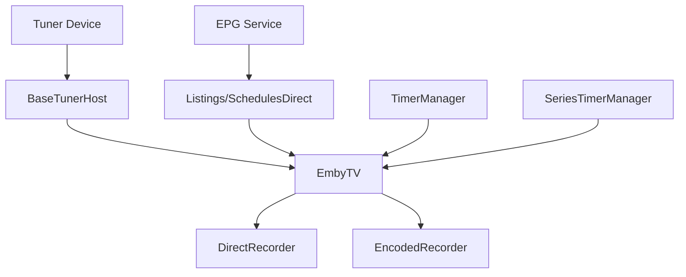

# Component: Emby.Server.Implementations — LiveTv (Full)

**Path:** `Emby.Server.Implementations/LiveTv/`
**Type:** Directory | Sub-module
**Language:** C#
**Maps to:** `.discovery/189-livetv-full.md`

## Decomposition

### LiveTvManager.cs (API & DTO)

#### Imports
```csharp
using MediaBrowser.Controller.LiveTV;
using MediaBrowser.Model.LiveTV;
using System;
using System.Collections.Generic;
using System.Threading;
using System.Threading.Tasks;
```

#### Classes
\`LiveTvManager\` (public class : ILiveTvManager)

#### Key Methods
```csharp
Task<IEnumerable<ChannelInfo>> GetChannels(CancellationToken cancellationToken)
Task<IEnumerable<ProgramInfo>> GetPrograms(string channelId, DateTime startDate, DateTime endDate, CancellationToken cancellationToken)
Task<RecordingInfo> GetRecording(string id, CancellationToken cancellationToken)
```

### EmbyTV.cs (Main Coordinator)

#### Classes
\`EmbyTV\` (public class : IServerEntryPoint)

#### Key Methods
```csharp
void Start()
void Stop()
Task<LiveStream> GetLiveStream(string streamId, CancellationToken cancellationToken)
```

### SchedulesDirect.cs (EPG Provider)

#### Imports
```csharp
using MediaBrowser.Model.LiveTV;
using System;
using System.Collections.Generic;
using System.Net.Http;
using System.Threading.Tasks;
```

#### Classes
\`SchedulesDirect\` (public class)

#### Key Methods
```csharp
Task<Channel> GetChannel(string channelId)
Task<List<Program>> GetPrograms(string channelId, DateTime start, DateTime end)
```

### HdHomerunHost.cs (HDHomeRun Tuner)

#### Classes
\`HdHomerunHost\` (public class : BaseTunerHost)

#### Key Methods
```csharp
Task<IEnumerable<ChannelInfo>> ScanForChannels(CancellationToken cancellationToken)
Task<MediaSourceInfo> GetMediaSource(string streamId, CancellationToken cancellationToken)
```

### TimerManager.cs (Recording Schedules)

#### Classes
\`TimerManager\` (public class)

#### Key Methods
```csharp
Task<TimerInfo> CreateTimer(TimerInfo timer, CancellationToken cancellationToken)
Task CancelTimer(string timerId, CancellationToken cancellationToken)
IEnumerable<TimerInfo> GetTimers()
```

## Description

Live TV functionality including tuner management, EPG data, and recording capabilities.

## Files

### EmbyTV/ (10 files)

- `DirectRecorder.cs` — Emby.Server.Implementations/LiveTv/EmbyTV/DirectRecorder.cs
- `EmbyTV.cs` — Emby.Server.Implementations/LiveTv/EmbyTV/EmbyTV.cs
- `EncodedRecorder.cs` — Emby.Server.Implementations/LiveTv/EmbyTV/EncodedRecorder.cs
- `EntryPoint.cs` — Emby.Server.Implementations/LiveTv/EmbyTV/EntryPoint.cs
- `IRecorder.cs` — Emby.Server.Implementations/LiveTv/EmbyTV/IRecorder.cs
- `ItemDataProvider.cs` — Emby.Server.Implementations/LiveTv/EmbyTV/ItemDataProvider.cs
- `RecordingHelper.cs` — Emby.Server.Implementations/LiveTv/EmbyTV/RecordingHelper.cs
- `SeriesTimerManager.cs` — Emby.Server.Implementations/LiveTv/EmbyTV/SeriesTimerManager.cs
- `TimerManager.cs` — Emby.Server.Implementations/LiveTv/EmbyTV/TimerManager.cs

### Listings/ (1 file)

- `SchedulesDirect.cs` — Emby.Server.Implementations/LiveTv/Listings/SchedulesDirect.cs

### TunerHosts/ (13 files)

- `BaseTunerHost.cs` — Emby.Server.Implementations/LiveTv/TunerHosts/BaseTunerHost.cs
- `LiveStream.cs` — Emby.Server.Implementations/LiveTv/TunerHosts/LiveStream.cs
- `M3UTunerHost.cs` — Emby.Server.Implementations/LiveTv/TunerHosts/M3UTunerHost.cs
- `M3uParser.cs` — Emby.Server.Implementations/LiveTv/TunerHosts/M3uParser.cs
- `SharedHttpStream.cs` — Emby.Server.Implementations/LiveTv/TunerHosts/SharedHttpStream.cs
- `HdHomerun/HdHomerunHost.cs` — Emby.Server.Implementations/LiveTv/TunerHosts/HdHomerun/HdHomerunHost.cs
- `HdHomerun/HdHomerunManager.cs` — Emby.Server.Implementations/LiveTv/TunerHosts/HdHomerun/HdHomerunManager.cs
- `HdHomerun/HdHomerunUdpStream.cs` — Emby.Server.Implementations/LiveTv/TunerHosts/HdHomerun/HdHomerunUdpStream.cs

### Root Files (5 files)

- `LiveTvConfigurationFactory.cs` — Emby.Server.Implementations/LiveTv/LiveTvConfigurationFactory.cs
- `LiveTvDtoService.cs` — Emby.Server.Implementations/LiveTv/LiveTvDtoService.cs
- `LiveTvManager.cs` — Emby.Server.Implementations/LiveTv/LiveTvManager.cs
- `LiveTvMediaSourceProvider.cs` — Emby.Server.Implementations/LiveTv/LiveTvMediaSourceProvider.cs
- `RefreshChannelsScheduledTask.cs` — Emby.Server.Implementations/LiveTv/RefreshChannelsScheduledTask.cs

## Architecture



## Key Classes

| Class | Responsibility |
|-------|----------------|
| `EmbyTV` | Main LiveTV coordinator |
| `LiveTvManager` | API and DTO management |
| `SchedulesDirect` | EPG data provider |
| `HdHomerunHost` | HDHomeRun tuner support |
| `TimerManager` | Recording schedules |
| `SeriesTimerManager` | Series recording |

## Tuner Support

| Tuner Type | Implementation |
|-------------|----------------|
| HDHomeRun | HdHomerunHost |
| M3U Streams | M3UTunerHost |
| HTTP Streams | SharedHttpStream |

## Dependencies

- `MediaBrowser.Controller` — TV interfaces
- `FFMpeg` — Recording encoding
