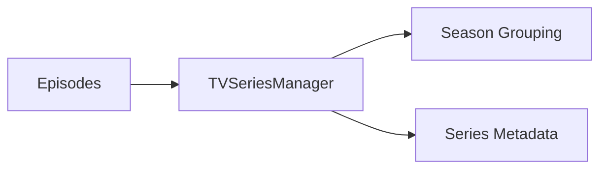

# Component: Emby.Server.Implementations — TV

**Path:** `Emby.Server.Implementations/TV/`
**Type:** Directory | Sub-module
**Language:** C#
**Maps to:** `.discovery/191-tv.md`

## Description

TV series management and organization.

## Files

- `TVSeriesManager.cs` — Emby.Server.Implementations/TV/TVSeriesManager.cs

## Architecture

## Dependencies

- `MediaBrowser.Controller` — TV interfaces
