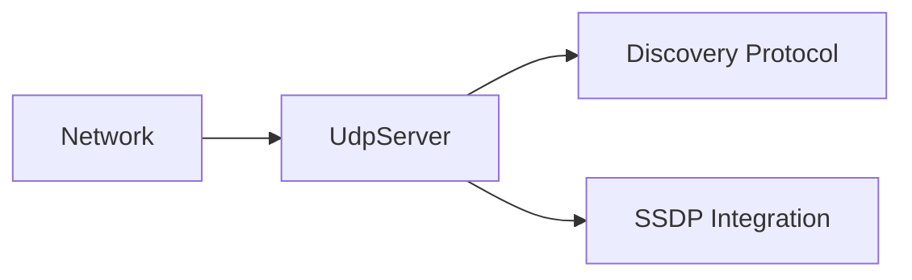

# Component: Emby.Server.Implementations — Udp

**Path:** `Emby.Server.Implementations/Udp/`
**Type:** Directory | Sub-module
**Language:** C#
**Maps to:** `.discovery/192-udp.md`

## Description

UDP server for network discovery and communication.

## Files

- `UdpServer.cs` — Emby.Server.Implementations/Udp/UdpServer.cs

## Architecture

## Dependencies

- `System.Net.Sockets` — UDP socket handling
