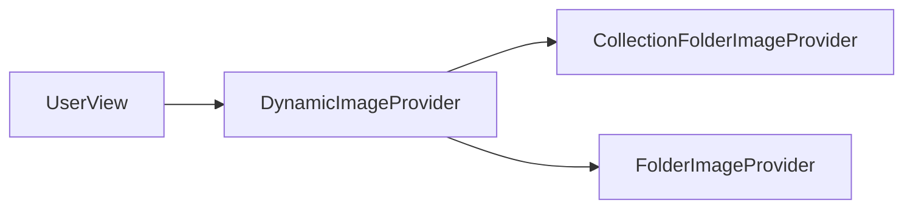

# Component: Emby.Server.Implementations — UserViews

**Path:** `Emby.Server.Implementations/UserViews/`
**Type:** Directory | Sub-module
**Language:** C#
**Maps to:** `.discovery/193-userviews.md`

## Description

User view image providers. Generates dynamic images for user collections and folders.

## Files

- `CollectionFolderImageProvider.cs` — Emby.Server.Implementations/UserViews/CollectionFolderImageProvider.cs
- `DynamicImageProvider.cs` — Emby.Server.Implementations/UserViews/DynamicImageProvider.cs
- `FolderImageProvider.cs` — Emby.Server.Implementations/UserViews/FolderImageProvider.cs

## Architecture

## Key Classes

| Class | Responsibility |
|-------|----------------|
| `DynamicImageProvider` | Main image provider |
| `CollectionFolderImageProvider` | Box art for collections |
| `FolderImageProvider` | Folder thumbnails |

## Dependencies

- `MediaBrowser.Controller` — Image provider interfaces
- `Emby.Drawing` — Image generation
