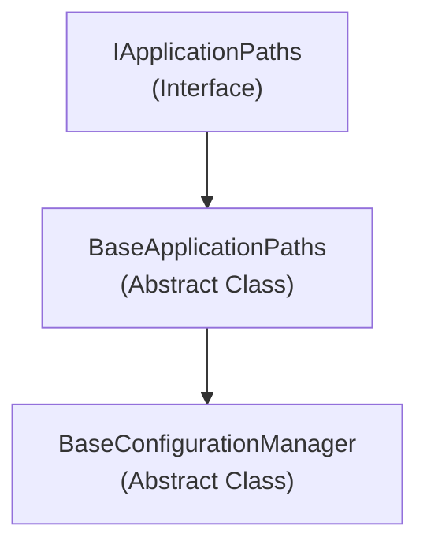

# Emby.Server.Implementations - AppBase Module

**Module:** Emby.Server.Implementations/AppBase
**Language:** C#
**Maps to:** `.discovery/194-emby-server-impl-appbase.md`

## Decomposition

### BaseApplicationPaths.cs (Abstract Path Provider)

#### Imports
```csharp
using System;
using System.IO;
using MediaBrowser.Common.Configuration;
```

#### Classes
`BaseApplicationPaths` (public abstract class : IApplicationPaths)

#### Properties
```csharp
string ProgramDataPath
string ProgramSystemPath
string DataPath
string VirtualDataPath
string ImageCachePath
string PluginsPath
string PluginConfigurationsPath
string TempUpdatePath
string LogDirectoryPath
string ConfigurationDirectoryPath
string SystemConfigurationFilePath
string CachePath
string TempDirectory
```

#### Key Methods
```csharp
protected BaseApplicationPaths(string programDataPath, string appFolderPath)
```

### BaseConfigurationManager.cs (Configuration Manager)

#### Classes
`BaseConfigurationManager<T>` (public abstract class)

#### Key Methods
```csharp
void Initialize()
T GetConfiguration(string name)
void SaveConfiguration(string name, T configuration)
```

### ConfigurationHelper.cs (Helper Utilities)

#### Key Methods
```csharp
string GetDataPath(IApplicationPaths paths)
```

## Architecture



## File Listing

```
AppBase/
├── BaseApplicationPaths.cs    (185 lines) - Abstract paths provider
├── BaseConfigurationManager.cs - Configuration management
└── ConfigurationHelper.cs   - Configuration helpers
```

## Description

AppBase provides foundational infrastructure for the Emby Server application. It defines application paths (data, cache, logs, plugins, configuration) and manages configuration persistence. The BaseApplicationPaths class is inherited by both the server and UI applications to share common path definitions.

## Dependencies

- **MediaBrowser.Common.Configuration** - Configuration interfaces and types

## Statistics

- **Files:** 3
- **Lines:** ~400
- **Classes:** 3
