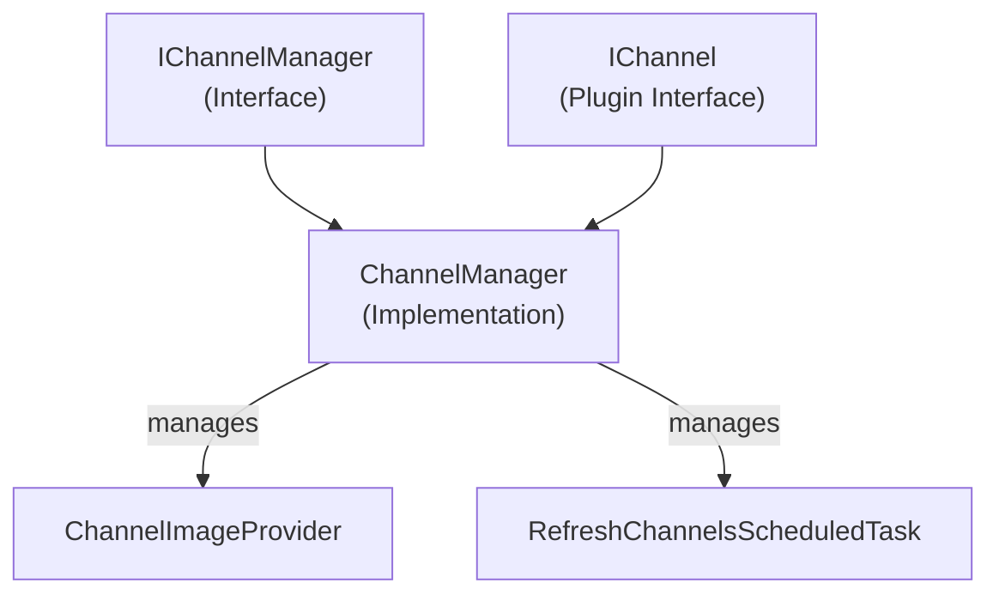

# Emby.Server.Implementations - Channels Module

**Module:** Emby.Server.Implementations/Channels
**Language:** C#
**Maps to:** `.discovery/195-emby-server-impl-channels.md`

## Decomposition

### ChannelManager.cs (Main Channel Manager - 1218 lines)

#### Imports
```csharp
using MediaBrowser.Common.Extensions;
using MediaBrowser.Common.Net;
using MediaBrowser.Controller.Channels;
using MediaBrowser.Controller.Configuration;
using MediaBrowser.Controller.Dto;
using MediaBrowser.Controller.Entities;
using MediaBrowser.Controller.Library;
using MediaBrowser.Controller.Providers;
using MediaBrowser.Model.Channels;
using MediaBrowser.Model.Dto;
using MediaBrowser.Model.Entities;
using MediaBrowser.Model.Logging;
using MediaBrowser.Model.MediaInfo;
using MediaBrowser.Model.Net;
using MediaBrowser.Model.Querying;
using MediaBrowser.Model.Serialization;
using System;
using System.Collections.Concurrent;
using System.Collections.Generic;
using System.IO;
using System.Linq;
using System.Net;
using System.Threading;
using System.Threading.Tasks;
```

#### Classes
`ChannelManager` (public class : IChannelManager)

#### Key Properties
```csharp
internal IChannel[] Channels { get; private set; }
```

#### Key Methods
```csharp
void AddParts(IEnumerable<IChannel> channels)
bool EnableMediaSourceDisplay(BaseItem item)
bool CanDelete(BaseItem item)
bool EnableMediaProbe(BaseItem item)
Task DeleteItem(BaseItem item)
Task<QueryResult<ChannelItemDto>> GetChannelItems(...)
Task<MediaSourceInfo> GetMediaSource(...)
void AddChannel(IChannel channel)
```

### ChannelDynamicMediaSourceProvider.cs

#### Classes
`ChannelDynamicMediaSourceProvider` (public class)

### ChannelImageProvider.cs

#### Classes
`ChannelImageProvider` (public class : IRemoteImageProvider)

### ChannelPostScanTask.cs

#### Classes
`ChannelPostScanTask` (public class : IScheduledTask)

### RefreshChannelsScheduledTask.cs

#### Classes
`RefreshChannelsScheduledTask` (public class : IScheduledTask)

## Architecture



## File Listing

```
Channels/
├── ChannelManager.cs               (1218 lines) - Main channel management
├── ChannelDynamicMediaSourceProvider.cs - Dynamic media source handling
├── ChannelImageProvider.cs         - Channel artwork provider
├── ChannelPostScanTask.cs          - Post-scan task
└── RefreshChannelsScheduledTask.cs - Scheduled refresh task
```

## Description

Channels module manages external media channels (internet TV, streaming services). The ChannelManager coordinates channel discovery, media retrieval, and playback. It supports dynamic media sources and scheduled channel refresh tasks. Channels can be enabled/disabled per user and provide browse/search capabilities.

## Dependencies

- **MediaBrowser.Controller.Channels** - Channel interfaces
- **MediaBrowser.Model.Channels** - Channel DTOs
- **MediaBrowser.Controller.Library** - Library management
- **MediaBrowser.Controller.Providers** - Metadata providers

## Statistics

- **Files:** 5
- **Lines:** ~1,500
- **Classes:** 5
