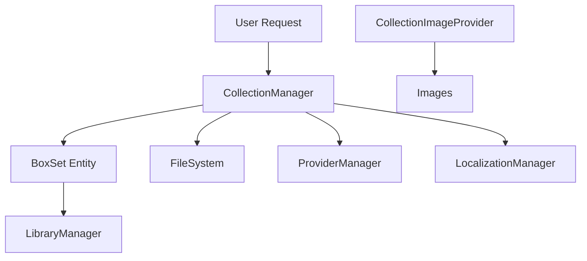

# Component: Emby.Server.Implementations.Collections

**Path:** `Emby.Server.Implementations/Collections/`
**Type:** Directory | Sub-Module
**Language:** C#
**Maps to:** `.discovery/196-emby-server-impl-collections.md`

## Description

Manages media collections (box sets). Handles creation, modification, and organization of media collections that group related items together.

## Directory Structure

```
Emby.Server.Implementations/Collections/
├── CollectionManager.cs
└── CollectionImageProvider.cs
```

## Files

| File | Description |
|------|-------------|
| `CollectionManager.cs` | Core collection management logic |
| `CollectionImageProvider.cs` | Collection image handling |

## Decomposition

### CollectionManager.cs

#### Imports
```csharp
using MediaBrowser.Common.Events;
using MediaBrowser.Controller.Collections;
using MediaBrowser.Controller.Entities;
using MediaBrowser.Controller.Entities.Movies;
using MediaBrowser.Controller.Library;
using MediaBrowser.Controller.Providers;
using MediaBrowser.Model.Logging;
using System;
using System.Collections.Generic;
using System.IO;
using System.Linq;
using System.Threading;
using System.Threading.Tasks;
using MediaBrowser.Model.IO;
using MediaBrowser.Model.Extensions;
using MediaBrowser.Common.Configuration;
using MediaBrowser.Controller.Configuration;
using MediaBrowser.Model.Entities;
using MediaBrowser.Model.Configuration;
using MediaBrowser.Controller.Plugins;
using MediaBrowser.Model.Globalization;
```

#### Classes
`CollectionManager` (public class : ICollectionManager)

#### Key Properties
| Property | Type | Description |
|----------|------|-------------|
| `CollectionCreated` | `EventHandler<CollectionCreatedEventArgs>` | Collection creation event |
| `ItemsAddedToCollection` | `EventHandler<CollectionModifiedEventArgs>` | Items added event |
| `ItemsRemovedFromCollection` | `EventHandler<CollectionModifiedEventArgs>` | Items removed event |

#### Key Methods
| Method | Return | Description |
|--------|--------|-------------|
| `CreateCollection(CollectionCreationOptions)` | `BoxSet` | Create new collection |
| `AddToCollection(Guid, IEnumerable<Guid>)` | `Task` | Add items to collection |
| `RemoveFromCollection(Guid, IEnumerable<Guid>)` | `Task` | Remove items from collection |
| `GetCollections(User)` | `IEnumerable<BoxSet>` | Get user collections |
| `GetCollectionFolder(bool)` | `Task<Folder>` | Get collections folder |

### CollectionImageProvider.cs

#### Classes
`CollectionImageProvider` (public class)

#### Key Methods
| Method | Return | Description |
|--------|--------|-------------|
| `Fetch(CollectionImageProviderArguments)` | `Task<DynamicImageResponse>` | Fetch collection image |

## Architecture



## Dependencies

- `MediaBrowser.Controller.Collections` — Collection interfaces
- `MediaBrowser.Controller.Entities` — Entity types
- `MediaBrowser.Controller.Library` — Library interfaces
- `MediaBrowser.Model.IO` — File I/O models

## Statistics

| Metric | Value |
|--------|-------|
| C# Files | 2 |
| LOC | ~500 |
| Public Classes | 2 |
