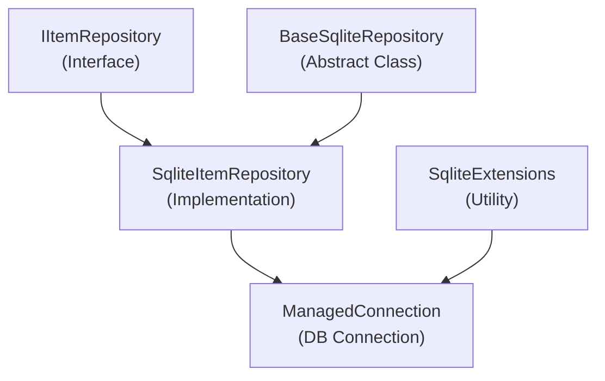

# Emby.Server.Implementations - Data Module

**Module:** Emby.Server.Implementations/Data
**Language:** C#
**Maps to:** `.discovery/196-emby-server-impl-data.md`

## Decomposition

### SqliteItemRepository.cs (Main Database Repository)

#### Imports
```csharp
using MediaBrowser.Controller.Entities;
using MediaBrowser.Controller.Library;
using MediaBrowser.Model.Configuration;
using MediaBrowser.Model.Entities;
using MediaBrowser.Model.IO;
using MediaBrowser.Model.Querying;
using MediaBrowser.Model.Serialization;
using System;
using System.Collections.Generic;
using System.IO;
using System.Linq;
using System.Threading;
using System.Threading.Tasks;
```

#### Classes
`SqliteItemRepository` (public class : BaseSqliteRepository, IItemRepository)

#### Key Methods
```csharp
void SaveItem(BaseItem item)
BaseItem GetItemById(Guid id)
IEnumerable<BaseItem> GetItemByIds(Guid[] ids)
void DeleteItem(Guid id)
QueryResult<T> Query(...)
IEnumerable<BaseItem> GetRecursiveChildren(...)
```

### BaseSqliteRepository.cs (Base Repository)

#### Classes
`BaseSqliteRepository` (public abstract class)

#### Key Methods
```csharp
void Initialize(ManagedConnection connection)
ManagedConnection CreateConnection()
void RunDefaultInitialization()
```

### ManagedConnection.cs (Connection Manager)

#### Classes
`ManagedConnection` (public class : IDisposable)

#### Key Methods
```csharp
void Open()
void Close()
void BeginTransaction()
void CommitTransaction()
```

### SqliteExtensions.cs (SQLite Extensions)

#### Classes
`SqliteExtensions` (public static class)

### SqliteUserDataRepository.cs (User Data Persistence)

#### Classes
`SqliteUserDataRepository` (public class : IUserDataRepository)

### SqliteUserRepository.cs (User Persistence)

#### Classes
`SqliteUserRepository` (public class : IUserRepository)

### SqliteDisplayPreferencesRepository.cs

#### Classes
`SqliteDisplayPreferencesRepository` (public class : IDisplayPreferencesRepository)

### TypeMapper.cs (Type Mapping)

#### Classes
`TypeMapper` (public class)

### CleanDatabaseScheduledTask.cs

#### Classes
`CleanDatabaseScheduledTask` (public class : IScheduledTask)

## Architecture



## File Listing

```
Data/
├── SqliteItemRepository.cs         - Main item storage (library)
├── BaseSqliteRepository.cs         - Base repository class
├── ManagedConnection.cs            - SQLite connection management
├── SqliteExtensions.cs             - SQLite extension methods
├── SqliteUserDataRepository.cs     - User preferences/data
├── SqliteUserRepository.cs         - User accounts
├── SqliteDisplayPreferencesRepository.cs - Display settings
├── TypeMapper.cs                   - Type mapping utilities
└── CleanDatabaseScheduledTask.cs   - DB maintenance task
```

## Description

Data module provides SQLite-based persistence for Emby Server. SqliteItemRepository is the main repository managing all media items (movies, shows, music, etc.). It handles CRUD operations, queries, and indexing. Other repositories manage users, user data, and display preferences. The CleanDatabaseScheduledTask performs periodic database maintenance.

## Dependencies

- **MediaBrowser.Controller.Entities** - Domain entities
- **MediaBrowser.Model.Querying** - Query models
- **System.Data.SQLite** - SQLite database

## Statistics

- **Files:** 9
- **Lines:** ~8,000+
- **Classes:** 9
