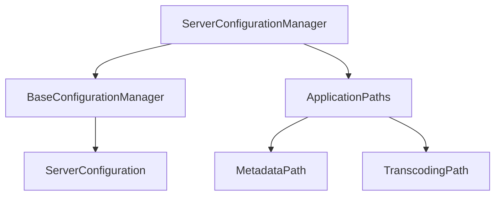

# Component: Emby.Server.Implementations.Configuration

**Path:** `Emby.Server.Implementations/Configuration/`
**Type:** Directory | Sub-Module
**Language:** C#
**Maps to:** `.discovery/197-emby-server-impl-configuration.md`

## Description

Server configuration management. Handles loading, saving, and managing server configuration including metadata paths, encoding settings, and system preferences.

## Directory Structure

```
Emby.Server.Implementations/Configuration/
└── ServerConfigurationManager.cs
```

## Files

| File | Description |
|------|-------------|
| `ServerConfigurationManager.cs` | Server configuration manager |

## Decomposition

### ServerConfigurationManager.cs

#### Imports
```csharp
using System;
using System.Collections.Generic;
using System.IO;
using System.Linq;
using Emby.Server.Implementations.AppBase;
using MediaBrowser.Common.Configuration;
using MediaBrowser.Common.Events;
using MediaBrowser.Controller;
using MediaBrowser.Controller.Configuration;
using MediaBrowser.Controller.Entities;
using MediaBrowser.Controller.Entities.Audio;
using MediaBrowser.Controller.Entities.Movies;
using MediaBrowser.Controller.Entities.TV;
using MediaBrowser.Model.Configuration;
using MediaBrowser.Model.Events;
using MediaBrowser.Model.IO;
using MediaBrowser.Model.Logging;
using MediaBrowser.Model.Serialization;
using MediaBrowser.Model.Extensions;
```

#### Classes
`ServerConfigurationManager` (public class : BaseConfigurationManager, IServerConfigurationManager)

#### Key Properties
| Property | Type | Description |
|----------|------|-------------|
| `ConfigurationUpdating` | `EventHandler<GenericEventArgs<ServerConfiguration>>` | Config update event |
| `Configuration` | `ServerConfiguration` | Current configuration |
| `ApplicationPaths` | `IServerApplicationPaths` | Application paths |

#### Key Methods
| Method | Return | Description |
|--------|--------|-------------|
| `AddParts(IEnumerable<IConfigurationFactory>)` | `void` | Add config factories |
| `UpdateMetadataPath()` | `void` | Update metadata path |
| `UpdateTranscodingTempPath()` | `void` | Update transcoding temp path |

## Architecture



## Dependencies

- `MediaBrowser.Common.Configuration` — Common config interfaces
- `MediaBrowser.Controller.Configuration` — Config controller interfaces
- `MediaBrowser.Model.Configuration` — Config models
- `Emby.Server.Implementations.AppBase` — Base application classes

## Statistics

| Metric | Value |
|--------|-------|
| C# Files | 1 |
| LOC | ~254 |
| Public Classes | 1 |
