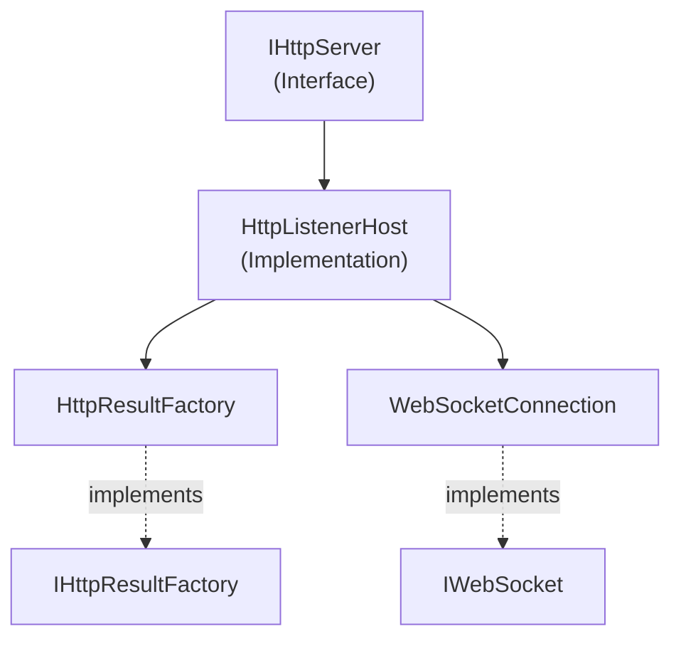

# Emby.Server.Implementations - HttpServer Module

**Module:** Emby.Server.Implementations/HttpServer
**Language:** C#
**Maps to:** `.discovery/197-emby-server-impl-httpserver.md`

## Decomposition

### HttpListenerHost.cs (Main HTTP Host)

#### Imports
```csharp
using MediaBrowser.Model.Services;
using MediaBrowser.Model.Logging;
using MediaBrowser.Model.IO;
using MediaBrowser.Model.Net;
using System;
using System.Collections.Generic;
using System.IO;
using System.Linq;
using System.Net;
using System.Threading.Tasks;
```

#### Classes
`HttpListenerHost` (public class : IHttpServer, IServerEntryPoint)

#### Key Properties
```csharp
string Name
string[] UrlPrefixes
```

#### Key Methods
```csharp
Task StartAsync(CancellationToken cancellationToken)
Task StopAsync()
void RebindSocket()
void OnWebSocketCreated(WebSocketConnection connection)
```

### HttpResultFactory.cs (Response Factory)

#### Classes
`HttpResultFactory` (public class : IHttpResultFactory)

#### Key Methods
```csharp
IHttpResult Create(object response, string contentType)
IHttpResult Create200Result(object response, string contentType)
IHttpResult Create404Result(string message)
```

### WebSocketConnection.cs (WebSocket Handler)

#### Classes
`WebSocketConnection` (public class : IWebSocket, IDisposable)

#### Key Methods
```csharp
void SendAsync(byte[] data, bool endOfMessage)
Task CloseAsync()
event EventHandler<WebSocketMessageEventArgs> MessageReceived
```

### FileWriter.cs (Static File Handler)

#### Classes
`FileWriter` (public class)

### RangeRequestWriter.cs (Range Request Handler)

#### Classes
`RangeRequestWriter` (public class)

### ResponseFilter.cs (Response Filtering)

#### Classes
`ResponseFilter` (public class)

### StreamWriter.cs (Stream Output)

#### Classes
`StreamWriter` (public class)

### LoggerUtils.cs (Logging Utilities)

#### Classes
`LoggerUtils` (public static class)

### IHttpListener.cs (Interface)

#### Classes
`IHttpListener` (public interface)

## Architecture



## File Listing

```
HttpServer/
├── HttpListenerHost.cs      (Main HTTP listener)
├── HttpResultFactory.cs     (Response creation)
├── WebSocketConnection.cs   (WebSocket handling)
├── FileWriter.cs           (Static files)
├── RangeRequestWriter.cs   (Range requests)
├── ResponseFilter.cs       (Response filtering)
├── StreamWriter.cs         (Stream output)
├── LoggerUtils.cs          (Logging utilities)
├── IHttpListener.cs        (Interface)
└── Security/              (Security-related)
```

## Description

HttpServer module implements the HTTP server for Emby. HttpListenerHost manages HTTP listeners and routes requests. HttpResultFactory creates standardized HTTP responses. WebSocketConnection handles real-time WebSocket connections for live updates and remote control. FileWriter and RangeRequestWriter serve static content with support for HTTP range requests.

## Dependencies

- **MediaBrowser.Model.Services** - Service stack
- **MediaBrowser.Model.Net** - Networking types
- **System.Net.Http** - HTTP stack

## Statistics

- **Files:** 12
- **Lines:** ~4,000+
- **Classes:** 10
