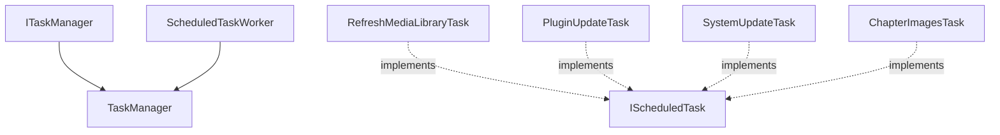

# Emby.Server.Implementations - ScheduledTasks Module

**Module:** Emby.Server.Implementations/ScheduledTasks
**Language:** C#
**Maps to:** `.discovery/198-emby-server-impl-scheduledtasks.md`

## Decomposition

### TaskManager.cs (Task Scheduler)

#### Imports
```csharp
using MediaBrowser.Model.Logging;
using MediaBrowser.Model.Tasks;
using System;
using System.Collections.Generic;
using System.Linq;
using System.Threading;
using System.Threading.Tasks;
```

#### Classes
`TaskManager` (public class : ITaskManager, IServerEntryPoint)

#### Key Methods
```csharp
void AddTask(IScheduledTask task)
void RemoveTask(string key)
IEnumerable<IScheduledTask> GetTasks()
Task StartTask(string key, CancellationToken cancellationToken)
void CancelTask(string key)
```

### ScheduledTaskWorker.cs (Task Executor)

#### Classes
`ScheduledTaskWorker` (public class)

#### Key Methods
```csharp
void Start()
void Stop()
Task Execute(TaskOptions options, CancellationToken cancellationToken)
event EventHandler<TaskCompletionEventArgs> Completed
```

### RefreshMediaLibraryTask.cs (Library Refresh)

#### Classes
`RefreshMediaLibraryTask` (public class : IScheduledTask)

### PluginUpdateTask.cs (Plugin Updates)

#### Classes
`PluginUpdateTask` (public class : IScheduledTask)

### SystemUpdateTask.cs (System Updates)

#### Classes
`SystemUpdateTask` (public class : IScheduledTask)

### ChapterImagesTask.cs (Chapter Extraction)

#### Classes
`ChapterImagesTask` (public class : IScheduledTask)

### PeopleValidationTask.cs (People Validation)

#### Classes
`PeopleValidationTask` (public class : IScheduledTask)

### Triggers

#### Classes
`DailyTrigger` (public class : ITaskTrigger)
`WeeklyTrigger` (public class : ITaskTrigger)
`IntervalTrigger` (public class : ITaskTrigger)
`StartupTrigger` (public class : ITaskTrigger)
`SystemEventTrigger` (public class : ITaskTrigger)

## Architecture



## File Listing

```
ScheduledTasks/
├── TaskManager.cs              - Main task scheduler
├── ScheduledTaskWorker.cs      - Task execution
├── RefreshMediaLibraryTask.cs  - Library refresh
├── PluginUpdateTask.cs         - Plugin updates
├── SystemUpdateTask.cs         - System updates
├── ChapterImagesTask.cs        - Chapter extraction
├── PeopleValidationTask.cs     - People validation
├── DailyTrigger.cs             - Daily schedule
├── WeeklyTrigger.cs            - Weekly schedule
├── IntervalTrigger.cs         - Interval-based
├── StartupTrigger.cs           - On startup
├── SystemEventTrigger.cs       - System events
└── Tasks/                     - Additional tasks
```

## Description

ScheduledTasks module implements Emby's background task system. TaskManager coordinates scheduled and on-demand tasks. Tasks include library refresh, plugin updates, system updates, chapter extraction, and people validation. Various triggers control when tasks execute: daily, weekly, on interval, on startup, or on system events.

## Dependencies

- **MediaBrowser.Model.Tasks** - Task models
- **MediaBrowser.Model.Logging** - Logging

## Statistics

- **Files:** 15+
- **Lines:** ~3,000+
- **Classes:** 12+
