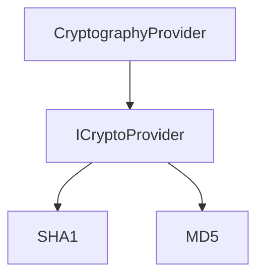

# Component: Emby.Server.Implementations.Cryptography

**Path:** `Emby.Server.Implementations/Cryptography/`
**Type:** Directory | Sub-Module
**Language:** C#
**Maps to:** `.discovery/199-emby-server-impl-cryptography.md`

## Description

Cryptographic utilities for the server. Provides hashing, encryption, and key derivation services for secure operations.

## Directory Structure

```
Emby.Server.Implementations/Cryptography/
└── CryptographyProvider.cs
```

## Files

| File | Description |
|------|-------------|
| `CryptographyProvider.cs` | Cryptography provider implementation |

## Decomposition

### CryptographyProvider.cs

#### Imports
```csharp
using System;
using System.IO;
using System.Security.Cryptography;
using System.Text;
using MediaBrowser.Model.Cryptography;
```

#### Classes
`CryptographyProvider` (public class : ICryptoProvider)

#### Key Methods
| Method | Return | Description |
|--------|--------|-------------|
| `GetMD5(string)` | `Guid` | Get MD5 hash as GUID |
| `ComputeSHA1(byte[])` | `byte[]` | Compute SHA1 hash |
| `ComputeMD5(Stream)` | `byte[]` | Compute MD5 hash from stream |
| `ComputeMD5(byte[])` | `byte[]` | Compute MD5 hash from bytes |

## Architecture



## Dependencies

- `MediaBrowser.Model.Cryptography` — Crypto interfaces
- `System.Security.Cryptography` — .NET crypto APIs

## Statistics

| Metric | Value |
|--------|-------|
| C# Files | 1 |
| LOC | ~41 |
| Public Classes | 1 |
