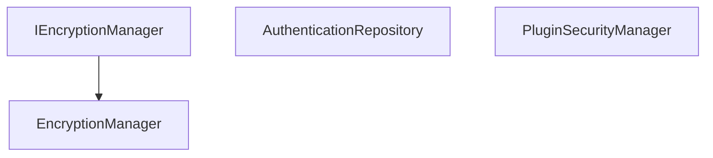

# Emby.Server.Implementations - Security Module

**Module:** Emby.Server.Implementations/Security
**Language:** C#
**Maps to:** `.discovery/199-emby-server-impl-security.md`

## Decomposition

### EncryptionManager.cs (Encryption Provider)

#### Imports
```csharp
using MediaBrowser.Model.Security;
using System;
using System.IO;
using System.Security.Cryptography;
using System.Text;
```

#### Classes
`EncryptionManager` (public class : IEncryptionManager)

#### Key Methods
```csharp
string EncryptString(string value, string key)
string DecryptString(string value, string key)
byte[] Encrypt(byte[] data, byte[] key)
byte[] Decrypt(byte[] data, byte[] key)
```

### MB LicenseFile.cs (License Management)

#### Classes
`MBLicenseFile` (public class)

### AuthenticationRepository.cs (Auth Storage)

#### Classes
`AuthenticationRepository` (public class)

### PluginSecurityManager.cs (Plugin Security)

#### Classes
`PluginSecurityManager` (public class)

### RegRecord.cs (Registration Record)

#### Classes
`RegRecord` (public class)

## Architecture



## File Listing

```
Security/
├── EncryptionManager.cs         - Encryption/decryption
├── MB LicenseFile.cs           - License management
├── AuthenticationRepository.cs - Auth storage
├── PluginSecurityManager.cs   - Plugin security
└── RegRecord.cs              - Registration records
```

## Description

Security module handles encryption, licensing, and authentication for Emby Server. EncryptionManager provides AES encryption/decryption for sensitive data. MB LicenseFile manages software licensing. AuthenticationRepository stores authentication tokens and sessions. PluginSecurityManager ensures plugins operate securely.

## Dependencies

- **System.Security.Cryptography** - Crypto operations
- **MediaBrowser.Model.Security** - Security models

## Statistics

- **Files:** 5
- **Lines:** ~500
- **Classes:** 5
