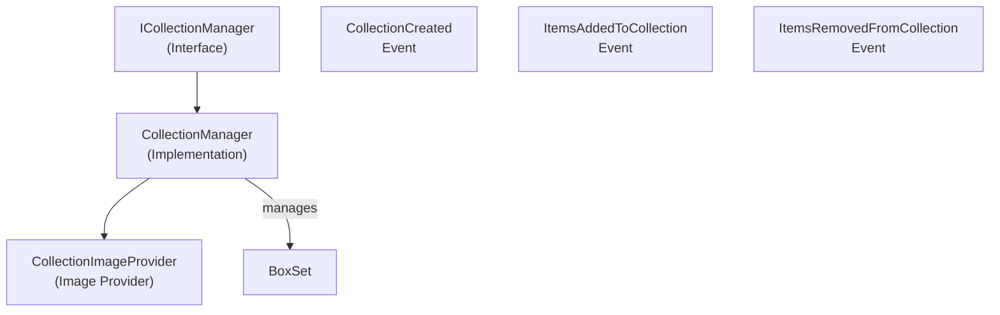

# Emby.Server.Implementations - Collections Module

**Module:** Emby.Server.Implementations/Collections
**Language:** C#
**Maps to:** `.discovery/200-emby-server-impl-collections.md`

## Decomposition

### CollectionManager.cs (Main Collection Manager - 413 lines)

#### Imports
```csharp
using MediaBrowser.Common.Events;
using MediaBrowser.Controller.Collections;
using MediaBrowser.Controller.Entities;
using MediaBrowser.Controller.Entities.Movies;
using MediaBrowser.Controller.Library;
using MediaBrowser.Controller.Providers;
using MediaBrowser.Model.Logging;
using MediaBrowser.Model.IO;
using MediaBrowser.Model.Globalization;
using MediaBrowser.Model.Entities;
using MediaBrowser.Model.Configuration;
```

#### Classes
`CollectionManager` (public class : ICollectionManager)

#### Key Properties
```csharp
event EventHandler<CollectionCreatedEventArgs> CollectionCreated
event EventHandler<CollectionModifiedEventArgs> ItemsAddedToCollection
event EventHandler<CollectionModifiedEventArgs> ItemsRemovedFromCollection
```

#### Key Methods
```csharp
BoxSet CreateCollection(CollectionCreationOptions options)
void AddToCollection(string collectionId, IEnumerable<string> itemIds)
void RemoveFromCollection(string collectionId, IEnumerable<string> itemIds)
Task<Folder> EnsureLibraryFolder(string path, bool createIfNeeded)
string GetCollectionsFolderPath()
IEnumerable<BoxSet> GetCollections(User user)
```

### CollectionImageProvider.cs

#### Classes
`CollectionImageProvider` (public class : ILocalImageProvider, IHasOrder)

## Architecture



## File Listing

```
Collections/
├── CollectionManager.cs     (413 lines) - Main collection management
└── CollectionImageProvider.cs - Box set image provider
```

## Description

Collections module manages media collections (box sets). The CollectionManager handles creating, adding items to, and removing items from collections. Collections are represented as BoxSet entities. The module supports collection creation events and image providers for collection artwork.

## Dependencies

- **MediaBrowser.Controller.Collections** - Collection interfaces
- **MediaBrowser.Controller.Entities** - Base entities including BoxSet
- **MediaBrowser.Controller.Library** - Library management
- **MediaBrowser.Model.Globalization** - Localization

## Statistics

- **Files:** 2
- **Lines:** ~500
- **Classes:** 2
