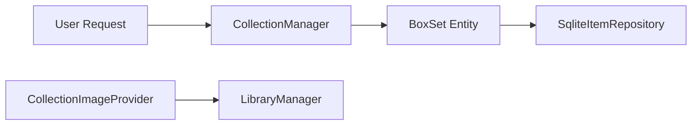

# Component: Emby.Server.Implementations — Collections

**Path:** `Emby.Server.Implementations/Collections/`
**Type:** Directory | Module
**Language:** C#
**Maps to:** `.discovery/200-emby-server-impl-collections.md`

## Description

Manages media collections (box sets, grouped media). Handles collection creation, modification, and media item association.

## Files

### Root Collection Files

- `CollectionManager.cs` — Emby.Server.Implementations/Collections/CollectionManager.cs
- `CollectionImageProvider.cs` — Emby.Server.Implementations/Collections/CollectionImageProvider.cs

## Decomposition

### CollectionManager.cs (Collection Manager)

#### Imports
```csharp
using MediaBrowser.Controller.Collections;
using MediaBrowser.Controller.Entities;
using MediaBrowser.Controller.Library;
using MediaBrowser.Model.Entities;
using MediaBrowser.Model.Querying;
using System;
using System.Collections.Generic;
using System.Threading.Tasks;
```

#### Classes
`CollectionManager` (public class : ICollectionManager)

#### Key Properties
| Property | Type | Description |
|----------|------|-------------|
| `Collections` | `IEnumerable<BoxSet>` | All collections |

#### Key Methods
| Method | Return | Description |
|--------|--------|-------------|
| `CreateCollection(CollectionCreationOptions)` | `Task<BoxSet>` | Create new collection |
| `AddToCollection(Guid, IEnumerable<Guid>)` | `Task` | Add items to collection |
| `RemoveFromCollection(Guid, IEnumerable<Guid>)` | `Task` | Remove items from collection |
| `GetCollections(IEnumerable<Guid>)` | `IEnumerable<BoxSet>` | Get collections by IDs |

### CollectionImageProvider.cs (Collection Image Provider)

#### Classes
`CollectionImageProvider` (public class : IDynamicImageProvider)

#### Key Properties
| Property | Type | Description |
|----------|------|-------------|
| `Name` | `string` | "Collection" |
| `SupportedImages` | `ImageType[]` | Primary, Backdrop, Thumb |

#### Key Methods
| Method | Return | Description |
|--------|--------|-------------|
| `GetImages(BaseItem, IEnumerable<ImageType>)` | `Task<IEnumerable<ItemImageInfo>>` | Get available images |

## Data Flow



## Dependencies

- `MediaBrowser.Controller` — Collection interfaces
- `MediaBrowser.Model` — Query models
- `Emby.Server.Implementations.Library` — Library integration

## Statistics

| Metric | Value |
|--------|-------|
| Files | 2 |
| Classes | 2 |
| LOC | ~175 |
