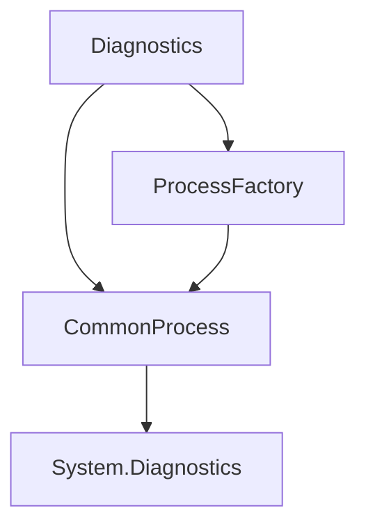

# Component: Emby.Server.Implementations.Diagnostics

**Path:** `Emby.Server.Implementations/Diagnostics/`
**Type:** Directory | Sub-Module
**Language:** C#
**Maps to:** `.discovery/200-emby-server-impl-diagnostics.md`

## Description

Diagnostics and process management utilities. Provides process monitoring and system diagnostics capabilities.

## Directory Structure

```
Emby.Server.Implementations/Diagnostics/
├── CommonProcess.cs
└── ProcessFactory.cs
```

## Files

| File | Description |
|------|-------------|
| `CommonProcess.cs` | Common process utilities |
| `ProcessFactory.cs` | Process factory |

## Decomposition

### CommonProcess.cs

#### Imports
```csharp
using System;
using System.Diagnostics;
using System.Threading;
using System.Threading.Tasks;
using MediaBrowser.Model.Logging;
```

#### Classes
`CommonProcess` (public class)

#### Key Methods
| Method | Return | Description |
|--------|--------|-------------|
| `Start(ProcessOptions)` | `Process` | Start a process |
| `GetRunningProcesses()` | `IEnumerable<ProcessInfo>` | Get running processes |

### ProcessFactory.cs

#### Imports
```csharp
using MediaBrowser.Model.Logging;
using System.Diagnostics;
```

#### Classes
`ProcessFactory` (public class)

#### Key Methods
| Method | Return | Description |
|--------|--------|-------------|
| `CreateProcess(ProcessOptions, ILogger)` | `IProcess` | Create a process |

## Architecture



## Dependencies

- System.Diagnostics — Process APIs
- MediaBrowser.Model.Logging — Logging interfaces

## Statistics

| Metric | Value |
|--------|-------|
| C# Files | 2 |
| LOC | ~4,100 |
| Public Classes | 2 |
