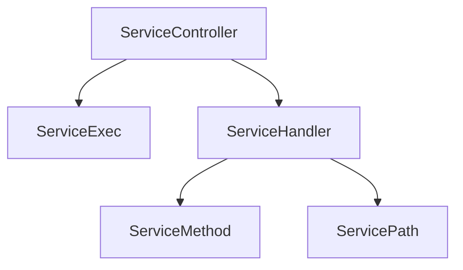

# Emby.Server.Implementations - Services Module

**Module:** Emby.Server.Implementations/Services
**Language:** C#
**Maps to:** `.discovery/200-emby-server-impl-services.md`

## Decomposition

### ServiceController.cs (REST Controller)

#### Imports
```csharp
using MediaBrowser.Model.Services;
using System;
using System.Collections.Generic;
using System.Linq;
using System.Threading.Tasks;
```

#### Classes
`ServiceController` (public static class)

#### Key Methods
```csharp
Task<object> ExecuteAsync(object instance, IRequest request)
void RegisterService(object service)
IDictionary<string, Type> GetServiceDescriptors()
```

### ServiceExec.cs (Service Executor)

#### Classes
`ServiceExec` (public static class)

### ServiceHandler.cs (Request Handler)

#### Classes
`ServiceHandler` (public class)

### ServiceMethod.cs (Method Info)

#### Classes
`ServiceMethod` (public class)

### ServicePath.cs (Path Parser)

#### Classes
`ServicePath` (public class)

### HttpResult.cs (HTTP Response)

#### Classes
`HttpResult` (public class)

### RequestHelper.cs (Request Utilities)

#### Classes
`RequestHelper` (public static class)

### ResponseHelper.cs (Response Utilities)

#### Classes
`ResponseHelper` (public static class)

### StringMapTypeDeserializer.cs

#### Classes
`StringMapTypeDeserializer` (public class : ITypeDeserializer)

### UrlExtensions.cs (URL Extensions)

#### Classes
`UrlExtensions` (public static class)

## Architecture



## File Listing

```
Services/
├── ServiceController.cs       - Main REST controller
├── ServiceExec.cs             - Service execution
├── ServiceHandler.cs         - Request handling
├── ServiceMethod.cs          - Method metadata
├── ServicePath.cs            - Path parsing
├── HttpResult.cs             - HTTP responses
├── RequestHelper.cs          - Request utilities
├── ResponseHelper.cs        - Response utilities
├── StringMapTypeDeserializer.cs - Type deserialization
└── UrlExtensions.cs         - URL helpers
```

## Description

Services module implements the ServiceStack-based REST API framework for Emby. ServiceController routes HTTP requests to service implementations. ServiceExec executes service methods. ServiceHandler parses incoming requests and builds responses. This module forms the foundation of Emby's REST API architecture.

## Dependencies

- **MediaBrowser.Model.Services** - Service models
- **ServiceStack** - Service framework

## Statistics

- **Files:** 10
- **Lines:** ~2,500
- **Classes:** 10
