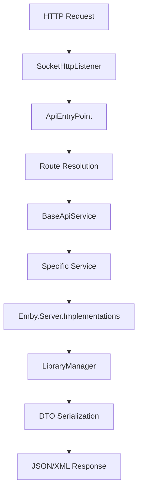

# Component: MediaBrowser.Api

**Path:** `MediaBrowser.Api/`
**Type:** Directory | Module
**Language:** C#
**Maps to:** `.discovery/200-mediabrowser-api.md`

## Description

MediaBrowser.Api implements the REST API layer for Emby Server. It contains service classes that handle HTTP requests for media library access, user management, device control, live TV, playlists, and system configuration. Built on a custom service framework using `SocketHttpListener` for HTTP handling.

## Structure

```
MediaBrowser.Api/
├── ApiEntryPoint.cs             # API bootstrap → [class] ApiEntryPoint
├── BaseApiService.cs            # Base class for API services
├── IHasDtoOptions.cs            # DTO options interface
├── IHasItemFields.cs            # Item fields interface
├── BrandingService.cs           # Server branding API
├── ChannelService.cs            # Channel plugin API
├── ConfigurationService.cs      # Server configuration API
├── DisplayPreferencesService.cs # Display preferences API
├── EnvironmentService.cs        # Environment info API
├── FilterService.cs             # Library filter API
├── GamesService.cs              # Games library API
├── ItemLookupService.cs         # Item lookup/search API
├── ItemRefreshService.cs        # Item metadata refresh API
├── ItemUpdateService.cs         # Item update API
├── LocalizationService.cs       # Localization API
├── NewsService.cs               # News feed API
├── PackageService.cs            # Plugin package API
├── PlaylistService.cs           # Playlist API
├── PluginService.cs             # Plugin management API
├── SearchService.cs             # Global search API
├── Devices/                     # Device management API
├── Images/                      # Image serving API
├── Library/                     # Media library API
│   ├── Movies/                  # Movie-specific endpoints
│   ├── Music/                   # Music-specific endpoints
│   └── ...                      # Other media types
├── LiveTv/                      # Live TV API
├── ScheduledTasks/              # Scheduled task API
└── Properties/                  # Assembly info
```

## Key Services

| Service | File | Endpoints |
|---------|------|-----------|
| `BrandingService` | `BrandingService.cs` | `/Branding` |
| `ChannelService` | `ChannelService.cs` | `/Channels` |
| `ConfigurationService` | `ConfigurationService.cs` | `/System/Configuration` |
| `ItemLookupService` | `ItemLookupService.cs` | `/Items/{Id}` |
| `LibraryService` | `Library/` | `/Library`, `/Users/{Id}/Items` |
| `LiveTvService` | `LiveTv/` | `/LiveTv` |
| `PlaylistService` | `PlaylistService.cs` | `/Playlists` |
| `PluginService` | `PluginService.cs` | `/Plugins` |
| `SearchService` | `SearchService.cs` | `/Search/Hints` |
| `SessionService` | `Session/` | `/Sessions` |
| `UserService` | `Security/` | `/Users` |

## Data Flow



## Dependencies

- `Emby.Server.Implementations` — Core server logic
- `MediaBrowser.Controller` — Controller interfaces
- `MediaBrowser.Model` — Model types
- `SocketHttpListener` — HTTP server → `.discovery/320-sockethttplistener.md`

## Side Effects

- Serves HTTP responses to clients
- Triggers media scans and metadata updates
- Manages user sessions and authentication
- Streams media content

## Reference

- API Docs: `https://github.com/MediaBrowser/MediaBrowser/wiki`
