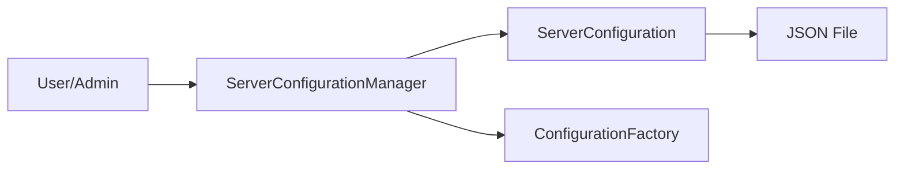

# Component: Emby.Server.Implementations — Configuration

**Path:** `Emby.Server.Implementations/Configuration/`
**Type:** Directory | Module
**Language:** C#
**Maps to:** `.discovery/201-emby-server-impl-configuration.md`

## Description

Server configuration management. Handles loading, saving, and validation of server configuration settings.

## Files

- `ServerConfigurationManager.cs` — Emby.Server.Implementations/Configuration/ServerConfigurationManager.cs

## Decomposition

### ServerConfigurationManager.cs (Server Configuration Manager)

#### Imports
```csharp
using MediaBrowser.Common.Configuration;
using MediaBrowser.Model.Configuration;
using System;
using System.IO;
```

#### Classes
`ServerConfigurationManager` (public class : BaseConfigurationManager<ServerConfiguration>, IServerConfigurationManager)

#### Key Properties
| Property | Type | Description |
|----------|------|-------------|
| `Configuration` | `ServerConfiguration` | Current configuration |
| `ApplicationPaths` | `IApplicationPaths` | Path configuration |

#### Key Methods
| Method | Return | Description |
|--------|--------|-------------|
| `ReplaceConfiguration(ServerConfiguration)` | `void` | Replace entire config |
| `SaveConfiguration()` | `void` | Persist configuration |
| `ReloadConfiguration()` | `void` | Reload from disk |
| `GetConfiguration(string)` | `T` | Get typed config section |

#### Key Events
| Event | Description |
|-------|-------------|
| `ConfigurationUpdated` | Fired when config changes |

## Data Flow



## Dependencies

- `MediaBrowser.Common.Configuration` — Base configuration interfaces
- `MediaBrowser.Model.Configuration` — Configuration models
- `System.IO` — File persistence

## Statistics

| Metric | Value |
|--------|-------|
| Files | 1 |
| Classes | 1 |
| LOC | ~250 |
