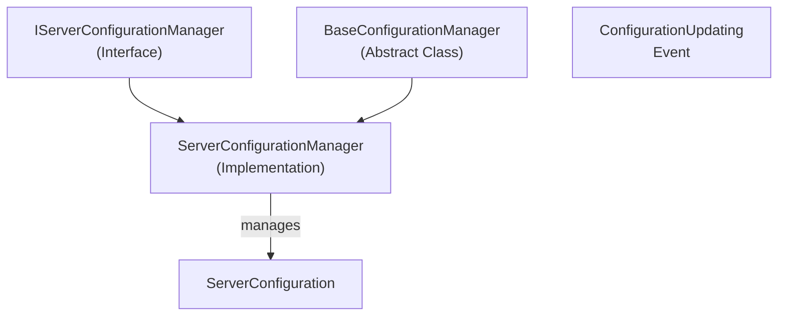

# Emby.Server.Implementations - Configuration Module

**Module:** Emby.Server.Implementations/Configuration
**Language:** C#
**Maps to:** `.discovery/201-emby-server-impl-configuration.md`

## Decomposition

### ServerConfigurationManager.cs (Main Configuration Manager - 254 lines)

#### Imports
```csharp
using System;
using System.Collections.Generic;
using System.IO;
using Emby.Server.Implementations.AppBase;
using MediaBrowser.Common.Configuration;
using MediaBrowser.Common.Events;
using MediaBrowser.Controller;
using MediaBrowser.Controller.Configuration;
using MediaBrowser.Controller.Entities;
using MediaBrowser.Model.Configuration;
using MediaBrowser.Model.IO;
using MediaBrowser.Model.Logging;
using MediaBrowser.Model.Serialization;
```

#### Classes
`ServerConfigurationManager` (public class : BaseConfigurationManager, IServerConfigurationManager)

#### Key Properties
```csharp
event EventHandler<GenericEventArgs<ServerConfiguration>> ConfigurationUpdating
IServerApplicationPaths ApplicationPaths { get; }
ServerConfiguration Configuration { get; }
```

#### Key Methods
```csharp
void AddParts(IEnumerable<IConfigurationFactory> factories)
void UpdateMetadataPath()
string GetInternalMetadataPath()
void UpdateTranscodingTempPath()
protected override Type ConfigurationType { get; }
protected override void OnConfigurationUpdated()
```

## Architecture



## File Listing

```
Configuration/
└── ServerConfigurationManager.cs (254 lines) - Server configuration management
```

## Description

Configuration module provides server-specific configuration management. ServerConfigurationManager extends BaseConfigurationManager with server-specific settings like metadata paths, transcoding temp paths, and server configuration events.

## Dependencies

- **Emby.Server.Implementations.AppBase** - Base classes
- **MediaBrowser.Common.Configuration** - Configuration interfaces
- **MediaBrowser.Model.Configuration** - Server configuration models

## Statistics

- **Files:** 1
- **Lines:** ~300
- **Classes:** 1
