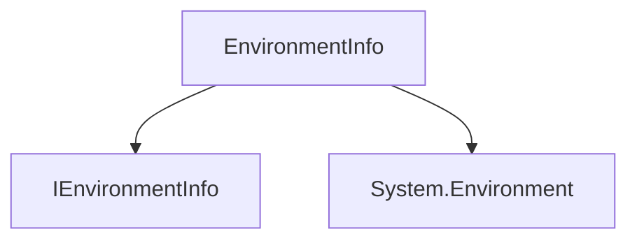

# Component: Emby.Server.Implementations.EnvironmentInfo

**Path:** `Emby.Server.Implementations/EnvironmentInfo/`
**Type:** Directory | Sub-Module
**Language:** C#
**Maps to:** `.discovery/201-emby-server-impl-environmentinfo.md`

## Description

Environment information provider. Provides system and runtime environment details including OS information, memory, and CPU statistics.

## Directory Structure

```
Emby.Server.Implementations/EnvironmentInfo/
└── EnvironmentInfo.cs
```

## Files

| File | Description |
|------|-------------|
| `EnvironmentInfo.cs` | Environment information provider |

## Decomposition

### EnvironmentInfo.cs

#### Imports
```csharp
using System;
using MediaBrowser.Model.Services;
```

#### Classes
`EnvironmentInfo` (public class : IEnvironmentInfo)

#### Key Properties
| Property | Type | Description |
|----------|------|-------------|
| `OsArchitecture` | `string` | OS architecture |
| `OsBuildVersion` | `string` | OS build version |
| `OperatingSystem` | `string` | Operating system name |
| `PhysicalMemory` | `long` | Total physical memory |

#### Key Methods
| Method | Return | Description |
|--------|--------|-------------|
| `GetEnvironmentVariable(string)` | `string` | Get environment variable |

## Architecture



## Dependencies

- MediaBrowser.Model.Services — Service interfaces

## Statistics

| Metric | Value |
|--------|-------|
| C# Files | 1 |
| LOC | ~85 |
| Public Classes | 1 |
