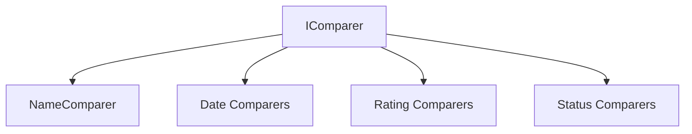

# Emby.Server.Implementations - Sorting Module

**Module:** Emby.Server.Implementations/Sorting
**Language:** C#
**Maps to:** `.discovery/201-emby-server-impl-sorting.md`

## Decomposition

All files implement `IComparer<T>` for sorting media items.

### Name Comparers

#### Classes
`NameComparer` (public class : IComparer<T>)
`SortNameComparer` (public class : IComparer<T>)
`SeriesSortNameComparer` (public class : IComparer<T>)
`AlphanumComparator` (public class : IComparer<T>)

### Date Comparers

#### Classes
`DateCreatedComparer` (public class : IComparer<T>)
`PremiereDateComparer` (public class : IComparer<T>)
`StartDateComparer` (public class : IComparer<T>)
`DateLastMediaAddedComparer` (public class : IComparer<T>)

### Playback Comparers

#### Classes
`DatePlayedComparer` (public class : IComparer<T>)
`PlayCountComparer` (public class : IComparer<T>)
`RuntimeComparer` (public class : IComparer<T>)

### Status Comparers

#### Classes
`IsPlayedComparer` (public class : IComparer<T>)
`IsUnplayedComparer` (public class : IComparer<T>)
`IsFolderComparer` (public class : IComparer<T>)
`IsFavoriteOrLikeComparer` (public class : IComparer<T>)

### Rating Comparers

#### Classes
`CommunityRatingComparer` (public class : IComparer<T>)
`CriticRatingComparer` (public class : IComparer<T>)
`OfficialRatingComparer` (public class : IComparer<T>)

### Other Comparers

#### Classes
`AlbumComparer` (public class : IComparer<T>)
`AlbumArtistComparer` (public class : IComparer<T>)
`ArtistComparer` (public class : IComparer<T>)
`ProductionYearComparer` (public class : IComparer<T>)
`StudioComparer` (public class : IComparer<T>)
`PlayersComparer` (public class : IComparer<T>)
`GameSystemComparer` (public class : IComparer<T>)
`AiredEpisodeOrderComparer` (public class : IComparer<T>)
`RandomComparer` (public class : IComparer<T>)

## Architecture



## File Listing

```
Sorting/
├── NameComparer.cs              - Name sorting
├── SortNameComparer.cs         - Sort name
├── SeriesSortNameComparer.cs   - Series sort
├── AlphanumComparator.cs       - Alphanumeric
├── DateCreatedComparer.cs      - Date created
├── PremiereDateComparer.cs     - Premiere date
├── StartDateComparer.cs        - Start date
├── DateLastMediaAddedComparer.cs - Last added
├── DatePlayedComparer.cs       - Date played
├── PlayCountComparer.cs        - Play count
├── RuntimeComparer.cs          - Runtime
├── IsPlayedComparer.cs         - Played status
├── IsUnplayedComparer.cs      - Unplayed status
├── IsFolderComparer.cs         - Folder check
├── IsFavoriteOrLikeComparer.cs - Favorite/like
├── CommunityRatingComparer.cs - Community rating
├── CriticRatingComparer.cs     - Critic rating
├── OfficialRatingComparer.cs  - Official rating
├── AlbumComparer.cs           - Album
├── AlbumArtistComparer.cs    - Album artist
├── ArtistComparer.cs         - Artist
├── ProductionYearComparer.cs  - Year
├── StudioComparer.cs         - Studio
├── PlayersComparer.cs        - Players
├── GameSystemComparer.cs     - Game system
├── AiredEpisodeOrderComparer.cs - Episode order
└── RandomComparer.cs         - Random
```

## Description

Sorting module provides 27 different comparers for sorting media items in Emby's library views. Comparers cover names, dates, ratings, play counts, status, and more. Multiple comparers can be combined for multi-level sorting. RandomComparer enables shuffle functionality.

## Dependencies

- **System.Collections.Generic** - Comparer interfaces

## Statistics

- **Files:** 27
- **Lines:** ~1,000
- **Classes:** 27
