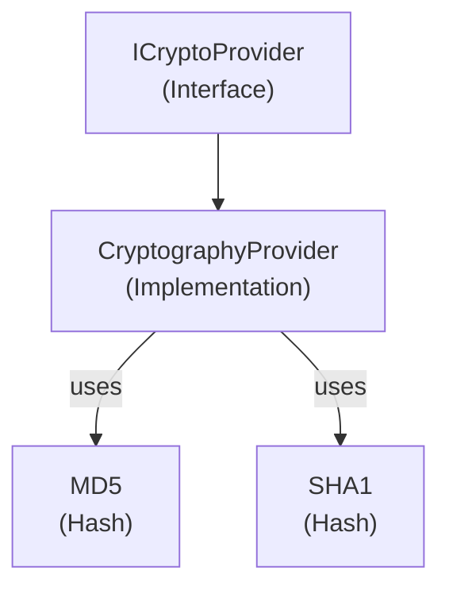

# Emby.Server.Implementations - Cryptography Module

**Module:** Emby.Server.Implementations/Cryptography
**Language:** C#
**Maps to:** `.discovery/202-emby-server-impl-cryptography.md`

## Decomposition

### CryptographyProvider.cs

#### Imports
```csharp
using System;
using System.Security.Cryptography;
using MediaBrowser.Model.Cryptography;
```

#### Classes
`CryptographyProvider` (public class : ICryptoProvider)

#### Key Methods
```csharp
byte[] GenerateSalt()
byte[] GetMD5Hash(byte[] data)
string GetMD5HashString(string value)
byte[] GetSha1Hash(byte[] data)
string GetSha1HashString(string value)
byte[] GetMD5Hash(byte[] data, int offset, int count)
string GetProprietaryHash(string value)
```

## Architecture



## File Listing

```
Cryptography/
└── CryptographyProvider.cs - Cryptographic operations provider
```

## Description

Cryptography module provides cryptographic utilities for Emby Server. The CryptographyProvider implements ICryptoProvider and provides hash generation (MD5, SHA1), salt generation, and proprietary hashing for password storage and data integrity verification.

## Dependencies

- **MediaBrowser.Model.Cryptography** - Cryptography interfaces
- **System.Security.Cryptography** - .NET crypto libraries

## Statistics

- **Files:** 1
- **Lines:** ~100
- **Classes:** 1
