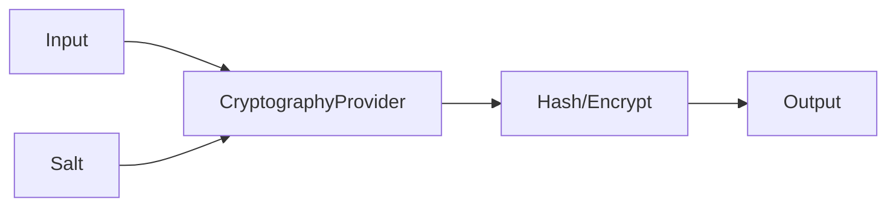

# Component: Emby.Server.Implementations — Cryptography

**Path:** `Emby.Server.Implementations/Cryptography/`
**Type:** Directory | Module
**Language:** C#
**Maps to:** `.discovery/202-emby-server-impl-cryptography.md`

## Description

Provides cryptographic services for the server. Wraps system cryptography for hashing, encryption, and secure operations.

## Files

- `CryptographyProvider.cs` — Emby.Server.Implementations/Cryptography/CryptographyProvider.cs

## Decomposition

### CryptographyProvider.cs (Cryptography Provider)

#### Imports
```csharp
using MediaBrowser.Model.Cryptography;
using System;
using System.Security.Cryptography;
using System.Text;
```

#### Classes
`CryptographyProvider` (public class : ICryptographyProvider)

#### Key Methods
| Method | Return | Description |
|--------|--------|-------------|
| `ComputeMD5(byte[])` | `string` | MD5 hash |
| `ComputeMD5(string)` | `string` | MD5 hash of string |
| `ComputeSHA1(byte[])` | `string` | SHA1 hash |
| `ComputeSHA256(byte[])` | `string` | SHA256 hash |
| `GenerateSalt()` | `string` | Generate random salt |
| `ComputeHmac(byte[], string)` | `byte[]` | HMAC computation |
| `EncryptString(string, string)` | `string` | Encrypt string |
| `DecryptString(string, string)` | `string` | Decrypt string |

## Data Flow



## Dependencies

- `System.Security.Cryptography` — .NET crypto primitives
- `MediaBrowser.Model.Cryptography` — Crypto interfaces

## Statistics

| Metric | Value |
|--------|-------|
| Files | 1 |
| Classes | 1 |
| LOC | ~30 |
