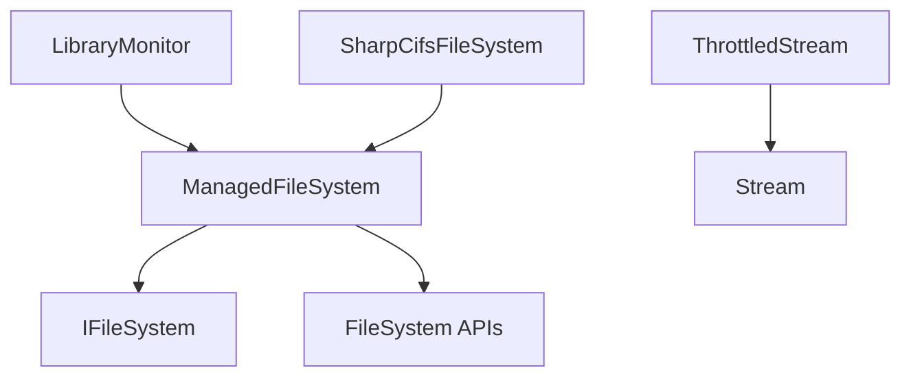

# Component: Emby.Server.Implementations.IO

**Path:** `Emby.Server.Implementations/IO/`
**Type:** Directory | Sub-Module
**Language:** C#
**Maps to:** `.discovery/202-emby-server-impl-io.md`

## Description

File system I/O operations and management. Provides managed file system access, library monitoring, ISO handling, and file refreshing capabilities.

## Directory Structure

```
Emby.Server.Implementations/IO/
├── ExtendedFileSystemInfo.cs
├── FileRefresher.cs
├── IsoManager.cs
├── LibraryMonitor.cs
├── ManagedFileSystem.cs
├── MbLinkShortcutHandler.cs
├── SharpCifs/                    # SMB/CIFS support
├── SharpCifsFileSystem.cs
├── StreamHelper.cs
└── ThrottledStream.cs
```

## Files

| File | Description |
|------|-------------|
| `ManagedFileSystem.cs` | Managed file system access |
| `LibraryMonitor.cs` | Library file system monitoring |
| `FileRefresher.cs` | File change tracking |
| `IsoManager.cs` | ISO image management |
| `ThrottledStream.cs` | Bandwidth throttled streaming |
| `StreamHelper.cs` | Stream utilities |
| `SharpCifsFileSystem.cs` | SMB file system access |
| `ExtendedFileSystemInfo.cs` | Extended file info |
| `MbLinkShortcutHandler.cs` | Symbolic link handling |

## Decomposition

### ManagedFileSystem.cs

#### Classes
`ManagedFileSystem` (public class : IFileSystem)

#### Key Methods
| Method | Return | Description |
|--------|--------|-------------|
| `GetFileInfo(string)` | `FileSystemMetadata` | Get file info |
| `GetDirectoryInfo(string)` | `DirectoryBrowser` | Get directory info |
| `DeleteFile(string)` | `void` | Delete file |
| `DeleteDirectory(string, bool)` | `void` | Delete directory |

### LibraryMonitor.cs

#### Classes
`LibraryMonitor` (public class : ILibraryMonitor)

#### Key Methods
| Method | Return | Description |
|--------|--------|-------------|
| `StartWatching(string, ILibraryMonitorCallback)` | `IDisposable` | Start monitoring |
| `StopWatching(string)` | `void` | Stop monitoring |

### ThrottledStream.cs

#### Classes
`ThrottledStream` (public class : Stream)

#### Key Methods
| Method | Return | Description |
|--------|--------|-------------|
| `SetThroughputLimit(long)` | `void` | Set throughput limit |
| `Read(byte[], int, int)` | `int` | Read with throttling |

## Architecture



## Dependencies

- MediaBrowser.Model.IO — I/O models
- MediaBrowser.Model.Logging — Logging

## Statistics

| Metric | Value |
|--------|-------|
| C# Files | 11 |
| LOC | ~80,000 |
| Public Classes | 8 |
