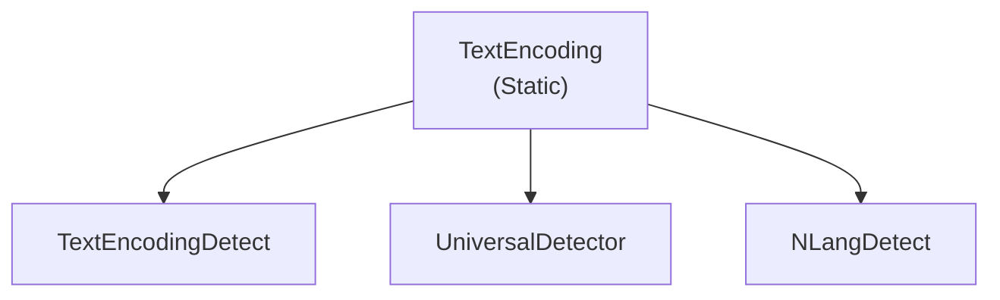

# Emby.Server.Implementations - TextEncoding Module

**Module:** Emby.Server.Implementations/TextEncoding
**Language:** C#
**Maps to:** `.discovery/202-emby-server-impl-textencoding.md`

## Decomposition

### TextEncoding.cs (Main Encoding Handler)

#### Imports
```csharp
using MediaBrowser.Model.Text;
using System;
using System.Text;
using System.Collections.Generic;
```

#### Classes
`TextEncoding` (public static class)

#### Key Methods
```csharp
Encoding GetEncoding(string charset)
Encoding GetEncoding(int codepage)
string GetCharacterSet(Encoding encoding)
IEnumerable<EncodingInfo> GetEncodings()
```

### TextEncodingDetect.cs (Encoding Detection)

#### Classes
`TextEncodingDetect` (public class)

#### Key Methods
```csharp
Encoding Detect(byte[] buffer)
Encoding Detect(byte[] buffer, int length)
```

### NLangDetect (Language Detection)

#### Classes
`LanguageDetector` (public class)

#### Key Methods
```csharp
string DetectLanguage(string text)
IEnumerable<LanguageMatch> DetectLanguages(string text)
```

### UniversalDetector (Charset Detection)

#### Classes
`UniversalDetector` (public class)

#### Key Methods
```csharp
void Feed(byte[] buffer, int offset, int length)
void DataEnd()
string DetectedCharset
bool IsDone
```

## Architecture



## File Listing

```
TextEncoding/
├── TextEncoding.cs       - Main encoding utilities
├── TextEncodingDetect.cs - Encoding detection
├── NLangDetect/         - Language detection library
│   └── [Language detection files]
└── UniversalDetector/    - Mozilla charset detector
    └── [Charset detection files]
```

## Description

TextEncoding module handles text encoding and language detection for Emby. It provides charset conversion utilities, encoding detection from byte streams, and language identification for subtitles and metadata. Essential for proper handling of international media and subtitles.

## Dependencies

- **System.Text** - Encoding types
- **MediaBrowser.Model.Text** - Text models

## Statistics

- **Files:** 52
- **Lines:** ~8,000+
- **Classes:** 10+
