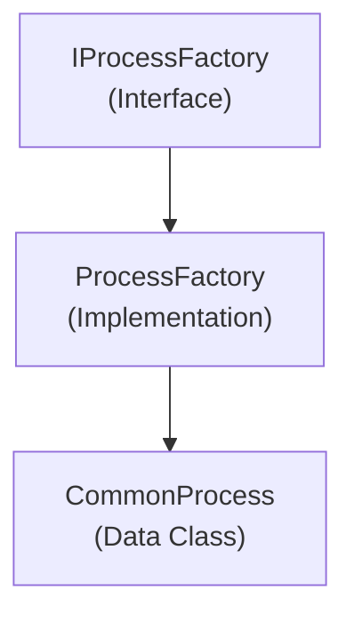

# Emby.Server.Implementations - Diagnostics Module

**Module:** Emby.Server.Implementations/Diagnostics
**Language:** C#
**Maps to:** `.discovery/203-emby-server-impl-diagnostics.md`

## Decomposition

### CommonProcess.cs (Process Information)

#### Imports
```csharp
using System.Diagnostics;
using System.IO;
using MediaBrowser.Model.IO;
```

#### Classes
`CommonProcess` (public class)

#### Key Properties
```csharp
string Name { get; }
long MemoryBytes { get; }
double CpuPercentage { get; }
```

### ProcessFactory.cs (Process Factory)

#### Classes
`ProcessFactory` (public class : IProcessFactory)

#### Key Methods
```csharp
Process CreateProcess(ProcessOptions options)
IProcess CreateProcessAsync(ProcessOptions options)
```

## Architecture



## File Listing

```
Diagnostics/
├── CommonProcess.cs    - Process information model
└── ProcessFactory.cs   - Process creation factory
```

## Description

Diagnostics module provides process management and monitoring utilities. The ProcessFactory creates and manages external processes (like FFmpeg). CommonProcess holds process information like memory usage and CPU percentage.

## Dependencies

- **System.Diagnostics** - Process management
- **MediaBrowser.Model.IO** - I/O interfaces

## Statistics

- **Files:** 2
- **Lines:** ~200
- **Classes:** 2
